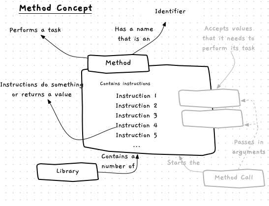

The computer is unintelligent, so performing anything meaningful requires a lot of instructions. Coding all of these directly would be slow and time-consuming. To avoid this, programming languages offer the capability to group instructions into a **method**.

A method is a list of instructions that gets the computer to perform a specific task.
We can [call a method](../03-method-call), which gives it control of the computer, allowing it to instruct the computer.
Often these instructions require data, so a method may need to be passed data when it is called.
This data is called the method's **arguments**.
When the method finishes its task, control is given back to the code that called the method.

[Figure 5.5](#FigureMethod) shows the concepts related to methods.

Figure 5.5: A method contains instructions to perform a task, and may need to be passed data in order to do this
 

## Method -- when, why, and how

For now we will focus on using methods that others have created.
This allows you to write programs that take advantage of code written by other programmers.
By doing this you are really just applying another layer of abstraction, enabling yourself to think about small tasks rather than the individual steps they require.
You are also saving yourself time, avoiding having to write everything in your program from scratch.

Every programming language comes with a **standard library**, containing methods written by the language developers to perform common tasks such as writing to and reading from the terminal.
For other tasks, you can find libraries written by other programmers.

### Arguments

Methods can require you to pass them values as **arguments**, just like the programs we run in the terminal. These arguments are used within the method to tailor the way it works. For example, you need to pass the `PlaySoundEffect` method from SplashKit an argument to indicate the sound effect you want to play. Arguments allow one method to be used for the same *general* action, while retaining flexibility to change the specifics of that action.

### Results

Some methods also **return** a value. You can think of this like a machine where you give it some input material, and it gives you back something. Another way to think of it as a mathematical function -- you give it some values, and it comes back with a result. For example, an `Add` method might take two arguments and return the sum of their values.

:::note[Describing method arguments]
There are a few different ways to describe a method that has arguments.
Three ways we have already used are to say that you can **pass** or **give** arguments to a method, and that a method can **take** arguments.
Other ways of saying the same thing are to say that a method **accepts**, **requires**, or **receives** arguments.

These different phrases all mean the same thing and can be used interchangeably depending on personal preference and sentence flow.
:::

## Examples

For the moment we will make use of methods that others have provided.
Let's explore some of them.

We can make use of the following methods to interact with the user in the terminal.

| 
**Method**
 | **Required Arguments** | **Description** | 
**Library Location**
 |
|------------|------------------------|-----------------|----------------------|
|`WriteLine`| data to output | Writes a line of data to the terminal via standard out. | `System.Console` or `SplashKitSDK.SplashKit` |
|`ReadLine`| none | Reads a line of data from standard input and returns it for you to use. | `System.Console` or `SplashKitSDK.SplashKit` |

The following are some example methods from the SplashKit library. All of these are available in `SplashKitSDK.SplashKit`.

| 
**Method**
 | 
**Required Arguments**
 | 
**Description**
 |
|-----------|------------------------|----------------|
|`OpenWindow`| A title, and two numeric values for the width and height | Opens a window for you to draw to. |
|`ClearScreen`| A color | Clears everything on the current window, making it the indicated color.  |
|`RefreshScreen`| None | Display what has been drawn to the user |
|`ColorWhite`, ... | None | Returns a value that represents the color indicated in the name of the method.  |
|`FillRectangle`, `DrawRectangle` | A color and four numeric values for the location (x and y), width, and height of the rectangle | Draws a filled or hollow rectangle to the screen. |
|`FillEllipse`, `DrawEllipse` | A color and four numeric values for the location (x and y), width, and height of the ellipse | Draws a filled or hollow ellipse to the screen. |
|`FillCircle`, `DrawCircle` | A color and three numeric values for the location (x and y) and radius of the circle | Draws a filled or hollow circle to the screen. |
|`Delay` | A whole number of milliseconds | Causes the program to wait the specified number of milliseconds. For example, 5000 is 5 seconds. |
| `DownloadSoundEffect` | A name, URL, and network port |  Access a sound effect from the specified URL and network port and load it into memory for your program to use by referring to the specified name. |
|`PlaySoundEffect` | The name of the sound effect to play | Play a loaded sound effect. |
|`Rnd` | A whole number | Return a random number between 0 and that value provided. |

Notice how each of method has an identifiable purpose that the library's developers have tried to capture in its name. There are very few constraints on the way you can name a method, but the names are very important. A `PlaySoundEffect` method should probably play a sound effect. The computer would not care if it draws a circle to the screen, but that would not help us when we want to think through how our programs work. As a rule, the name of a method should tell you what that method does.

## Activities

Think about a task you complete regularly in your daily life, like cooking a meal.
Once you have thought of a task, consider the following questions:

* What sub-tasks does this task contain?
* What data (if any) would each sub-task require?
* How would this data change the behaviour of the sub-task?

:::note[Summary]

* A method is a **building block**, something that can be created in code.
* A method can be called to perform a certain task, or calculate or return a certain value.
* [Libraries](../10-library) can contain many methods to perform common tasks.
* The standard library of every language will include methods to write values to, and read values from, the terminal.
* The SplashKit library contains methods that can draw images on the screen, play sounds, and perform other tasks needed to create small games.

:::
