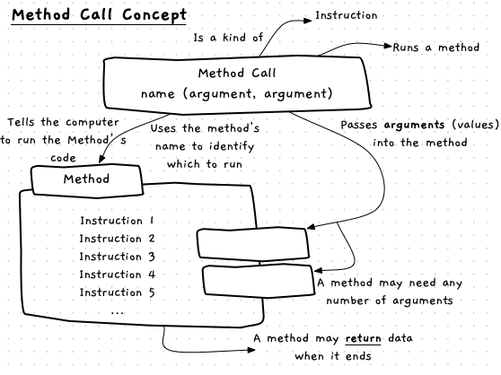
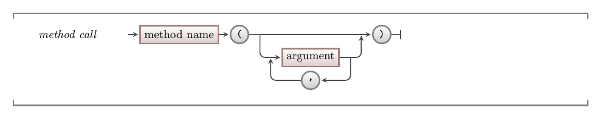

import MySwiper from '../../../../../../components/react/myswiper.jsx';
import Slide1 from './images/method-call-in-depth/Slide1.png';
import Slide2 from './images/method-call-in-depth/Slide2.png';
import Slide3 from './images/method-call-in-depth/Slide3.png';
import Slide4 from './images/method-call-in-depth/Slide4.png';
import Slide5 from './images/method-call-in-depth/Slide5.png';
import Slide6 from './images/method-call-in-depth/Slide6.png';
import Slide7 from './images/method-call-in-depth/Slide7.png';
import Slide8 from './images/method-call-in-depth/Slide8.png';

export const sliderImages = [
  {
    src: Slide1.src,
    altText: "Program is loaded into memory, and ready to run",
    tipStart: 1,
    tips: [
      "The program has been loaded by the operating system and its first instruction is ready to be executed.",
      "Instruction 1 is a method call with three arguments. Each method call has two steps: evaluate and load the arguments, then call the method.",
      "For this call we need to evaluate all three arguments, then execute the method. This means the one instruction (the method call) actually has four steps - a, b, c, and d.",
    ]
  },
  {
    src: Slide2.src,
    altText: "Instruction 1 shows a method call with three arguments",
    tipStart: 5,
    tips: [
      "All arguments are literal values in this call. They need to be loaded into registers 0, 1, and 2, so they are in the CPU when the method starts. The first argument is the string literal \"Random Color\". It is loaded into the first register.",
      "As with sequence before, the instruction counter is incremented as we step through each instruction. So 1a becomes 1b for our visualisation."
    ]
  },
  {
    src: Slide3.src,
    altText: "Evaluate and load arguments 2 and 3",
    tipStart: 7,
    tips: [
      "The second argument is loaded into register 1, then the program counter is incremented to 1c.",
      "At 1c, we load the third argument into register 2. Then, the program counter is incremented to 1d."
    ]
  },
  {
    src: Slide4.src,
    altText: "Save the old program counter so we can resume here when the call is done",
    tipStart: 9,
    tips: [
      "Instruction 1d will now start the method call. There are a few steps at this point that the compiler takes care of, but it is good to see how this works.",
      "First, we need to save the old program counter into memory. When the method returns this will be used to resume the code from where the method was called."
    ]
  },
  {
    src: Slide5.src,
    altText: "Shows the CPU switching into the instructions of the called method",
    tipStart: 11,
    tips: [
      "The code for this method was also loaded into memory when the program started. So to execute the method we can just set the program counter to the address of the first instruction in the Open Window method.",
      "As the program counter is now in Open Windows instructions, those will run in sequence.",
      "By convention, the method arguments are loaded into the CPU registers in order. So, Open Window knows that it can access the title of the window in register 0, its width in register 1, and its height in register 2."
    ]
  },
  {
    src: Slide6.src,
    altText: "Shows the CPU at the end of Open Window's instructions",
    tipStart: 14,
    tips: [
      "At this point, the method has done its work. In this case, a window should have appeared for the user.",
      "The program counter is now up to an instruction telling the computer that the method is finished."
    ]
  },
  {
    src: Slide7.src,
    altText: "Shows the CPU restoring the old program counter from memory",
    tipStart: 16,
    tips: [
      "To get back to the code where the method was called, the compiler reads in the old program counter value from memory."
    ]
  },
  {
    src: Slide8.src,
    altText: "Shows the CPU continuing within the code we wrote",
    tipStart: 17,
    tips: [
      "The first instruction has now been executed, so we add one to the program counter.",
      "We are now onto the next method call.",
      "This method will be executed in the same way: evaluate and load the arguments, then call the method. Again, the value of the program counter will be saved to memory so we can return once the method is finished.",
      "This process will repeat until the program is finished."
    ]
  },
]

A method call is an instruction that gets the computer to run the code in a [method](../02-method). You use the name of the method to identify which method you want to run. Some methods require data, which you must pass as **arguments** to the method as part of the method call.



## Method Call -- when, why, and how

As you have seen, [methods](../03-method) are building blocks that contain instructions that do a task -- sort of like mini-programs. A large part of your code will be calling methods to get them to do things you need done, in the order you need them done.

When you are thinking about calling a method, you need to know what it does, what to give it, and what it will give you back. Writing the code to call a method is then simple: you just provide the name, and a list of values for arguments.

:::note[Method Call]

- Know what the method does
- Know what arguments you need to give it
- Know what it gives you back

:::

The name of a method should help you know what that method does, and the method's documentation will help you understand what you need to provide the method for it to do its job.

### Arguments

When you call a Method, you need to pass a value for each argument. This value can be a [literal](../05-literal) or calculated value known as an [expression](../04-expression).

### Overloading

Languages like C# support something called **overloading**. Overloading lets programmers create multiple methods with the same name but different arguments. Each method with the same name should do the same general action, but provide a different option for the data you can pass in. For example, library might provide two versions of a method to print data to the terminal -- one where you can pass in text, and another where you can pass in a number.

Overloading gives programmers even more flexibility in how they ask the computer to do things. If you look at the [SplashKit documentation](https://splashkit.io/api/) you will see several examples of overloaded methods. So make sure to pay attention to which version of a method you want to call, and the arguments you will need to pass for that version.

### Method Calls and Sequence

Method calls are one instruction that gives you control of the **program counter**. A method call will save the current state of your program, and then set the program counter to the first instruction within the method. The sequence will then progress through the method, and when it ends, the location of the next instruction after the method call will be put into the program counter. In this way, the method is called and then **returns** to where it was called from. This allows us to maintain our focus on **sequence**. A method call lets you *direct* the sequence into the method and then back to your next instruction. As you read, design, or work with code for your program, you can focus on the program's **sequence** and not worry about what happens within the methods you call.

## In C#

A method call allows you to run the code in a [method](../02-method), getting its instructions to run before control returns to the point where the method was called.

:::tip[Syntax]
A method call looks like a single instruction in your source code.
The C# syntax for one is structured like this:


:::

A method call consists of a method's name followed by an opening parenthesis, zero or more arguments (delimited by commas), a closing parenthesis, then a semicolon.

## Examples

### Basic Example

The code below contains a C# program with four method calls. Each method call runs the `WriteLine` method to output text to the terminal.

The method call starts with the method's name that indicates the method to be called is `WriteLine`.
Following the identifier is a list of values within parenthesis.
These are the arguments passed to the method for it to use.

As the `WriteLine` method comes from the C# library `System.Console`, this example program starts with a [using directive](../00-program/#in-c) to tell the compiler to look in the `System.Console` library for any methods that are called.
Remember that programs run in [sequence](../01-sequence.mdx), so we need to provide this directive *before* writing any code that calls a method from this library.
This is why it is convention to put using directives at the start of a program's source code.

:::caution
C# is case sensitive so using `writeLine` instead of `WriteLine` will not work.
:::

```csharp
using static System.Console;

WriteLine("Count back from 2...");
WriteLine(2);
WriteLine(1);
WriteLine(0);
```

### SplashKit Example

The following code uses three different methods from the [SplashKit](https://splashkit.io) library. You can see the details for these on the [methods page](../02-method#examples), but the names should give you a good idea of what this does.

```csharp
using static SplashKitSDK.SplashKit;

DownloadSoundEffect("hello", "https://programmers.guide/hello.ogg", 443);
PlaySoundEffect("hello");
Delay(5000);
```

All of the arguments in this code are using literal values.

**TODO Add file to website and adjust url**

### Example using result

Some methods return data, which you can use within any calculated value ([expression](../04-expression)) within your code. The following code demonstrates the use of the values returned by the `RandomColor` and `Rnd` methods.

```csharp
using static SplashKitSDK.SplashKit;

OpenWindow("Random Color", 800, 600);
ClearScreen(RandomColor());
RefreshScreen();
Delay(1000 * Rnd(10));
```

Line 4 demonstrates the use of the result from calling `RandomColor` within the call to `ClearScreen`. In this case, the value returned from the `RandomColor` method becomes the value for the argument passed to `ClearScreen`. As you would expect, this will clear the screen to a random color.

Line 6 demonstrates this again, where the result of `1000 * Rnd(10)` is passed to `Delay`. The easiest way to approach this is to consider each value independently. `Rnd(10)` will return a random value between 0 and 10 -- let us imagine this returns `6`. In this case, `1000 * Rnd(10)` would become `1000 * 6`, as the value **returned** by `Rnd(10)` was `6`. This is then evaluated, and `Delay` will be passed the argument `6000`, causing it to delay for 6 seconds.

## Method Calls Up Close

Review the following images to explore how method calls work within the computer.

<MySwiper client:only height="" images={sliderImages}></MySwiper>

:::note[Summary]

- A method call is an **instruction** that commands the computer to run the code in a method.
- Use a method's name to identify the method to run.
- Data values passed to a method are called **arguments**. These are put between parentheses after the method name.
- When a method’s task is complete the program continues with the next instruction after the method call.

:::
