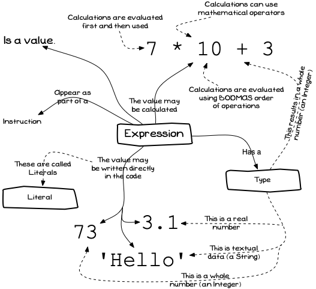

Some instructions need data, which can be calculated or provided as a literal value. The term **expression** is used in programming to describe any code that represents a value. Expressions are used wherever data must be supplied in code. When a program runs, each expression is **evaluated** to become a single value that can be used by an instruction.

The concepts related to expressions are shown in [Figure 5.6](#FigureExpression).

Figure 5.6:  An expression provides a <strong>value</strong> to be used in an instruction.
 

## Expressions - why, when, and how

Whenever an instruction needs data, an expression is needed to provide it. This lets you put whatever data you want in that instruction. Data can be hard-coded as a [literal](../05-literal), use [variables](../07-variable), and contain mathematical operators to calculate a value.

When you code an expression, you need to think about the value you need and how you can get it. You could provide a fixed value using a literal, read a value stored in a variable, or combine values with standard mathematical operators. If you are unsure, draw out the details you have on paper and think through how you can calculate the value you need.

If you do not have the details you need, you may need to think about adding extra variables to capture these values when they are available. You can then use them to get the value you need.

## In C#

An expression is used to define a value.
If a literal value is given, the computer doesn't need to do anything.
However, if an expression uses mathematical operations, the computer will evaluate the expression to a single value.

Table 5.1 lists the operators that you can include in expressions in [order of precedence](https://en.wikipedia.org/wiki/Order_of_operations). The operators you can use in any specific expression depend on the kind of data that you are using.
For example, it does not make sense to use the division operator on text data, so C# will return an error if you try to do this in your code.

| **Operator** | **Description**                          | **Example**    |
---------------|------------------------------------------|----------------|
|      ( )     | Parenthesis                              |  `(1 + 1) * 2` |
|     % * /    | Modulo[a](#FootnoteOperators), multiplication, and division |  `1 / 2 * 5 % 3` |
|      + -     | Addition and subtraction                 |  `10 + 3 - 4` |

a The remainder after division. For example, 9 modulo 3 is 0, 10 modulo 3 is 1, 11 modulo 3 is 2, 12 modulo 3 is 0, and so on.

Table 5.1:  C# Operators and Example Expressions
 

## Examples

Table 5.2 shows some example expressions and the value they evaluate to in C#.
Some of these examples are literal values, and others use mathematical calculations.
Have a look at the table, and note down anything that surprises you.
If you are confused about the last row, remember that C# will follow the [BOMDAS order of operations](https://en.wiktionary.org/wiki/BOMDAS#:~:text=English-,Phrase,division%2C%20then%20addition%20and%20subtraction).

| **Example Expression**    | **Value**                               |
|---------------------------|-----------------------------------------|
| 73                        | 73                                      |
| 2.1                       | 2.1                                     |
| "Hello World"             | "Hello World"                           |
| "Fred"                    | "Fred"                                  |
| 3 * 2                     | 6                                       |
| 1 + 3 * 2                 | 7                                       |
| (1 + 3) * 2               | 8                                       |
| 7 - 3 + 1                 | 5                                       |
| 3 / 2                     | 1[b](#FootnoteExpressions)   |
| 3 / 2.0                   | 1.5[c](#FootnoteExpressions) |
| 3.0 / 2.0                 | 1.5                                     |
| 3 % 2                     | 1                                       |
| 11 % 3                    | 2                                       |
| 1 + (3 / 2.0) + 6 * 2 - 8 | 6.5                                     |

b C# does <a href="https://mathworld.wolfram.com/IntegerDivision.html">integer division</a> when none of the values in an expression contain decimal places. 
c If any of the values in an expression have decimal places, the value the expression evaluates to does as well.

Table 5.2: Example C# Expressions and their values
 

:::tip[When to use quotes]
The convention when describing data is to use double quotes `"` around text, and nothing around regular numbers.
This helps to avoid confusion -- `3` means the number 3, and `"3"` means the text 3.
:::

## Activities

What values do the following expressions evaluate to?

1. `2`
2. `"Learning is fun"`
3. `5 + 3`
4. `16 * 2`
5. `7 / 2`
6. `7 / 2.0`
7. `10 - (1 + 2) * 3`

  
Answers

  <ul>
    <li><strong>1:</strong><code>2</code></li>
    <li><strong>2:</strong><code>"Learning is fun"</code></li>
    <li><strong>3:</strong><code>8</code></li>
    <li><strong>4:</strong><code>32</code></li>
    <li><strong>5:</strong><code>3</code>. There are no numbers with decimal places in this expression, so C# will use integer division.</li>
    <li><strong>6:</strong><code>3.5</code>. C# won't use integer division here because one of the values in the expression does have a decimal place, even if that decimal value is 0!</li>
    <li><strong>7:</strong><code>1</code>. Order of operations means that C# will evaluate the brackets first, then the multiplication, then the subtraction.</li>
  </ul>

:::note[Summary]

- An expression is a term given to code that **calculates a value**.
- An expression can be used anywhere a value is needed by an instruction.
- An expression’s can use **literal** values and calculations.
- A literal value on its own is a valid expression.
- Calculations can use mathematical operators: `+` for addition, `-` for subtraction, `*` for multiplication, `/` for division, and parenthesis `( )` for grouping.
- The computer **evaluates** an expression to determine its value.
- Expressions are evaluated using the [BOMDAS order of operations](https://en.wiktionary.org/wiki/BOMDAS#:~:text=English-,Phrase,division%2C%20then%20addition%20and%20subtraction).

:::
