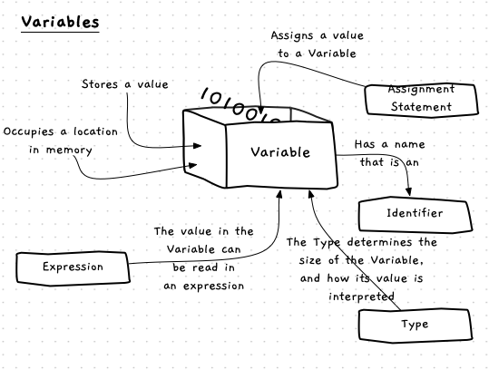
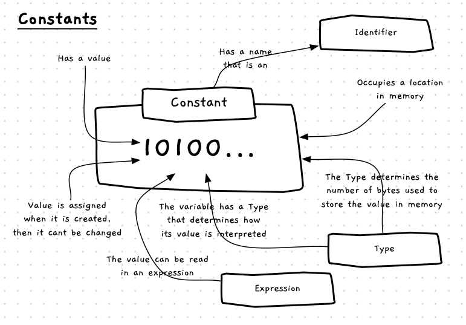
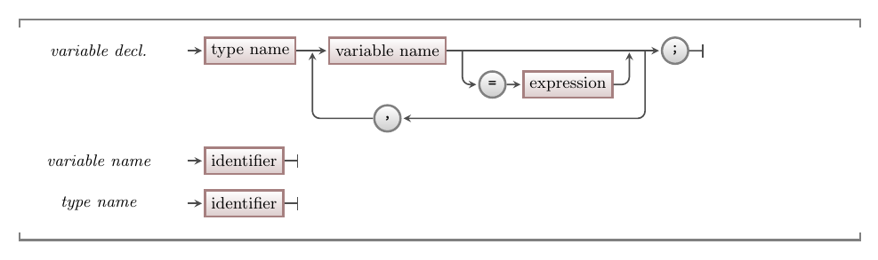
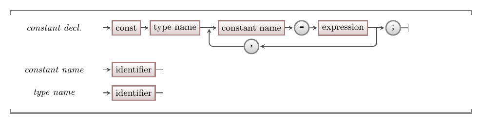

While fixed literal values are useful, to make programs dynamic you need to be able to work with values that change.

A **variable** is a **building block** you can use to store a value that you can change as the program runs. You can picture a variable as a **container** into which you can store a value and retrieve it later.



<div class="caption"><span class="caption-figure-nbr">Figure 5.17:</span>Variables store a value that can be read and changed</div><br/>

## Variables -- why, when, and how

Variables are an invaluable tool to help you build digital realities.
They allow you to capture simple values, associate them with a name -- the variable's **identifier** -- and change the value within your code.
You can also use the variable to retrieve (i.e., read) the value it contains.

Whenever you have information in your program that you want to be able to change, you create a variable to store it. Every variable has a [data type](../06-type), which needs to match the kind of data you want to store.
After you define a variable with an **identifier** and [**data type**](../06-type), you need to **initialise** it with a starting value.
Then, you can then read the current value and store new values in the variable as the program runs and the information the variable represents changes.

## Constants

A **constant** is similar to a variable, in that they have a name and a data type. Constants are declared within a program and must be given a value when they are created. However, they differ from a variable because once they are created the value within a constant cannot be changed. This is useful for data that should not change during the program's execution.


<div class="caption"><span class="caption-figure-nbr">Figure 5.13: </span> Constants have a value that cannot be changed</div><br/>

## Constants -- why, when, and how

*Literals are values that are fixed within the code, so why do we need constants?*

With programming, the biggest challenge is making sure your code is **understandable**. Scattering your program with literal values becomes confusing very quickly. When you see a value like `10` in code it doesn't mean much, and potentially could represent anything. There will often be lots of these values that are easy to lose track of. Using a constant lets you name the value, which gives it meaning. When you see `MAX_ITEMS` in the code instead of `10`, you are reminded of its meaning.

Another advantage of using a constant is that you can change the value in one place. If you want to change the maximum number of items in your pack from 10 to 42, you change it in one place. Updating the value of the constant means that everywhere that reads it will get the new value.

## In C#

:::tip[Syntax]

<div class="caption"><span class="caption-figure-nbr">Figure 5.18: </span>The syntax for variable declarations in C#</div><br/>


<div class="caption"><span class="caption-figure-nbr">Figure 5.18: </span>The syntax for constant declarations in C#</div><br/>
:::

Variable and constant declarations use almost identical syntax in C#, shown in Figure 5.18. The main difference between a variable and a constant is the `const` keyword at the start of the declaration. If you include `const`, you are creating constants. Without it, you are creating variables.

Both variables and constant declarations need to include the [type](../06-type) of data you want to store.Then, you provide a name (identifier) for the variable or constant.
A variable can optionally be given a value when it is declared, but a constant must be given a value.
You can also declare multiple variables or constants in the one line of code, as long as they are of the same data type.

By convention, all constants should have an **UPPERCASE** name. Where the name has multiple words, separate them with underscores (`_`). For example: `MAX_ITEMS`.
Variables should have a **camelCase** name, where the first letter is lowercase but each new word in the identifier starts with an uppercase character. For example, `bottleVolume`.

## Examples

### Basic Example

In this program, we want to capture the user's name and greet them using it. We need a variable for the name, as it may change each time the program runs. Within the program, the variable will represent the name of the user.

```csharp
using static System.Console;

string name;

WriteLine("Welcome to The Greeting");
WriteLine();
WriteLine("What is your name?")
Write("name: ");
name = ReadLine();

WriteLine();
WriteLine("Hello " + name);
```

<div class="caption"><span class="caption-figure-nbr">Listing 5.14: </span>Example program with variable declaration</div>

The next example will help us calculate the volume of our water bottles, assuming they are cylinders. To achieve this, we need the following variables:

- A `PI` constant for the calculation.
- Numbers for `radius` and `height` which the user will enter.
- A string `line` to store the text the user enters before we convert it to a number.
- Numbers for `bottleVolume` and `litres` to store calculated values.

```csharp
using static System.Console;
using static System.Convert;

const double PI = 3.1415;
double radius, height;
string line;
double bottleVolume, litres;

WriteLine("Water Bottle Volume");
WriteLine();
WriteLine("Enter the radius and height of the bottle in centimeters");

Write("radius: ");
line = ReadLine();
radius = ToDouble(line);

Write("height: ");
line = ReadLine();
height = ToDouble(line);

bottleVolume = PI * radius * radius * height;

litres = bottleVolume / 1000;

WriteLine();
WriteLine($"Volume { bottleVolume } cm^3");
WriteLine($"       { litres } litres");
```

:::tip
Notice how the names of the variables help us understand how the program works. In this, we are building the things we need in the digital reality that exists as the program runs.

Adding in additional line breaks also helps group the steps in our code to make it more readable.
:::

### Circle Drawing Example

Let's use SplashKit to look how variables can be used in a graphical program. The following program captures a radius for a circle and uses that to draw to the screen. To achieve this we need two variables, `line` and `radius`. We use `ReadLine` to read a `string` from the user, and `ConvertToDouble` to convert the text read into a `double` value. This value is stored in the `radius` variable, which can then be used in the call to `FillRadius`.

```csharp
using static System.Convert;
using static SplashKitSDK.SplashKit;

const double SATURATION = 0.8;
const double BRIGHTNESS = 0.8;

string line;
int radius;
double hue;

WriteLine("Welcome to Circle Drawer!");
WriteLine();
WriteLine("Enter the radius of the circle to draw. (a whole number)");

// Read value from the user and conver to double for radius
Write("Circle radius: ");
line = ReadLine();
radius = ToInt32(line);

// Read value from the user and conver to double for hue
WriteLine("What color? Enter hue between 0 to 1");
Write("Hue: ");
line = ReadLine();
hue = ToDouble(line);

// Draw scene and delay
OpenWindow("Circle Drawing", 800, 600);
ClearScreen(ColorWhite());
FillCircle(HSBColor(hue, SATURATION, BRIGHTNESS), 400, 300, radius);
RefreshScreen();
Delay(5000);
```

<!-- ## Activities -->
<!-- [TODO] -->

:::note[Summary]

- Variables and constants are **building blocks** you can create to store values in your programs.
- You can think of a variable or constant as a box. The variable or constant is the box, and its value is stored within it.
- Each variable and constant has a ...
  - **name** (identifier) that can be used to refer to it.
  - **type** that determines its size and how its value is interpreted.
  - **value** that it is storing.
- The first time you assign a value to a variable or constant, you are **initialising** it.
- Constants are just like variables, but you can only assign them a value once, when they are created.
- You can **read** the value from variables and constants in your instructions.
- A variable **is not** its value -- it is a container that stores a value, but its value can change over time as you write new values into the variable.

:::
