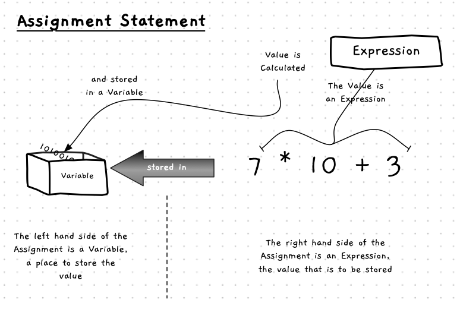
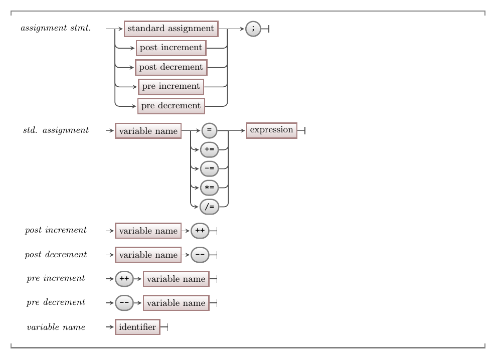

import MySwiper from '../../../../../../components/react/myswiper.jsx'

import Slide1int from './images/assignment-statements-in-depth/assignment-statement-int-division-01.png';
import Slide2int from './images/assignment-statements-in-depth/assignment-statement-int-division-02.png';
import Slide3int from './images/assignment-statements-in-depth/assignment-statement-int-division-03.png';
import Slide4int from './images/assignment-statements-in-depth/assignment-statement-int-division-04.png';
import Slide5int from './images/assignment-statements-in-depth/assignment-statement-int-division-05.png';
import Slide6int from './images/assignment-statements-in-depth/assignment-statement-int-division-06.png';
import Slide7int from './images/assignment-statements-in-depth/assignment-statement-int-division-07.png';
import Slide8int from './images/assignment-statements-in-depth/assignment-statement-int-division-08.png';
import Slide9int from './images/assignment-statements-in-depth/assignment-statement-int-division-09.png';
import Slide10int from './images/assignment-statements-in-depth/assignment-statement-int-division-10.png';
import Slide11int from './images/assignment-statements-in-depth/assignment-statement-int-division-11.png';
import Slide12int from './images/assignment-statements-in-depth/assignment-statement-int-division-12.png';
import Slide13int from './images/assignment-statements-in-depth/assignment-statement-int-division-13.png';
import Slide14int from './images/assignment-statements-in-depth/assignment-statement-int-division-14.png';
import Slide15int from './images/assignment-statements-in-depth/assignment-statement-int-division-15.png';
import Slide16int from './images/assignment-statements-in-depth/assignment-statement-int-division-16.png';
import Slide17int from './images/assignment-statements-in-depth/assignment-statement-int-division-17.png';
import Slide18int from './images/assignment-statements-in-depth/assignment-statement-int-division-18.png';


import Slide1double from './images/assignment-statements-in-depth/assignment-statement-double-division-01.png';
import Slide2double from './images/assignment-statements-in-depth/assignment-statement-double-division-02.png';
import Slide3double from './images/assignment-statements-in-depth/assignment-statement-double-division-03.png';
import Slide4double from './images/assignment-statements-in-depth/assignment-statement-double-division-04.png';


export const sliderImagesAssignInt = [
  {
    src: Slide1int.src,
    altText: "Assignment for integer division",
    tipStart: 1,
    listType: "ol",
    tips: [
      "The program is loaded into memory and the program counter is set to instruction 1"
    ]
  },
  {
    src: Slide2int.src,
    altText: "The variable quotient is allocated memory on the stack",
    tipStart: 2,
    listType: "ul",
    tips: [
      "Instruction 1 runs and the variable 'quotient' is allocated memory on the stack"
    ]
  },
  {
    src: Slide3int.src,
    altText: "1 is added to the program counter - it is now at instruction 2. Instructions on line 1 are now finished... line 2 is about to start",
    tipStart: 3,
    listType: "ul",
    tips: [
      "1 is added to the program counter - it is now at instruction 2",
      "Instructions on line 1 are now finished... line 2 is about to start"
    ]
  },
  {
    src: Slide4int.src,
    altText: "Line 2 also allocates memory on the stack for the two variables 'dividend' and 'divisor'",
    tipStart: 4,
    listType: "ul",
    tips: [
      "Line 2 also allocates memory on the stack for the two variables 'dividend' and 'divisor'"
    ]
  },
  {
    src: Slide5int.src,
    altText: "1 is added to the program counter again - line 2 is done, line 3 is starting",
    tipStart: 5,
    listType: "ul",
    tips: [
      "1 is added to the program counter again - line 2 is done, line 3 is starting"
    ]
  }
  ,
  {
    src: Slide6int.src,
    altText: "Line 3 is an assignment - it involves evaluating the expression (3a) and saving the result (3b). These involve distinct instructions, but we will update the program counter with letters",
    tipStart: 6,
    listType: "ul",
    tips: [
      "Line 3 is an assignment - it involves <span class='boldunderline'>evaluating</span> the expression (3a) and <span class='boldunderline'>saving</span> the result (3b)",
      "These involve distinct instructions, but we will update the program counter with letters"
    ]
  }
  ,
  {
    src: Slide7int.src,
    altText: "Instruction 3a will evaluate the right-hand side...to evaluate - 21 is loaded into the CPU - the compiler decided to put it in register 1",
    tipStart: 7,
    listType: "ul",
    tips: [
      "Instruction 3a will evaluate the right-hand side...",
      "...to evaluate - 21 is loaded into the CPU - the compiler decided to put it in register 1"
    ]
  }
  ,
  {
    src: Slide8int.src,
    altText: "1 is added to the program counter... but we will call it '3b'",
    tipStart: 8,
    listType: "ul",
    tips: [
      "1 is added to the program counter... but we will call it '3b'"
    ]
  }
  ,
  {
    src: Slide9int.src,
    altText: "3b saves the result of the expression to 'dividend'. The value is in Register 1, 3b copies it to memory. So 21 is saved to the location of the dividend variable",
    tipStart: 9,
    listType: "ul",
    tips: [
      "3b saves the result of the expression to 'dividend'",
      "The value is in Register 1, 3b copies it to memory",
      "So 21 is <span class='boldunderline'>saved</span> to the location of the dividend variable"
    ]
  }
  ,
  {
    src: Slide10int.src,
    altText: "The last step of the instruction on line 3... add one to the program counter... on to line 4!",
    tipStart: 10,
    listType: "ul",
    tips: [
      "The last step of the instruction on line 3... add one to the program counter... on to line 4!"
    ]
  }
  ,
  {
    src: Slide11int.src,
    altText: "Line 4 is also an assignment - and again involves evaluating the expression (4a) and saving the result (4b)",
    tipStart: 11,
    listType: "ul",
    tips: [
      "Line 4 is also an assignment - and again involves <span class='boldunderline'>evaluating</span> the expression (4a) and <span class='boldunderline'>saving</span> the result (4b)"
    ]
  }
  ,
  {
    src: Slide12int.src,
    altText: "Let's run through it quickly: 4a: loads 4 into Register 1 (replacing the old value 21). 4b: save the result (in Register 1) into the 'divisor' variable on the stack memory. 4c: The program counter is incremented to line 5",
    tipStart: 12,
    listType: "ul",
    tips: [
      "Let's run through it quickly:<ul><li>4a: loads 4 into Register 1 (replacing the old value 21)</li><li>4b: save the result (in Register 1) into the 'divisor' variable on the stack memor</li><li>4c: The program counter is incremented to line 5</li></ul>"
    ]
  }
  ,
  {
    src: Slide13int.src,
    altText: "How does the division operator work? Again, remember, assignment = two actions: evaluate (the right hand side expression) and save (into the left hand variable). For division, evaluate will need a few actions - Load the variables (5a and 5b) and do the division (5c)",
    tipStart: 13,
    listType: "ul",
    tips: [
      "How does the division operator work?",
      "Again, remember that assignment = two actions: <span class='boldunderline'>evaluate</span> (the right hand side expression) and <span class='boldunderline'>save</span> (into the left hand variable)",
      "For division, the <span class='boldunderline'>evaluate</span> part will need a few actions - Load the variables (5a and 5b) and do the division (5c)"
    ]
  }
  ,
  {
    src: Slide14int.src,
    altText: "Let's consider 5a and 5b in the same step - 5a: Load the divisor value (4) into Register 1. 5b: Load the dividend value (21) into Register 2",
    tipStart: 14,
    listType: "ul",
    tips: [
      "Let's consider 5a and 5b in the same step <ul><li>5a: Load the divisor value (4) into Register 1</li><li>5b: Load the dividend value (21) into Register 2</li></ul>"
    ]
  }
  ,
  {
    src: Slide15int.src,
    altText: "The CPU does the division (Register 1 / Register 2). This is integer division, so 21/4 = 5. The result of this instruction is stored in it's own register (Register 3 here)",
    tipStart: 15,
    listType: "ul",
    tips: [
      "The CPU does the division (Register 1 / Register 2)",
      "This is integer division, so 21/4 = 5",
      "The result of this instruction is stored in it's own register (Register 3 here)"
    ]
  }
  ,
  {
    src: Slide16int.src,
    altText: "Step 5d is the save part of the assignment. The result is in Register 3 - so it is saved to the 'quotient' variable in the stack memory. Assignment done... add one to the program counter !",
    tipStart: 16,
    listType: "ul",
    tips: [
      "Step 5d is the <span class='boldunderline'>save</span> part of the assignment",
      "The result is in Register 3 - so it is saved to the 'quotient' variable in the stack memory",
      "Assignment done... add one to the program counter !"
    ]
  }
  ,
  {
    src: Slide17int.src,
    altText: "Argh... lots of steps here ! We must evaluate the argument to pass to WriteLine. 6a: Load dividend 6b: Convert to string 6c: Load '/' 6d: Append 6e: Load divisor 6f: Convert to string 6g: Append 6h: Load '=' 6i: Append 6j: Load quotient 6k: Convert to string 6l: Append. Result is '21/4=5'. Result passed to WriteLine(k) which outputs it to the terminal",
    tipStart: 17,
    listType: "ul",
    tips: [
      "Argh... lots of steps here !",
      "We must evaluate the argument to pass to WriteLine:<ul><li>6a: Load dividend</li> <li>6b: Convert to string</li> <li>6c: Load '/'</li> <li>6d: Append</li> <li>6e: Load divisor</li> <li>6f: Convert to string</li> <li>6g: Append</li> <li>6h: Load '='</li> <li>6i: Append</li> <li>6j: Load quotient</li> <li>6k: Convert to string</li> <li>6l: Append.</li></ul>",
      "Result is '21/4=5'",
      "Result passed to WriteLine(k) which outputs it to the terminal"
    ]
  }
  ,
  {
    src: Slide18int.src,
    altText: "The procedure call ends, so we add one to the program counter... ending our program",
    tipStart: 18,
    listType: "ul",
    tips: [
      "The procedure call ends, so we add one to the program counter... ending our program"
    ]
  }
];


export const sliderImagesAssignDouble = [
  {
    src: Slide1double.src,
    altText: "Assignment for a division stored in a double.",
    tipStart: 1,
    tips: [
      "How does the assignment operator work when the result is to be stored in a double instead of an int? <br>&nbsp; <span class='fa fa-arrow-right'></span> &nbsp; Let's change the type of the variable that stores the result of the division ('quotient') from an int to a double.",
      "Remember, the assignment operator ('=') implies two actions: <ul><li><span class='boldunderline'>evaluate</span> the right hand side expression (5a,5b,5c) and</li> <li><span class='boldunderline'>save</span> the result of the evaluation into the variable on the left hand side (5d).</li></ul>"
    ]
  },
  {
    src: Slide2double.src,
    altText: "The right hand.",
    tipStart: 3,
    tips: [
      "To <span class='boldunderline'>evalulate</span> the right hand side expression, the CPU needs to first <span class='boldunderline'>load</span> the dividend and divisor from the stack into the registers (5a, 5b), then perform the <span class='boldunderline'>division</span> (5c)",
      "To perform the <span class='boldunderline'>division</span> (5c):<ul><li>The cpu calculates register 1 / register 2</li><li>Although the divisor and dividend are both integers, the result is to be stored in a double, and so the CPU stores the result as a double in a register (register 3)</li><li>The double value 5.25 represents the final evaluation of the right hand side expression.</li></ul>"
    ]
  },
  {
    src: Slide3double.src,
    altText: "The result of the evaluation of the right hand side, is saved into the variable on the left hand side of the assignment operator.",
    tipStart: 5,
    tips: [
      "The final part of the assignment statement is to save the result of the evaluation of the right hand side expression, into the variable on the stack ('quotient') (5d)"
    ]
  },
  {
    src: Slide4double.src,
    altText: "the CPU increments the program counter ready for the next instruction",
    tipStart: 6,
    tips: [
      "Once the assignment is done, the CPU increments the program counter ready for the next instruction."
    ]
  }
];

The Assignment Statement is an **instruction** that stores a value in a [Variable](../12-variable). You use this instruction any time you want to update the value of a variable.
<br/>
<a id="FigureAssignmentStatement"></a>



<div class="caption"><span class="caption-figure-nbr">Figure 5.19: </span> A Assignment Statements assign values to Variable</div> <br/>

The assignment statement performs two actions. First, it calculates the value of the expression (calculation) on the right-hand side of the assignment operator (the `=`). Once it has the value, it stores the value (assigns it) to the variable on the left-hand side of the assignment operator.

## Assignment statement up close

### Assigning an int division result to an int variable

<MySwiper client:only height="" images={sliderImagesAssignInt}></MySwiper>

### Assigning an int division result to a double variable

<MySwiper client:only height="" images={sliderImagesAssignDouble}></MySwiper>

## Assignment Statement - why, when, and how

When you create a variable, you have identified a value that you want to be able to change as the program runs. The **assignment statement** lets you store a value in the variable. When designing your program, you can use the assignment statement to store updated values for your variables as they change.

For example, you can decide to ask the user for their name. You need a variable to store the value, and the assignment statement lets you read a response from the user and store the result in a variable. In this case, the **right-hand side** of the assignment would be a call to `ReadLine`, which reads input from standard in and returns it to you. In this case, the assignment statement would allow you to store that value in a `name` variable, for example, which you can use later whenever you want to refer to the user's name.

```csharp
using static System.Console;

// Declare a variable - somewhere we can store a string
string name;

Write("Enter your name: ");

// Assign a value to name
//
// name is the left-hand side - where to store the value
// |
// |    ReadLine() is the right-hand side. It is called
// |      |        to get the value to assign to name
// v      v
name = ReadLine();
```

It is important to remember this has **2 actions**:

1. Calculate the value on the right-hand side
2. Store it in the variable on the left-hand side.

This means you can update the value of a variable. For example:

```csharp
using static System.Convert;
using static System.Console;

string line;
int count;

Write("What is the start count: ");

// Read in a line from the user
line = ReadLine();

// Initialise the count to a user provided value.
count = ToInt32(line);

WriteLine($"Count is {count}");

// Add one to count
//
// count is the left-hand side - where to store the value
// |
// |    count + 1 is calculated first...
// |      |
// v      v
count = count + 1;

WriteLine($"After count = count + 1... count is now {count}");

// We can use shorthand to do this too
//
// count is the left-hand side - where to store the value
// |
// |  This means... count = count + 5
// |  |
// v  v
count += 5;

WriteLine($"After count += 5... count is now {count}");

// We can make this shorter for + 1
//
// count is the left-hand side - where to store the value
// |
// | This means... count = count + 1
// | |
// v v
count++;

WriteLine($"After count += 5... count is now {count}");

```

The following shows the output if you run this at the Terminal and enter **17** as the start count. The different shorthand assignments aim to help you with the common operations of updating a variable based on its current value. The example shows the use of `+=` and `++` and there are the equivalent versions for subtraction (`-=` and `--`) and for multiplication and division (`*=` and `\=`).

```bash
What is the start count: 17
Count is 17
After count = count + 1 ... count is now 18
After count += 5 ... count is now 23
After count++    ... count is now 24
```

You do not always need to store values in variables. Sometimes you can just use the value and then forget it. For example, in the above code, we read the initial count from the user. This requires us to read it as text, and then convert that text to a number. Given then we do not ever use the details in `line` again, we do not need to create this variable in the first place. Instead, we could pass the value to the convert function directly as shown below.

```csharp
using static System.Convert;
using static System.Console;

int count;

Write("What is the start count: ");

// Initialise the count to a user provided value.
//
//       Instead of storing in line and using it here, we can call
//       ReadLine and pass its result to ToInt32 directly.
//               |
//               v
count = ToInt32(ReadLine());

//... the rest of the code would be the same
```

## In C#

:::tip[Syntax]

- The C# syntax for an assignment statement is shown in [Figure 5.x](#FigureAssignmentStatementSyntax) below
- In C# assignment is indicated by the equals sign ( = ).
- The left-hand side of the assignment must be a valid variable, this is where the value is to be stored.
- The right-hand side of the assignment is an expression. It calculates the value that will be stored in the variable.
- There are multiple versions of the assignment, giving short-hand ways of using the current value.
  - `=` is the standard assignment, this stores the value of the expression in the Variable.
  - `+=` increments the variable’s value, where `a += n;` is equivalent to `a = a + n`
  - `-=` decrements the variable’s value, where `a -= n;` is equivalent to `a = a - n`
  - `*=` multiplies the value in the variable by a given factor, where `a *= n;` is equivalent to `a = a * n`
  - `/=` divides the value in the variable by a factor, where `a /= n;` is equivalent to `a = a / n`
- The `++` and `--` operators allow you to add or remove one from a variable's current value.


<a id="FigureAssignmentStatementSyntax"></a>


<div class="caption"><span class="caption-figure-nbr">Figure 5.x: </span>The syntax for an assignment statement</div><br/>

:::

## Examples

See [Listing 5.x](#ListingAssignmentStatement) below for an example assignment statements.

<a id="ListingAssignmentStatement"></a>

```csharp
#include "splashkit.h"
/* Program: assignment_tests.cs 
 * Demonstrates assignment to a variable
 */

int my_data = 10, days_in_month, days_remaining;

WriteLine($"my_data_is {my_data}");

my_data = my_data + 1; // add 1 to my_data and store in my_data
WriteLine($"my_data_is {my_data}");

my_data++; // add 1 to my_data and store in my_data
WriteLine($"my_data_is {my_data}");

my_data *= 2; // double my_data and store in my_data
WriteLine($"my_data_is {my_data}");

days_in_month = 365 / 12; // assign days_in_month a calculated value
WriteLine($"On average there are {days_in_month} days in a month.");

// assign days_remaining a calculated value
days_remaining = 365 - days_in_month * 12;
WriteLine($"The remaining {days_remaining} days are distributed to a few months");
```

<div class="caption"><span class="caption-figure-nbr">Listing 5.x: </span>Assignment Tests</div>

## Activities

[TODO]

:::note[Summary]

- An assignment statement is an **instruction** you can get the computer to perform.
- The _right-hand side_ of the assignment is used to calculate the value to be stored.
- The _left-hand side_ of the assignment is a **[variable](../12-variable)** into which the value is stored.
- When the assignment statement is executed the expression is evaluated first, and then the resulting value is stored in the variable.
- It's important to remember that the variable is a location to store a value.
- When the variable appears on the left-hand side of an assignment it is used to store the resulting value. If the variable appears on the right-hand side its value is being used as part of the calculation.

:::
