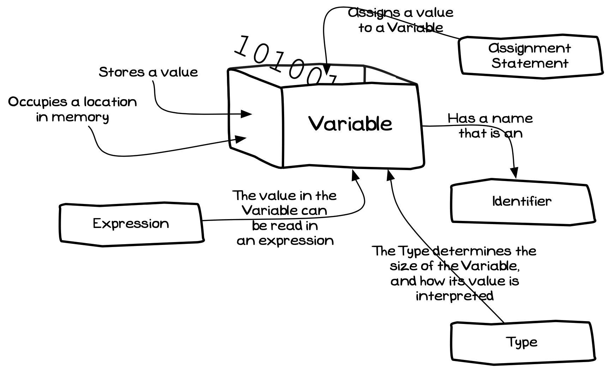

While fixed values are useful, to make programs dynamic you need to be able to work with values that change.

A **variable** is a **building block** you can use to store a value that you can change and read as the program runs.  You can picture a variable as a **container** into which you store a value and retrieve it later.

<a id="FigureVariable"></a>



<Caption><FigureText>Figure 5.17: </FigureText>Variables store a value that can be read and changed</Caption><br/>

## Variables - why, when, and how

A variable allows you to store a value that represents something in your code. You can change the value as that *thing* changes, and read the value when it is needed. When you have something you want to be able to change, you create a variable to store this. The type of the variable needs to match the kind of data you want to store.

You need to initialise the variable with a starting value, and you can then read and store new values within the variable as the program runs and the *thing* the variable represents changes.

This is where you start to build your digital reality. Within this reality, you can capture simple values and change these within your code.

## Constants

A **constant** is just like a variable, but its value cannot be changed. Constants are declared within a program and must be given a value when they are created. Once they are created, the value within the constant cannot be changed. This is useful for data that should not change during the program's execution.

<a id="FigureConstant"></a>


<div class="caption"><span class="caption-figure-nbr">Figure 5.13: </span> Constants have a value that cannot be changed</div><br/>

## Constants - why, when, and how

*Literals are values that are fixed within the code, so why do we need constants?*

With programming, the biggest challenge is making sure your code is **understandable**. Scattering your program with literal values becomes confusing very quickly. When you see a value like *10* in the code it doesn't mean much - and potentially could represent anything. There will often be lots of these values that are easy to lose track of. Using a **constant** lets you name the value - giving it meaning. When you see `MAX_ITEMS` in the code, you are reminded of its meaning.

Another advantage of using a set constant is that you can change the value in one place. If you want to change the maximum number of items in your pack from 10 to 42, you change it in one place. Updating the value of the constant means that everywhere that reads it will get the new value.

## In C#

Variable and constant declarations can be described at the same time. [Figure 5.18](#FigureVariableSyntax) shows the syntax for creating a variable or constant in C#. The difference between a variable and a constant is the `const` keyword at the start of the declaration. If you include `const`, you are creating constants. Without it, you are creating variables.

:::tip[Syntax]

- This is the C# Syntax for creating variables and constants.
- Add the `const` keyword to the start, to create constants.
- Next, the [Type](../06-type) indicates the kind of data the constants or variables will store.
- Following the type is a list of the names (identifiers) for the variables or constants you are creating.
- You can create one or more variables/constants in a single declaration, all with the same type.
- Each variable can be assigned a value when it is declared, and constants need to be given their value.
- By convention, all constants should have an **UPPERCASE** name. Where the name has multiple words, separate them with underscores (`_`). For example: `MAX_ITEMS`.
- Variables should have a **camelCase** name - where the first letter is lowercase, but each new word in the identifier starts with an uppercase character. For example, `bottleVolume`.

<a id="FigureVariableSyntax"></a>


<div class="caption"><span class="caption-figure-nbr">Figure 5.18: </span>The syntax for C# variable declarations</div><br/>

:::

## Examples

### Basic Example

In this program, we want to capture the user's name and greet them using it. We need a variable for the name, as it may change each time the program runs. Within the program, the variable will represent the name of the user.

```csharp
using static System.Console;

string name;

WriteLine("Welcome to The Greeting");
WriteLine();
WriteLine("What is your name?")
Write("name: ");
name = ReadLine();

WriteLine();
WriteLine("Hello " + name);
```

<div class="caption"><span class="caption-figure-nbr">Listing 5.14: </span>Example program with varible declaration</div>

The next example will help us calculate the volume of our water bottles - assuming they are cylinders. To achieve this, we need the following variables:

- A `PI` constant for the calculation.
- Numbers for `radius` and `height` which the user will enter.
- A string `line` to store the text the user enters before we convert it to a number.
- Numbers for `bottleVolume` and `litres` to store calculated values.

```csharp
using static System.Console;
using static System.Convert;

const double PI = 3.1415;
double radius, height;
string line;
double bottleVolume, litres;

WriteLine("Water Bottle Volume");
WriteLine();
WriteLine("Enter the radius and height of the bottle in centimeters");

Write("radius: ");
line = ReadLine();
radius = ToDouble(line);

Write("height: ");
line = ReadLine();
height = ToDouble(line);

bottleVolume = PI * radius * radius * height;

litres = bottleVolume / 1000;

WriteLine();
WriteLine($"Volume { bottleVolume } cm^3");
WriteLine($"       { litres } litres");
```

:::tip

Notice how the names of the variables help us understand how the program works. In this, we are building the things we need in the digital reality that exists as the program runs.

Adding in additional line breaks also helps group the steps in our code to make it more readable.

:::

In this program, we want to capture the user's name and greet them using it.

```csharp
using static System.Console;

string name;

WriteLine("Welcome to The Greeting");
WriteLine();
WriteLine("What is your name?")
Write("name: ");
name = Console.ReadLine();

WriteLine();
WriteLine("Hello " + name);
```

<div class="caption"><span class="caption-figure-nbr">Listing 5.14: </span>Example program with varible declaration</div>

### Circle Drawing Example

The following program captures a radius for a circle and uses that to draw to the screen. To achieve this we need two variables, `line` and `radius`. We use `ReadLine` to read a `string` from the user, and `ConvertToDouble` to convert the text read into a `double` value. This value is stored in the `radius` variable, which can then be used in the call to `FillRadius`.

```csharp
using static System.Convert;
using static SplashKitSDK.SplashKit;

const double SATURATION = 0.8;
const double BRIGHTNESS = 0.8;

string line;
int radius;
double hue;

WriteLine("Welcome to Circle Drawer!");
WriteLine();
WriteLine("Enter the radius of the circle to draw. (a whole number)");

// Read value from the user and conver to double for radius
Write("Circle radius: ");
line = ReadLine();
radius = ToInt32(line);

// Read value from the user and conver to double for hue
WriteLine("What color? Enter hue between 0 to 1");
Write("Hue: ");
line = ReadLine();
hue = ToDouble(line);

// Draw scene and delay
OpenWindow("Circle Drawing", 800, 600);
ClearScreen(ColorWhite());
FillCircle(HSBColor(hue, SATURATION, BRIGHTNESS), 400, 300, radius);
RefreshScreen();
Delay(5000);

```

## Activities

[TODO]


:::note[Summary]

- Variables and constants are **building blocks**, you can create them to store values in your programs.
- You can think of a variable as a box to note down a value. The variable is the box, its value is written within it.

- Each Variable has a ...
  - **Name** that can be used to refer to it.
  - **Value** that it is storing.
  - **Type** that determines the size of the Variable and how its value is interpreted.
- You use an [Assignment Statement](../19-assignment-statement) to store a value in a variable.
- Constants are just like variables, but you can only assign them a value when they are created.
- You can **read** the value from variables and constants in your instructions.
- Each variable is **different** to its value:
  - The variable is the container into which a value can be stored.
  - You can read the value from the variable.
  - The variable **is not** the value, it has a value but that value can change over time as you write new values into the variable.

:::