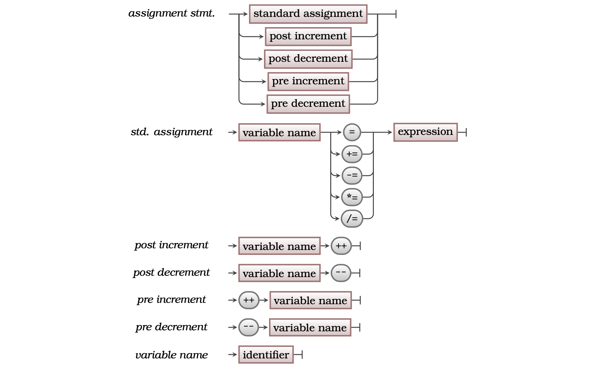

The Assignment Statement is an **instruction** that stores a value in a [Variable](../12-variable). You use this instruction any time you want to update the value of a variable.

<a id="FigureAssignmentStatement"></a>


<div class="caption"><span class="caption-figure-nbr">Figure 5.19: </span> A Assignment Statements assign values to Variable</div> <br/>

The assignment statement performs two actions. First, it calculates the value of the expression (calculation) on the right-hand side of the assignment operator (the `=`). Once it has the value, it stores the value (assigns it) to the variable on the left-hand side of the assignment operator.

## In C#

:::tip[Syntax]

- The C# syntax for an assignment statement is shown in [Figure 5.x](#FigureAssignmentStatementSyntax) below
- In C# assignment is indicated by the equals sign ( = ).
- The left-hand side of the assignment must be a valid variable, this is where the value is to be stored.
- The right-hand side of the assignment is an expression. It calculates the value that will be stored in the variable.
- There are multiple versions of the assignment, giving short-hand ways of using the current value.
  - `=` is the standard assignment, this stores the value of the expression in the Variable.
  - `+=` increments the variable’s value, where `a += n;` is equivalent to `a = a + n`
  - `-=` decrements the variable’s value, where `a -= n;` is equivalent to `a = a - n`
  - `*=` multiplies the value in the variable by a given factor, where `a *= n;` is equivalent to `a = a * n`
  - `/=` divides the value in the variable by a factor, where `a /= n;` is equivalent to `a = a / n`
- The `++` and `--` operators allow you to add or remove one from a variable's current value.


<a id="FigureAssignmentStatementSyntax"></a>


<div class="caption"><span class="caption-figure-nbr">Figure 5.x: </span>The syntax for an assignment statement</div><br/>

:::

## Assignment Statement - why, when, and how

**TODO - write this**

## Examples

See [Listing 5.x](#ListingAssignmentStatement) below for an example assignment statements.

<a id="ListingAssignmentStatement"></a>

```csharp
#include "splashkit.h"
/* Program: assignment_tests.cs 
 * Demonstrates assignment to a variable
 */

int my_data = 10, days_in_month, days_remaining;

WriteLine($"my_data_is {my_data}");

my_data = my_data + 1; // add 1 to my_data and store in my_data
WriteLine($"my_data_is {my_data}");

my_data++; // add 1 to my_data and store in my_data
WriteLine($"my_data_is {my_data}");

my_data *= 2; // double my_data and store in my_data
WriteLine($"my_data_is {my_data}");

days_in_month = 365 / 12; // assign days_in_month a calculated value
WriteLine($"On average there are {days_in_month} days in a month.");

// assign days_remaining a calculated value
days_remaining = 365 - days_in_month * 12;
WriteLine($"The remaining {days_remaining} days are distributed to a few months");
```

<div class="caption"><span class="caption-figure-nbr">Listing 5.x: </span>Assignment Tests</div>

## Activities

[TODO]

:::note[Summary]

- An Assignment Statement is an **instruction** you can get the computer to perform.
- The _right-hand side_ of the assignment is used to calculate the value to be stored.
- The _left-hand side_ of the assignment is a **[Variable](../12-variable)** into which the value is stored.
- When the Assignment Statement is executed the Expression is evaluated first, and then the resulting value is stored in the variable.
- It's important to remember that the Variable is a location to store a value.
- When the Variable appears on the left-hand side of an assignment it is used to store the resulting value. If the variable appears on the right-hand side its value is being used as part of the calculation.

:::
