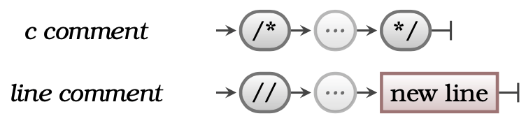

A program's source code contains instructions for the computer to perform. Although code is ultimately written for the computer, it is also written, read, and maintained by people. Because of this, it is useful to be able to place comments in our code to help anyone reading it understand how it works. These comments are not something to be translated into machine code, it is for us humans.

Programming languages support the ability to embed **comments** into source code.
This is simply text that is ignored by the compiler.

## Comments -- when, why, and how

Comments do not change how your program runs, so why bother? Well, getting things working is great, but sometimes you need to capture your thought process. Comments allow you to embed documentation and explanatory text within your program’s code. You write comments to explain what you intend the program to do, and any thoughts you want to record along with the code. This can be helpful for other programmers, or even just future you!

Some good practices include adding comments outlining the steps within your code. This becomes more important as your programs get bigger and more complex.

## In C#

:::tip[Syntax]
The following diagram shows the syntax for code comments in C#.


:::


There are two types of comments in C#:

1. **Block comments** begin with `/*` and end with `*/` and contain any text in between these, including new lines.
2. **Line comments** begin with `//` and end with a new line.

## Example

The following code shows an example of both block and line comments in C#.

```csharp
/* 
 * This program calculates the area of a circle based on the radius. 
 * Variables:
 *  - the radius as a double
 *  - the area as a double
 *  - a line string to read text from the user
 */

using static System.Convert;
using static System.Console;

// Setup constants and variables
const double PI = 3.1415;
string line;
double radius, area;

// Get data from the user
Write("Radius: ");
line = ReadLine();
radius = ToDouble(line);

// Calculate area
area = PI * radius * radius;

// Output area
WriteLine(area);
```

## Activities

1. Is the following a valid comment in C#? Why/why not?

```csharp
/* 
  /* my comment */ 
*/
```

<details>
  <summary role="button">Answers</summary>
  <ul>
    <li><strong>1: </strong>No, this is not a valid code comment in C#. Let's break down why. The first <code>/*</code> will start the comment as expected. The second <code>/*</code> will then be considered part of the comment text, as will the text "my comment". This is all fine, but then the first <code>*/</code> will end the comment. This means the second <code>*/</code> will not be considered part of the comment text. It also won't be considered valid syntax to end a comment, because there is technically no matching syntax to start a comment, so the computer will try to interpret it as an instruction. Because <code>*/</code> on its own is not a valid instruction, this will crash your program. Try it out and see!</li>
  </ul>
</details>

:::note[Summary]

- Comments allow you to document your source code.
- Comments should be included to help other people and your future self read your code.
- It is good practice to place a comment at the top of your code explaining what the program does.
- Comments should be meaningful, and can be used to capture your intentions and ideas.
- Comments have no impact on the output produced by the compiler.

:::
