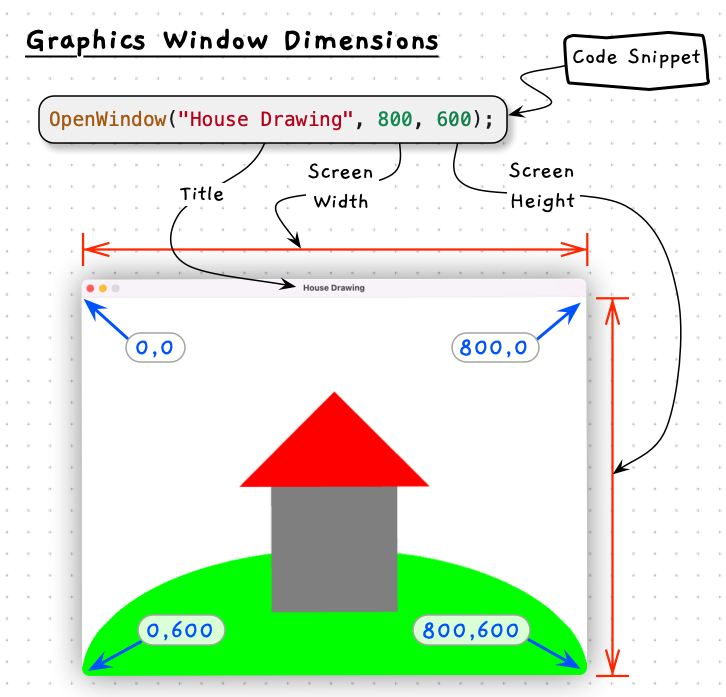
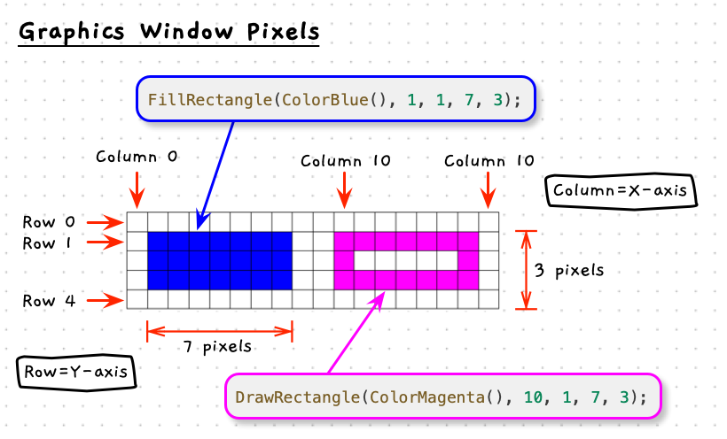
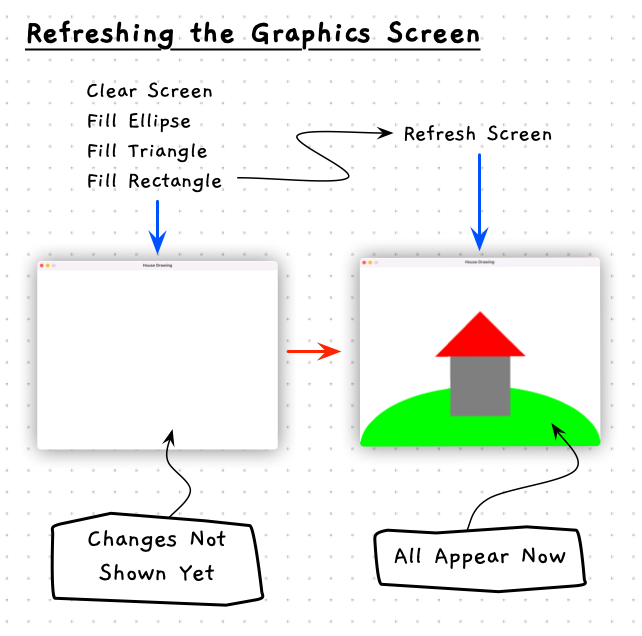
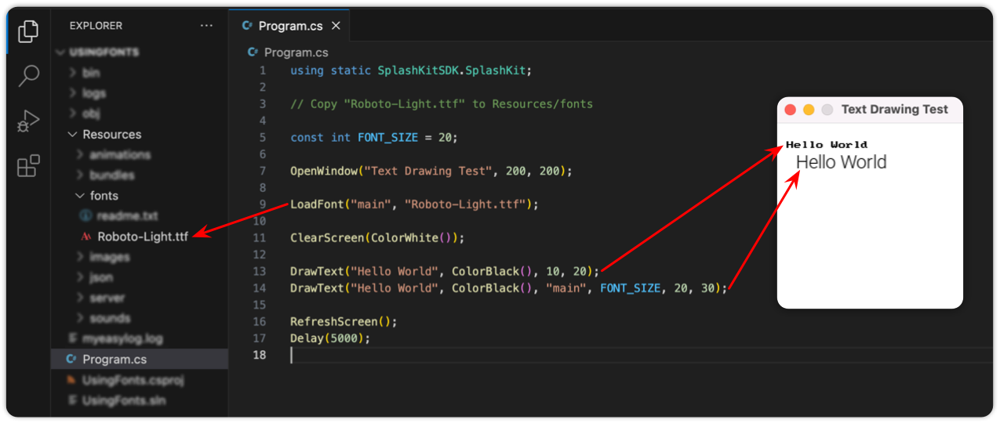

This journey should be fun. While reading and writing text from the terminal can demonstrate all the programming features, it doesn't have as much of a *fun factor*. Creating visual and interactive programs will help you **see** that your programs are working as you expected.

To help you achieve this, we created the [SplashKit](https://splashkit.io) library. This library is designed to support your journey as you learn to program. It does not take any control away from you but empowers you to make interactive, multimedia programs.

Let's detour briefly to explore how graphics work, and how you can use them within SplashKit. There are additional articles about this on the [splashkit.io](https://splashkit.io) website.

:::tip[Why Games?]
Programming is about getting the computer to do what you want it to do. This will involve calculations and data manipulation. For many programs, these values are what is important. For example, we want to calculate values for our bank account balance in a banking application, or record marks for a grading system. When things go wrong it requires you to be able to see what the expected value was, and then think through these calculations to see what happened.

With games, we make it much easier to **see** problems. You still need to go back through the code and understand why, but you can **see** that it is wrong. The player is in the wrong location. They didn't pick up the item when they should have, or they did when they shouldn't have. This **visual** aspect *should* help you engage with your program. You will be drawing your digital reality to the screen, which helps you connect with these abstractions in your code.

The programming knowledge and coding skills you gain by building these games will *directly* apply to building any other kind of program. So we encourage you to build some games and have some fun while you are learning.

Don't worry if you are not interested, or able, to engage with these visuals. We provide examples and projects that do not require you to use these ideas.
:::

## Graphics

SplashKit provides methods you can call to create windows and draw images and shapes for the user to see.

### Open a Window

To draw, you need something to draw onto. The base interactive component in SplashKit is a **Window**.

| <div style="width:120px">**Method**</div> | **Required Arguments** | **Description** |
|-------------|------------------------|----------------|
| `OpenWindow` | the title, width, and height of the window | Opens a window for you to draw to. |
| `ClearScreen` | a color | Clears everything on the current window, making it the indicated color. |

The `OpenWindow` method can be called to create a new window for the user to interact with, and for your code to draw upon. This method requires three arguments: the window’s title, its width and its height. For example, `OpenWindow("House Drawing", 800, 600);` will open a window that is 800 pixels wide and 600 pixels high with the title "House Drawing", as shown in the following image. Please note that the house and hill are drawn by additional code.



To test this out, try out the following code for a program that opens a new window using SplashKit. In this program we are also using the SplashKit method `Delay`. This makes the program wait so that we can see what is happening. When you compile and run this, you will see the window open and the program delay for 5 seconds. Try changing the title and size of the window.

```csharp
using static SplashKitSDK.SplashKit;

OpenWindow("Window title to change", 800, 600);

Delay(5000); // wait 5 sections (5000 milliseconds)
```

### Pixels and Coordinates

The images you see on your computer’s screen are made up of dots called **pixels**: picture elements. The screen has many pixels arranged into a grid (columns and rows), meaning that each pixel has its own unique location represented as a combination of an `x` and `y` value, where `x` indicates the column or distance from the left of the screen, and `y` the row or distance from the top of the screen. Each pixel also has its own color, which we can change individually or in combination with other pixels to form images on the screen.

:::caution
If you've studied any mathematics, you might be used to the coordinate (0, 0) being at the bottom-left, or even the middle of your coordinate system.
In computer graphics (0, 0) is at the **top left** of the screen.
Forgetting this can create some interesting graphics!
:::

The following image shows an example of how the computer would draw rectangles using the SplashKit instructions to draw a filled (`FillRectangle`) and outlined (`DrawRectangle`) rectangle.
Both of these instructions require a color, an x and y value, and a width and a height.
It uses this information, and the knowledge that position (0, 0) is the top left of the screen, to know where these shapes should be drawn.
So, the blue filled rectangle is drawn at x 1, y 1, is 7 pixels wide, and 3 pixels high.
The magenta outlined rectangle is drawn 10 pixels from the left of the screen, 1 pixel from the top, 7 pixels wide, and 3 pixels high.



:::tip[Why the top down?]
The answer is simply **history**. The original monitors were based on Cathode Ray Tubes (CRTs) and drew to the screen from left to right, and top to bottom, matching the writing style of Western cultures.
:::

### Double Buffering

In a graphical program the computer still executes code in [sequence](../01-sequence).
If we were to show the result of every drawing instruction immediately, we would get some very odd looking programs.

For example, to draw a house on a hill we might combine an ellipse, a triangle, and a rectangle.
If the computer showed us the result of drawing each individual shape, we would see these three shapes pop up individually.
In a program drawing only three shapes this might happen too quickly for a human to see, but the problem would eventually become obvious if you added enough complexity to the graphics.

Instead of having each element we draw appear individually, we just want the whole picture to appear at once.
To achieve this, SplashKit uses a technique called **double buffering**, illustrated in the image below. With double buffering, the computer first draws the shapes to an off-screen surface.
It then waits for a command to display that surface to the user. With SplashKit, the command for this is `RefreshScreen`.



### Drawing to a Window

Now that we understand how to refer to positions on the screen, and how SplashKit uses double buffering to display graphics, let's do some drawing of our own.

There are several methods in SplashKit that you can use to draw shapes to the window.
These methods typically require arguments that allow you to control where the shape appears, its size, and its color.

| <div style="width:70px">**Method**</div> | **Required Arguments** | **Description** |
|-----------|------------------------|----------------|
| `ColorWhite`, `ColorBlue`, ... | None | Returns a value that represents the color indicated in the name of the method.  |
| `FillRectangle`, `DrawRectangle` | A color and four numeric values for the location (x and y), width, and height of the rectangle | Draws a filled or hollow rectangle to the screen. |
| `FillEllipse`, `DrawEllipse` | A color and four numeric values for the location (x and y), width, and height of the ellipse | Draws a filled or hollow ellipse to the screen. |
| `FillTriangle`, `DrawTriangle` | A color and six numeric values for the location (x and y) or each point of the triangle. | Draws a filled or hollow triangle to the screen. |
|`DrawLine` | A color and four numeric values for the location (x and y) of the start and end of the line. | Draws a line from one point to another. |
| `RefreshScreen` | none | Present what has been drawn to the user. |

The following code draws a house on a hill using some basic shapes in SplashKit.  
Try running it, then modify the drawing to make it your own.

```csharp
using static SplashKitSDK.SplashKit;

OpenWindow("Shapes by ...", 800, 600);

ClearScreen(ColorWhite());
FillEllipse(ColorBrightGreen(), 0, 400, 800, 400);
FillRectangle(ColorGray(), 300, 300, 200, 200);
FillTriangle(ColorRed(), 250, 300, 400, 150, 550, 300);
RefreshScreen();

Delay(5000);
```

:::tip[Autocomplete]
If you are ever unsure of what a method requires, you should be able to get Visual Studio Code to show you a list of the arguments you need to provide. To do this, type the start of the method name then press `ctrl-space`. There are usually a couple of different ways to draw a shape in SplashKit, which you can eexplore by pressing the up/down arrows to navigate the pop-up list. An example with C# is shown below. Try it out for yourself as you modify you first shape drawing program.


:::

## Working with Resources

SplashKit provides methods to help you work with resources such as images, sounds, fonts, and animations. There are methods to load these into your program, and draw them to the screen or play them from your speakers.

SplashKit organises these files in a **Resources** folder containing sub-folders for each different kind of resource. For example, the **Resources/images** folder is used to store the images you want to work with. The SplashKit library comes with an `skm` script that you can use in the terminal to help set up your project. Running `skm resources` in the root folder of your project will create these resource folders for you.

### Drawing images

| <div style="width:100px">**Method**</div> | **Required Arguments** |**Description** |
|-----------|------------------------|----------------|
| `LoadBitmap` | the name of the bitmap and its filename | This loads the image (bitmap) into your program. You can use the name to access this bitmap in other method calls. The filename can be the full path to a file, or the filename of a file in the **Resources/images** folder.  |
| `DrawBitmap` | the image name, and two numbers for the coordinate to draw to | This draws the image you loaded with the given name, at the coordinates you provided (x and y). The coordinates indicate the top left corner of the bitmap when it is drawn. |

To draw an image:

1. Copy the image into the **Resources/images** folder.
2. Load the image in your code using `LoadImage`.
3. Draw the image using its name in `DrawBitmap`.

The following code shows how you might follow these steps in a simple program.

```csharp
using static SplashKitSDK.SplashKit;

// Copy "background.png" to Resources/images

OpenWindow("Drawing Test", 800, 600);

LoadBitmap("bkg", "background.png");
ClearScreen(ColorWhite());
DrawBitmap("bkg", 10, 20);
RefreshScreen();

Delay(5000);
```

### Drawing text

You might want to be able to draw text to the screen to display messages to the user. For static text, you are best to embed this within an image, as drawing an image is easier and faster than drawing text. For dynamic text (i.e., any text that changes as the program runs) you will need to use a text drawing method. In SplashKit you can draw simple text with fixed characters, or load a font and use that to draw the text.

| <div style="width:100px">**Method**</div> | **Required Arguments** |**Description** |
|-----------|------------------------|----------------|
| `LoadFont` | the name of the font and its filename | This loads the font into your program. You can use the name to access this font in other method calls. The filename can be the full path to a file, or the filename of a file in the **Resources/fonts** folder. |
| `DrawText` | some text, a color, x, and y | This draws the provided text in the indicated color at the given coordinates (x and y). The coordinates indicate the top left of the text. This will draw using the built-in font. |
| | some text, a color, a loaded font's name, font size (int), x, and y | This draws the provided text in the indicated color, with the named font, at the indicated size. The coordinates (x and y) will be the top left of the text. |

Several online sites provide free fonts for personal projects. The [Google Fonts](https://fonts.google.com) site is a good option. The font files should be **true type fonts**, which usually have a **ttf** file extension. Find the font you want to draw with and download it into your **Resources/fonts** folder. Load the font, and use the drawing methods to render text to your window.

The following code draws "Hello World" to the screen using the built-in font, and the [Roboto-Light font from Google Fonts](https://fonts.google.com/specimen/Roboto).

```csharp
using static SplashKitSDK.SplashKit;

// Copy "Roboto-Light.ttf" to Resources/fonts

const int FONT_SIZE = 20;

OpenWindow("Text Drawing Test", 200, 200);

LoadFont("main", "Roboto-Light.ttf");

ClearScreen(ColorWhite());

DrawText("Hello World", ColorBlack(), 10, 20);
DrawText("Hello World", ColorBlack(), "main", FONT_SIZE, 20, 30);

RefreshScreen();
Delay(5000);
```



### Playing sound effects

Sound effects are designed to be used for short sounds that are triggered by actions in your program. You can play several sound effects at the same time.

SplashKit can handle several file formats for sound effects, but the best and most reliable is [Ogg Vorbis](https://xiph.org/vorbis/). You can use programs like [Audacity](https://www.audacityteam.org) to edit and convert sound effects to the Ogg Vorbis format.

| <div style="width:130px">**Method**</div> | **Required Arguments** |**Description** |
|-----------|------------------------|----------------|
|`LoadSoundEffect` | the name of the sound effect and its filename | As with `LoadBitmap`, but this loads the sound effect into your program. You can use the name to access this sound effect in other method calls. The filename can be the full path to a file, or the filename of a file in the **Resources/sounds** folder.  |
|`PlaySoundEffect` | the name of a loaded sound effect | Plays the sound effect once at its full volume.  |
| | the name of a loaded sound effect, volume (`float`) | Plays the sound effect once at a percentage of its full volume. The volume should be between 0 and 1.0  |
| | the name of a loaded sound effect, times (`int`) | Plays the sound effect multiple times in a row at full volume.  |
| | the name of a loaded sound effect, times (`int`), volume (`float`) | Plays the sound effect multiple times in a row at a percentage of its full volume. |
|`StopSoundEffect` | the name of a loaded sound effect | Stops playing the indicated sound effect. |

Find a sound effect you like and try out this program:

```csharp
using static SplashKitSDK.SplashKit;

// Copy "Hello.ogg" to Resources/sounds

LoadSoundEffect("hello", "Hello.ogg");
PlaySoundEffect("hello");
Delay(2500);

PlaySoundEffect("hello", 0.2f); // Play it quietly
Delay(2500);

PlaySoundEffect("hello", 2); // Play it twice
Delay(2500);

PlaySoundEffect("hello", 2, 0.2f); // Play it twice, quietly
Delay(2500);
```

### Playing music

Music is designed to work with long playing background audio. Unlike sound effects, you can only play one music track at a time. This means you can have one music track playing and several sound effects.

As with sound effects, The Ogg Vorbis format works best with SplashKit for music.

| <div style="width:130px">**Method**</div> | **Required Arguments** |**Description** |
|-----------|------------------------|----------------|
| `LoadMusic` | the name of the music and its filename | As with `LoadBitmap`, but this loads the music into your program. You can use the name to access this music in other method calls. The filename can be the full path to a file, or the filename of a file in the **Resources/sounds** folder. |
| `PlayMusic` | the name of the loaded music | Plays the indicated music track once. This will switch tracks if other music was already playing. |
| | the name of the loaded music, a number of times to play | Plays the indicated music track the number of times indicated (-1 means infinitely). |
| `FadeMusicIn` | the name of the loaded music, and a number of milliseconds (int) | Plays the indicated music track, starting softly and increasing to full volume over the indicated time. |
| `FadeMusicOut` | a number of milliseconds (int) | Stops playing music, fading out over the indicated time. |
| `SetMusicVolume` | a value between 0 and 1.0 (float) | Set the volume to a proportion of full volume. |
| `StopMusic` | none | Stops the music playing. |

Try out playing some music using SplashKit with the following code:

```csharp
using static SplashKitSDK.SplashKit;

// Copy "ACoolSong.ogg" to Resources/music
// Copy "MoodSettingMusic.ogg" to Resources/music

LoadMusic("track1", "ACoolSong.ogg");
LoadMusic("track2", "MoodSettingMusic.ogg");

PlayMusic("track1");
Delay(2500);

FadeMusicOut(2000); // Fade out
Delay(2500);

FadeMusicIn("track2", 2); // Play it twice
Delay(2500);

SetMusicVolume(0.5f); // 50 %
Delay(500);

SetMusicVolume(0.75f); // 75 %
Delay(500);

StopMusic();
Delay(2500);
```

## Animation

With the methods and programming tools you have now, you can create short animations. An animation would involve playing music, drawing a scene to the screen, delaying, then drawing an updated scene, delaying, then drawing the next scene, and so on.

## Activities

Try to use as many of the methods we have introduced here to make your own animation.

**TODO: Add details on how to share a recording of their scene - something we can link here to see what others have done.**

:::tip[Summary]

* SplashKit is a library which helps you make interactive multimedia programs.
* SplashKit uses **double buffering**, so you have to call `RefreshScreen` to make anything you draw in code appear to the user.
* The easiest way to use resources like images and sounds in your SplashKit program is to run `skm resources` in the terminal in the root folder of your project, and place the resource in the relevant folder.

:::
