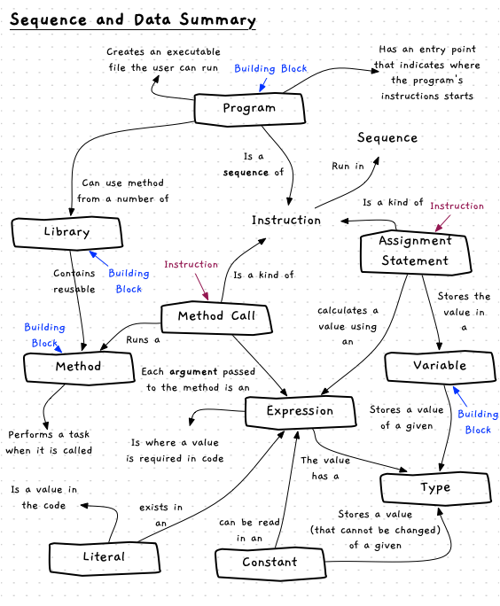

So far this chapter has introduced several programming building blocks, some programming terminology, and lots of different instructions. An overview of these concepts is shown in the concept map below. The next section will look at how you can use these concepts to design some small programs.

:::note[Summary]

- Building blocks are things that go into building your digital reality. You can create and use these within your code.
- Instructions capture the different *things* you can command the computer to perform.
- Your program is a **sequence** of instructions that use **data** (in variables, constants, and literals) that get the computer to do something when it is run.

:::
