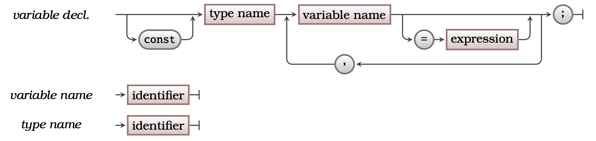

## Concept

A Variable is a **container** into which you can store a value, which can then be retrieved later. The Variable allows you to store values you want to work with in your program, you store values in the variable so that you can read them back later. The variable's themselves are either a [Global Variable](../15-global-variable), [Local Variable](../14-local-variable), or [Parameter](../16-parameter).

<a id="FigureVariable"></a>


<Caption><FigureText>Figure 5.17: </FigureText>Variables store a value that can be read and changed</Caption><br/>

## In C#

A Variable Declaration allows you to create a Variable in your Code. In C# you can declare variables in the program’s code, and in Functions and Procedures. [Figure 5.18](#FigureVariableSyntax) shows the syntax for variable declarations in C#.


:::tip[Syntax]

- This is the C Syntax for creating your own Variable.
- This syntax can be used to declare ...
  - Local Variables within Functions and Procedures.
  - Global Variables within the program.
- In C the Variable Declaration starts with the [Type](../06-type) name indicating the kind of data that will be stored.
- Following the Type is a list of the identifiers for the Variables that are being created.
- You can create one or more variables in a single Variable Declaration, but all of these Variables will have the same type.
- Each variable can be assigned a value when it is declared.
- The **const** modifier can be added to the start of a Variable declaration to create a Constant.
- See C Procedure Declaration (with Local Variables) for details on declaring Local Variables within Functions and Procedures.
- See C Program (with Global Variables and Constants) for details on declaring Global Variables within the program itself.
- The syntax for declaring Parameters is very similar, see C Procedure Declaration (with Parameters).

<a id="FigureVariableSyntax"></a>


<div class="caption"><span class="caption-figure-nbr">Figure 5.18: </span>The syntax for C# variable declarations</div><br/>

:::


## Examples

<a id="ListingVariableDeclaration"></a>
```csharp
/* Program: variable_test.c
 * This program demonstrates some variable declarations
 */

#include <stdio.h>

const float PI = 3.1415;
float global_float = 12.3;
int global_int = 73;

void test(int param_int, float param_float) {
    int my_local = 37, another_local = 42;
    printf("my local int = %d, another_local = %d\n", my_local, another_local);
    printf("param int = %d, param float = %f\n", param_int, param_float);
    printf("globals are %f and %d\n", global_float, global_int);
}

int main() {
    int local_int;
    local_int = 21;

    test(local_int, PIT * local_int * local_int);

    printf("local int = %d\n", local_int);
    printf("globals are %f and %d\n", global_float, global_int);
    printf("PI is a constant with value %f\n", PI);
    return 0;
}

```

<div class="caption"><span class="caption-figure-nbr">Listing 5.14: </span>Example program containing variable declarations</div>

## Activities

[TODO]


:::note[Summary]

- A Variable is an **artefact**, you can create variables to store values in your programs.
- You can think of a Variable like a "box with an item in it". The Variable is the box, its value is the item within it.
- Each Variable has a ...
  - **Name** that can be used to refer to it.
  - **Value** that it is storing.
  - **Type** that determines the size of the Variable and how its value is interpreted.
- You use an [Assignment Statement](../19-assignment-statement) to store a value into the Variable.
- You can **read** the value from Variable in Expressions.
- The Variable is **different** to its value:
  - The Variable is a container into which a value can be stored.
  - You can read the value from the Variable.
  - The Variable **is not** the value, it is a container into which the value is stored

:::