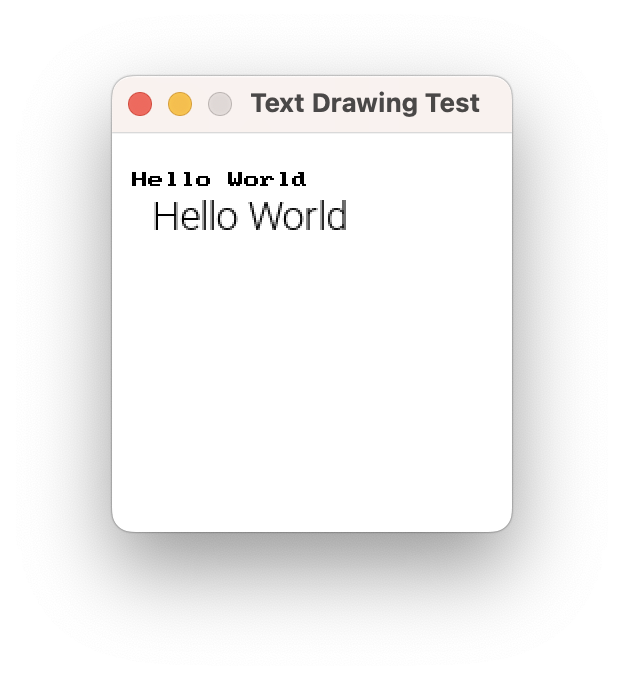

This journey should be fun. While reading and writing text from the terminal can demonstrate all of the programming features, it doesn't have as much of a *fun factor*. Creating visual and interactive programs will help you **see** that your programs are working as you expected.

To help you achieve this, we created the [SplashKit](https://splashkit.io) library. This library is designed to support your journey as you learn to program. It does not take any control away from you but empowers you to make interactive, multimedia programs.

Let's detour briefly to explore how graphics works, and how you can use this within SplashKit. There are additional articles about this on the [splashkit.io](https://splashkit.io) website.

:::tip[Why Games?]

Programming is about getting the computer to do what you want it to do. This will involve calculations and data manipulation. For many programs, these values are what is important. We want to calculate values for our bank account balance in a banking application, or record marks for a grading system for example. When things go wrong it requires you to be able to see what the expected value was, and then think through these calculations to see where it went wrong.

With games, we make it much easier to **see** problems. You still need to go back through the code and understand why, but you can **see** that it is wrong. The player is in the wrong location. They didn't pick up the item when they were over it and pressed a key, or they did when they were not over the item. This **visual** aspect *should* help you engage with your program. You will be drawing your digital reality to the screen - helping you connect with these abstractions in your code.

The programming knowledge and coding skills you gain by building these games will *directly* apply to building any other kind of program. So we encourage you to build some games and have some fun while you are learning.

Don't worry if you are not interested, or able, to engage with these visuals. We provide examples and projects that do not require you to use these ideas.

:::

## Graphics

SplashKit provides methods you can call to create windows and draw images and shapes for the user to see.

### Open a Window

To draw, you need something to draw onto. The base interactive component in SplashKit is a **Window**.

|**Method** | **Required Arguments** |**Description** |
|-----------|------------------------|----------------|
|`OpenWindow`| the title, width, and height of the window | Opens a window for you to draw to. |
|`ClearScreen`| a color | Clears everything on the current window, making it the indicated color.  |
|`RefreshScreen`| none | present what has been drawn to the user |

The `OpenWindow` method can be called to create a new window for the user to interact with, and for your code to draw upon. This method requires three arguments, the window’s title, its width and its height. For example  `OpenWindow("House Drawing", 800, 600);` will open a window that is 800 pixels wide and 600 pixels high with the title "House Drawing", as shown in the following image. Please note that the house and hill are drawn by additional code.

**TODO Fix Image**


To test this out, try opening a new Window, and using SplashKit to delay us for a few seconds. When you compile and run this, you will see the window open, and the program delay for 5 seconds. Try changing the title and size of the window.

```csharp
using static SplashKitSDK.SplashKit;

OpenWindow("Window title to change", 800, 600);

Delay(5000);
```

### Drawing to a Window

There are several methods that you can use to draw shapes and images to the window.

|**Method** | **Required Arguments** |**Description** |
|-----------|------------------------|----------------|
|`ColorWhite`, ... | none | Returns a value that represents the color indicated in the name of the method.  |
|`FillRectangle`, `DrawRectangle` | a color, and four numeric values for the location (x and y) and width and height of the rectangle | Draws a filled or hollow rectangle to the screen. |
|`FillEllipse`, `DrawEllipse` | a color, and four numeric values for the location (x and y) and width and height of the ellipse | Draws a filled or hollow ellipse to the screen. |
|`FillCircle`, `DrawCircle` | a color, and three numeric values for the location (x and y) and radius of the circle | Draws a filled or hollow circle to the screen. |
|`FillTriangle`, `DrawTriangle` | a color, and six numeric values for the location (x and y) of each point of the triangle | Draws a filled or hollow triangle to the screen. |
|`DrawLine` | a color, and four numeric values for the location (x and y) of the start and end of the line | Draws a line from one point to another. |

```csharp
using static SplashKitSDK.SplashKit;

OpenWindow("Shapes by ...", 800, 600);

ClearScreen(ColorWhite());
FillEllipse(ColorBrightGreen(), 0, 400, 800, 400);
FillRectangle(ColorGray(), 300, 300, 200, 200);
FillTriangle(ColorRed(), 250, 300, 400, 150, 550, 300);
RefreshScreen();

Delay(5000);
```

### Pixels and Coordinates

The images you see on your computer’s screen are made up of dots called **pixels**: picture elements. The screen has many pixels arranged into a grid (columns and rows), with each pixel having its own color and unique location (a combination of an `x` and `y` value, where `x` indicates the column or distance from the left of the screen, and `y` the row or distance from the top of the screen).

The following image shows an example of two rectangles (one filled, one outlined). The top left corner of the screen is at row (x) 0 and column (y) 0, and these numbers increase as you go to the right and down the screen. 

The calls to `FillRectangle` and `DrawRectangle` accept arguments for the color, an `x` value and `y` value, and a `width` and a `height`. So the blue rectangle is filled at x 1, y 1, is 7 pixels wide, and 3 pixels high.

**TODO: fix image**


Coordinates for the positions on the screen use two values: one **x** and **y**. The x value determines the number of pixels from the left side of the screen. The y value determines the number of pixels from the top of the screen.

For example: the magenta rectangle is drawn at 10, 1. This means its x value is 10 and its y is 1. This rectangle is drawn 10 pixels from the left of the screen, and its 1 pixel from the top.

:::tip[Why the top down?]

The answer is simply **history**. The original monitors were based on Cathode Ray Tubes (CRTs) and drew to the screen from left to right, and top to bottom, matching the writing style of Western cultures.

:::

### Drawing Methods

To draw a shape with SplashKit you need to call one of the shape drawing methods. All of the shape drawing operations in SplashKit require arguments that allow you to control where the shape appears, its size, and its color.

* The **color** to draw the shape. SplashKit has many built-in colors and methods you can use to create custom colors. See the list of colors starting with [Alice Blue](https://splashkit.io/api/color/#color-alice-blue). For example, you can call `ColorBrown()` in your C# code.

* The **x** value for the number of pixels from the left edge of the screen. Larger values are further to the right.
* The **y** value for the number of pixels from the top edge of the screen. Larger values are further down the screen.
* and other values for the size of the shape, these will differ depending on the kind of shape being drawn (e.g., for a rectangle, you must specify the width and height, as you would for an ellipse, whereas a circle requires a radius).

|**Method** | **Required Arguments** |**Description** |
|-----------|------------------------|----------------|
|`RGBColor` | three numeric values | Returns a value that represents the color resulting from combining the red, green, and blue components. They can all be whole numbers between 0 and 255, or real numbers between 0 and 1. |
|`RGBAColor` | four numeric values | As with `RGBColor` but with the addition of an *alpha* component to represent opacity. When `alpha` is less than 255 or 1.0, the drawing operation will blend the color with the color already on the surface.  |
|`HSBColor` | three numeric values | Creates a color from hue, saturation, and brightness colors (all between 0.0 and 1.0). Hue indicates the color, saturation indicates how rich or intense the color is, and brightness is how bright the color is.|
|`RandomColor` | none | Returns a random color - with random opacity.|
|`RandomRGBColor` | a single integer value | Returns a random color - with set opacity (0 to 255).|

### Autocomplete

You should be able to get Visual Studio Code to show you to list of arguments you need to provide. Type the start of the Method name then press `ctrl-space`. There are usually a couple of different ways to draw each shape, by pressing the up/down arrows you should be able to explore this list. An example with C# is shown below.

**TODO Fix image**


### Double Buffering

To draw a picture, like the house shown above, the computer executes the code to draw the individual shapes one at a time in the order they appear in the code (in **sequence**).  However, we don't want each element to appear individually, we just want the whole picture to appear at once. In this case, we want the whole house to appear at once.

To achieve this, SplashKit uses a technique called **Double Buffering**. With double buffering, the computer first draws the shapes to an offscreen surface and waits for a command to display that surface to the user.  With SplashKit, this is performed when you call the `RefreshScreen` method. This is illustrated below.


## Working with Resources

SplashKit provides methods to help you work with resources such as images, sounds, fonts, and animations. There are methods to load these into your program, and draw them to the screen or play them from your speakers.

SplashKit organises these files in a **Resources** folder within sub-folders for the different kinds of resources. For example, the **Resources/images** folder is used to store the images you want to work with. The SplashKit library comes with an `skm` script that you can use in the terminal to help setup your project. Running `skm resources` in the root folder of your project will create these resource folders for you.

### Drawing images

|**Method** | **Required Arguments** |**Description** |
|-----------|------------------------|----------------|
|`LoadBitmap` | two strings, the name of the bitmap and its filename | This loads the image (bitmap) into your program. You can use the name to access this bitmap in other method calls. The filename can be the full path to a file, or the filename of a file in the **Resources/images** folder.  |
|`DrawBitmap` | a string for the image name, and two numbers for the coordinate to draw to | This draws the image you loaded with the given name, at the coordinates you provided (x and y). The coordinates indicate the top left corner of the bitmap when it is drawn. |

To draw an image

- Copy the image into the **Resources/images** folder.
- Load the image in your code using `LoadImage`
- Draw the image using its name in `DrawBitmap`

```csharp
using static SplashKitSDK.SplashKit;

// Copy "background.png" to Resources/images

OpenWindow("Drawing Test", 800, 600);

LoadBitmap("bkg", "background.png");
ClearScreen(ColorWhite());
DrawBitmap("bkg", 10, 20);
RefreshScreen();

Delay(5000);
```

### Drawing text

You will want to be able to draw text to the screen to display messages to the user. For static text, you are best to embed this within an image as drawing an image will be easier and faster than drawing text. For dynamic text, any text that changes as the program runs, you will need to use a text drawing method. In SplashKit you can draw simple text with fixed characters, or load a font and use that to draw the text.

|**Method** | **Required Arguments** |**Description** |
|-----------|------------------------|----------------|
|`LoadFont` | two strings, the name of the font and its filename | This loads the font into your program. You can use the name to access this bitmap in other method calls. The filename can be the full path to a file, or the filename of a file in the **Resources/fonts** folder. |
|`DrawText` | text string, color, x, and y | This draws *text* in the indicated color at the coordinates (x and y). The coordinates indivate the top left of the text. This will draw using the built in font. |
| | text string, color, loaded font's name, font size (int), x, and y | This draws *text* in the indicated color, with the named font at the indicated size. The coordinates (x and y) will be the top left of the text. |

Several online sites provide free fonts for personal projects. The [Google Fonts](https://fonts.google.com) site is a good option. The font files should be **true type fonts** usually with a **ttf** file extension. Find the font you want to draw with and download it into your **Resources/fonts** folder. Load the font, and use the drawing methods to render text to your window.

The following code draws "Hello World" to the screen using the built-in font, and the [Roboto-Light font from Google Fonts](https://fonts.google.com/specimen/Roboto).

```csharp
using static SplashKitSDK.SplashKit;

// Copy "Roboto-Light.ttf" to Resources/fonts

const int FONT_SIZE = 20;

OpenWindow("Text Drawing Test", 200, 200);

LoadFont("main", "Roboto-Light.ttf");

ClearScreen(ColorWhite());

DrawText("Hello World", ColorBlack(), 10, 20);
DrawText("Hello World", ColorBlack(), "main", FONT_SIZE, 20, 30);

RefreshScreen();
Delay(5000);
```

**TODO: Fix image width**



## Audio - sound effects and music

Programs come to life when you add backing music and sound effects. With SplashKit, playing music and sound effect

### Playing sound effects

Sound effects are designed to be used for short sounds that are triggered by actions in your program. You can play several sound effects at the same time, and they will blend together, allowing the user to hear multiple effects at the same time.

SplashKit can handle several file formats for sound effects, the best and most reliable is [Ogg Vorbis](https://xiph.org/vorbis/). You can use programs like [Audacity](https://www.audacityteam.org) to edit and convert sound effects to the Ogg Vorbis format.

|**Method** | **Required Arguments** |**Description** |
|-----------|------------------------|----------------|
|`LoadSoundEffect` | two strings, the name of the sound effect and its filename | As with `LoadBitmap`, but this loads the sound effect into your program. You can use the name to access this sound effect in other method calls. The filename can be the full path to a file, or the filename of a file in the **Resources/sounds** folder.  |
|`PlaySoundEffect` | the name of a loaded sound effect | Plays the sound effect once at its full volume.  |
| | the name of a loaded sound effect, volume (`float`) | Plays the sound effect once at a percentage of its full volume. The volume should be between 0 and 1.0  |
| | the name of a loaded sound effect, times (`int`) | Plays the sound effect multiple times, starting it again when it ends.  |
| | the name of a loaded sound effect, times (`int`), volume (`float`) | Plays the sound effect multiple times, starting it again when it ends, at a percentage of its full volume. |
|`StopSoundEffect` | the name of a loaded sound effect | Stops playing the indicated sound effect. |

```csharp
using static SplashKitSDK.SplashKit;

// Copy "Hello.ogg" to Resources/fonts

LoadSoundEffect("hello", "Hello.ogg");
PlaySoundEffect("hello");
Delay(2500);

PlaySoundEffect("hello", 0.2f); // Play it quietly
Delay(2500);

PlaySoundEffect("hello", 2); // Play it twice
Delay(2500);

PlaySoundEffect("hello", 2, 0.2f); // Play it twice, quietly
Delay(2500);
```

### Playing music

Music is designed to work with long playing background audio. Unline sound effects, you can only play one music track at a time. This means you can have one music track playing and several sound effects.

The Ogg Vorbis format should work for both music and sound effects.

|**Method** | **Required Arguments** |**Description** |
|-----------|------------------------|----------------|
|`LoadMusic` | two strings, the name of the music and its filename | As with `LoadBitmap`, but this loads the music into your program. You can use the name to access this music in other method calls. The filename can be the full path to a file, or the filename of a file in the **Resources/sounds** folder.  |
|`PlayMusic` | the name of the loaded music | Plays the indicated music track once. This will switch tracks if other music was playing |
| | the name of the loaded music, a number of times to play | Plays the indicated music track the number of times indicated (-1 means infinitely). |
|`FadeMusicIn` | the name of the loaded music, and a number of milliseconds (int) | Plays the indicated music track, starting softly and increasing to full volume over the indicated time. |
|`FadeMusicOut` | a number of milliseconds (int) | Stops plays music, fading out over the indicated time. |
|`SetMusicVolume` | a value between 0 and 1.0 (float) | Set the volume to a proportion of full volume. |
|`StopMusic` | none | Stops the music playing. |

```csharp
using static SplashKitSDK.SplashKit;

// Copy "Hello.ogg" to Resources/fonts

LoadMusic("track1", "ACoolSong.ogg");
LoadMusic("track2", "MoodSettingMusic.ogg");

PlayMusic("track1");
Delay(2500);

FadeMusicOut(2000); // Fade out
Delay(2500);

FadeMusicIn("track2", 2); // Play it twice
Delay(2500);

SetMusicVolume(0.5f); // 50 %
Delay(500);

SetMusicVolume(0.75f); // 75 %
Delay(500);

StopMusic();
Delay(2500);
```

## Animation

With the methods and programming tools you have now, you can create short animations. An animation would involve playing music, drawing a scene to the screen, delaying, then drawing an updated scene, delaying, then drawing the next scene, and so on.

**TODO: Add details on how to share a recording of their scene - something we can link here to see what others have done.**
