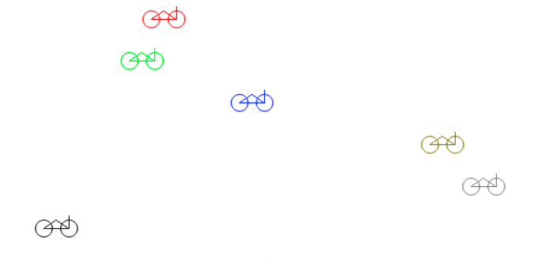

## Times Table

:::note
This is an updated version of the [Seven Times Table Program](../26-program-creation-examples#seven-times-table) that takes user input to work out the times tables for any number the user specifies.
:::

This program prints out the times table for a number entered by the user, displaying from 1 x n to 10 x n. The description of the program is in [Table 5.x](#TableTimesTable), the pseudocode in [Listing 5.x](#ListingTimesTablePseudoCode), the C code in [Listing 5.x](#ListingTimesTableCode).

<a id="TableTimesTable"></a>

<div class="caption"><span class="caption-figure-nbr">Program Description</span></div>

|   |   |
|---|---|
| **Name** | *Times Table* |
| **Description** | Displays the times table from `1 x n` to `10 x n` |
<div class="caption"><span class="caption-figure-nbr">Table 5.x: </span>Description of the <em>Times Table</em> program</div><br/>

### Pseudocode

<a id="ListingTimesTablePseudoCode"></a>

```bash
------------------------
Program: Times Table
------------------------
Variables:
- number (Integer)
Steps:
  1.  Output 'Times Table' to the Terminal
  2.  Output 'Enter number: ' to the Terminal
  3.  Read input into number
  4.  Output '------------------------' to the Terminal
  5.  Output '1 x ' number '= ' and 1 * number to the Terminal
  5.  Output '2 x ' number '= ' and 2 * number to the Terminal
  5.  Output '3 x ' number '= ' and 3 * number to the Terminal
  5.  Output '4 x ' number '= ' and 4 * number to the Terminal
  5.  Output '5 x ' number '= ' and 5 * number to the Terminal
  5.  Output '6 x ' number '= ' and 6 * number to the Terminal
  5.  Output '7 x ' number '= ' and 7 * number to the Terminal
  5.  Output '8 x ' number '= ' and 8 * number to the Terminal
  5.  Output '9 x ' number '= ' and 9 * number to the Terminal
  5.  Output '10 x ' number '= ' and 10 * number to the Terminal
  13. Output '------------------------' to the Terminal
```

<div class="caption"><span class="caption-figure-nbr">Listing 5.x: </span>Pseudocode for the <em>Times Table</em> program</div>

### C# Code

<a id="ListingTimesTableCode"></a>

```csharp
/*
 * Program: times_table.c
 * Displays the Times Table from 1 x n to 10 x n
 */

#include <stdio.h>

int main() {

    int number = 0;
    printf("Times Table\n");

    printf("Enter number:");
    scanf("%d", &number);


    printf("------------------------\n");
    printf(" 1 x %d = %d\n", number, 1 * number);
    printf(" 2 x %d = %d\n", number, 2 * number);
    printf(" 3 x %d = %d\n", number, 3 * number);
    printf(" 4 x %d = %d\n", number, 4 * number);
    printf(" 5 x %d = %d\n", number, 5 * number);
    printf(" 6 x %d = %d\n", number, 6 * number);
    printf(" 7 x %d = %d\n", number, 7 * number);
    printf(" 8 x %d = %d\n", number, 8 * number);
    printf(" 9 x %d = %d\n", number, 9 * number);
    printf(" 10 x %d = %d\n", number, 10 * number);
    printf("------------------------\n");

    return 0;
}
```

<div class="caption"><span class="caption-figure-nbr">Listing 5.x: </span>C# code for the <em>Times Table</em> program</div>

## Circle Areas

:::note
This is an updated version of the [Circle Area Program](../26-program-creation-examples#circle-area). It uses a method with a parameter to calculate the area of a circle rather than calculating the area in the main() method. It also uses a constant for the value PI.
:::

This program prints out the area of a circle. The description of the program is in [Table 5.x](#TableCircleAreas), the pseudocode in  [Listing 5.x](#ListingCircleAreasPseudoCode), the C code in [Listing 5.x](#ListingCircleAreasCode).

<a id="TableCircleAreas"></a>

<div class="caption"><span class="caption-figure-nbr">Program Description</span></div>

|   |   |
|---|---|
| **Name** | *Circle Areas* |
| **Description** | Displays the Circle Areas for circles with radius from 1.0 to 5.0 with increments of 0.5 |
<div class="caption"><span class="caption-figure-nbr">Table 5.x: </span>Description of the <em>Circle Areas</em> program</div><br/>

### Pseudocode

<a id="ListingCircleAreasPseudoCode"></a>

```bash
------------------------
Program: Circle Areas
------------------------

  .........................
  Constant: PI = 3.1415
  .........................
  Function: CircleArea
  - Returns: A Double - the area of a circle with a given radius
  - Parameters: 
    * radius (Double)

  - Steps: 
    1. Return the result PI * radius * radius
  .........................

Steps:
  1.  Output 'Circle Areas' to the Terminal
  2.  Output '------------------------' to the Terminal
  3.  Output 'Radius: 1.0 = ', CircleArea(1.0) to the Terminal
  4.  Output 'Radius: 1.5 = ', CircleArea(1.5) to the Terminal
  5.  Output 'Radius: 2.0 = ', CircleArea(2.0) to the Terminal
  6.  Output 'Radius: 2.5 = ', CircleArea(2.5) to the Terminal
  7.  Output 'Radius: 3.0 = ', CircleArea(3.0) to the Terminal
  8.  Output 'Radius: 3.5 = ', CircleArea(3.5) to the Terminal
  9.  Output 'Radius: 4.0 = ', CircleArea(4.0) to the Terminal
  10. Output 'Radius: 4.5 = ', CircleArea(4.6) to the Terminal
  11. Output 'Radius: 5.0 = ', CircleArea(5.0) to the Terminal
  12. Output '------------------------' to the Terminal
```

<div class="caption"><span class="caption-figure-nbr">Listing 5.x: </span>Pseudocode for the <em>Circle Areas</em> program</div>

### C# Code

<a id="ListingCircleAreasCode"></a>

```csharp
/*
 * Program: circle_areas.c
 * Displays the Circle Areas for circles with radius
 * from 1.0 to 5.0 with increments of 0.5
 */

#include <stdio.h>

#define PI 3.1415

double circle_area(double radius) {
    return PI * radius * radius;
}

int main() {
    printf("Circle Areas\n");
    printf("------------------------\n");
    printf(" Radius: 1.0 = %4.2f\n", circle_area(1.0));
    printf(" Radius: 1.5 = %4.2f\n", circle_area(1.5));
    printf(" Radius: 2.0 = %4.2f\n", circle_area(2.0));
    printf(" Radius: 2.5 = %4.2f\n", circle_area(2.5));
    printf(" Radius: 3.0 = %4.2f\n", circle_area(3.0));
    printf(" Radius: 3.5 = %4.2f\n", circle_area(3.5));
    printf(" Radius: 4.0 = %4.2f\n", circle_area(4.0));
    printf(" Radius: 4.5 = %4.2f\n", circle_area(4.5));
    printf(" Radius: 5.0 = %4.2f\n", circle_area(5.0));
    printf("------------------------\n");

    return 0;
}
```

<div class="caption"><span class="caption-figure-nbr">Listing 5.x: </span>C# code for the <em>Circle Areas</em> program</div>

## Water Tank
The *Water Tank* program draws four water tanks to the terminal. Each water tank is drawn as a cylinder that fills a given area on the screen, and shows its current water level. An example execution is shown in [Figure 5.x](#FigureWaterTank).


<a id="TableWaterTank"></a>

<div class="caption"><span class="caption-figure-nbr">Program Description</span></div>

|   |   |
|---|---|
| **Name** | *Water Tank* |
| **Description** | Displays can calculates 'Water Tanks'. Each tank has a position on the screen, a width, a height and a percent full. |
<div class="caption"><span class="caption-figure-nbr">Table 5.x: </span>Description of the <em>Water Tank</em> program</div><br/>

<a id="FigureWaterTank"></a>

 

<div class="caption"><span class="caption-figure-nbr">Figure 5.x: </span> Example execution of the water tank program</div><br/>

### C# Code

<a id="ListingTimesTableCode"></a>

```csharp
/*
 * Program: water_tank.c
 * 
 */

#include "splashkit.h"

#define MAX_HEIGHT 400
#define MAX_WIDTH  200

// Draws a water tank, at a given x, y location in a set width and height
// and at a certain percent full
void draw_water_tank(float x, float y, int width, int height, float pct_full) {
    float ellipse_height: // the height of the ellipses for the top/bottom of the tank
    float body_height, body y; // the height of the core of the cylinder
    float bottom_ellipse_y, top_ellipse_y; // the y position of the ellipses
    float water_height, water_y; // the top(y) of the water, and its height

    ellipse_height = height * 0.1; // 10% of its height
    body_height = height - ellipse_height;
    body_y = y + ellipse_height / 2;
    bottom_ellipse_y = (y + height) - ellipse_height;

    water_height = pct_full * body_height;
    water_y = body_y + (body_height - water_height);
    top_ellipse_y = water_y - ellipse_height / 2;

    // Water
    // Bottom ellipse
    fill_ellipse(ColorBlue, x, bottom_ellipse_y, width, ellipse_height);
    draw_ellipse(ColorBlue, x, bottom_ellipse_y, width, ellipse_height);
    // Body - center of cylinder
    fill_rectangle(ColorBlue, x, water_y, width, water_height);
    // Top ellipse
    fill_ellipse(ColorBlue, x, top_ellipse_y, width, ellipse_height);
    draw_ellipse(ColorBlue, x, top_ellipse_y, width, ellipse_height);

    // Frame
    draw_ellipse(ColorBlack, x, y, width, ellipse_height);
    draw_line(ColorBlack, x, y + ellipse_height / 2, x, bottom_ellipse_y + ellipse_height / 2);
    draw_line(ColorBlack, x + width, y + ellipse_height / 2, x + width, bottom_ellipse_y + ellipse_height / 2);
}

// Coordinates the drawing of a number of water tanks
int main(int argc, char* argv[]) {

    open_audio();
    open_graphics_window("Water Tanks", 800, 600);
    load_default_colors();

    clear_screen(ColorWhite);
    draw_water_tank(10, 50, 100, 200, 0.75);
    draw_water_tank(150, 50, 100, 300, 0.0);
    draw_water_tank(300, 50, 70, 100, 0.25);
    draw_water_tank(450, 50, rnd() * MAX_HEIGHT, rnd() * MAX_WIDTH, 0.25);

    delay(5000);

    release_all_resources();
    close_audio();

    return 0;
}
```

<div class="caption"><span class="caption-figure-nbr">Listing 5.x: </span>C Water Tank drawing code</div>

## Bicycle Race

The Bicycle Race program will simulate a thirty second sprint race between a number of bicycles. The race has a standing start, and then each racer accelerates as fast as they can for thirty seconds. The winner is the racer who makes it the furthest.

<a id="TableTimesTable"></a>

<div class="caption"><span class="caption-figure-nbr">Program Description</span></div>

|   |   |
|---|---|
| **Name** | *Bike Race* |
| **Description** | Calculates the position of seven bikes at the end of a timed race, drawing the final positions. Each bike’s position is calculated based on a random acceleration over the duration of the race. |
<div class="caption"><span class="caption-figure-nbr">Table 5.x: </span>Description of the <em>Bike Race</em> program</div><br/>

- You can calculate distance the racers cover using **Equation 5.1:** <span class="equationBox"> 𝑠=𝑢𝑡+ 𝑎𝑡<sup>2</sup>/2 </span>  where:
    - s is the distance covered.
    - u is the starting speed
    - t is time.
    - a is acceleration.


- This race has a standing start, so the initial speed of each racer will be 0.
- The time for the race is 30 seconds, this is constant.
- Each racer will have a randomly determined acceleration, with a maximum acceleration of 10 𝑝𝑖𝑥𝑒𝑙𝑠/𝑠𝑒𝑐𝑜𝑛𝑑<sup>2</sup>


<a id="FigureBicycleRace"></a>

 

<div class="caption"><span class="caption-figure-nbr">Figure 5.x: </span> Example execution of the Bike Race program</div><br/>

### C# Code

<a id="ListingTimesTableCode"></a>

```csharp
/* Program: bike_race.c, splashkit */

#include "splashkit.h"

// ====================
// = Define constants =
// ====================
#define WHEEL_SIZE       10
#define WHEEL_GAP        10
#define SEAT_GAP         5
#define MAX_ACCELERATION 10
#define RACE_DURATION    30
#define X_SCALE_FACTOR   0.15

// =============
// = Functions =
// =============

// Calculate the distance travelled given acceleration and time
// distance = ut + ((at^2) / 2)
float distance_travelled(float initial_speed, float acceleration, float time) {
    return (initial_speed * time) + ((acceleration * time * time) / 2);

}

// Calculate the x position of a bike accelerating at the given
// acceleration for the duration of the race
float bike_x_for_accel(float acceleration) {
    float distance;

    distance = distance_travelled(0, acceleration, RACE_DURATION);

    return distance * X_SCALE_FACTOR;

}

// Come up with a random acceleration value foa bike between 0 and MAX_ACCELERATION
float random_accel() {
    return rnd() * MAX_ACCELERATION;
}

// ===========
// = Methods =
// ===========

// Draw the bike to the screen in the given color
void draw_bike(color bike_color, float x, float y) {
    float left_wheel_x, right_wheel_x, wheel_y;
    float seat_x, seat_y;

    left_wheel_x = x + WHEEL_SIZE;
    right_wheel_x = left_wheel_x + WHEEL_SIZE * 2 + WHEEL_GAP;

    wheel_y = y + WHEEL_SIZE + SEAT_GAP;

    seat_x = (right_wheel_x - left_wheel_x) / 2.0f + left_wheel_x;
    seat_y = y + SEAT_GAP;

    draw_circle(bike_color, left_wheel_x, wheel_y, WHEEL_SIZE);
    draw_circle(bike_color, right_wheel_x, wheel_y, WHEEL_SIZE);
    draw_triangle(bike_color, left_wheel_x, wheel_y, right_wheel_x, wheel_y, seat_x, seat_y);

    draw_line(bike_color, right_wheel_x, wheel_y, right_wheel_x, y);

}

// ======================
// = Main - Entry Point =
// ======================

// Run the bike race
int main() {

    open_audio();
    open_graphics_window("Bicycle Race...", 800 , 600);
    load_default_colors();

    clear_screen(ColorWhite);

    draw_bike(ColorRed, bike_x_for_accell(random_accel()), 10);
    draw_bike(ColorGreen, bike_x_for_accell(random_accel()), 60);
    draw_bike(ColorBlue,  bike_x_for_accell(random_accel()), 120);
    draw_bike(rgbcolor(127, 127, 0), bike_x_for_accell(random_accel()), 160);
    draw_bike(rgbcolor(127, 127, 127), bike_x_for_accell(random_accel()), 210);
    draw_bike(rgbcolor(0, 0, 0), bike_x_for_accell(random_accel()), 260);
    draw_bike(random_color(), bike_x_for_accell(random_accel()), 310);

    refresh_screen();

    delay(5000);

    close_audio();

    release_all_resources();
    return 0;
}
```

<div class="caption"><span class="caption-figure-nbr">Listing 5.x: </span>C# code for the <em>Times Table</em> program</div>