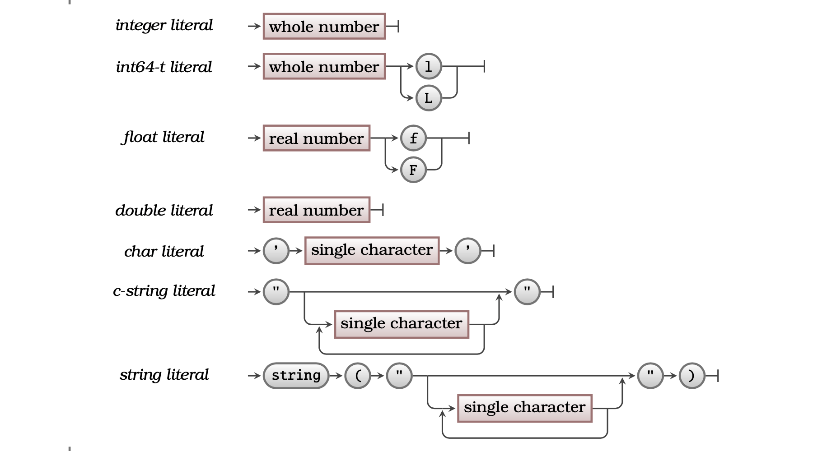

## Concept

All values within a program will have a **type**. The type indicates how the data stored in the computers memory is interpreted by the program. There are three basic data types available in a programming language, as
shown in [Figure 5.9](#FigureType).

-   **Textual** data such as `"Fred"`, `"Hello World"`, `"23"` and `"This is text!"`.
-   **Whole numbers** such as `1`, `0`, `-5`, and `37`.
-   **Real numbers** such as `0.5`, `-126.0`, `3.141516` and `23.981`.

The concepts related to expressions are shown in [Figure 5.9](#FigureType).

<a id="FigureType"></a>


<div class="caption"><span class="caption-figure-nbr">Figure 5.9: </span>A types define how values are interpreted and the operations that can be performed on the data.</div><br/>


## In C#

Types are used to define how data is interpreted and the operations that can be performed on the data. [Tables 5.3](#TableBasicTypes) show the three basic types of data, the associated C# type, size in memory, and other related information. [Table 5.4](#TablePermittedOperators) shows the operators that are permitted for each Type.

- The `int` type is the typical whole number type.
- The `double` type is the typical real number type.
- C# builds on the C programming language, and inherits a the ‘c-string’ standard literal. This can be converted to a C# string, but needs you to indicate this as shown. You cannot perform concatenation on the c-string type, but you can on C# strings.
- For example values see Table 1.4 on page 41.


<a id="TableBasicTypes"></a>

  |  Whole Number Types |                           |  |
  ----------------|------------------------------------------|----------------
 | *Name*                    | *Size*            | *Range (lowest .. highest)*   
  |`short`                   | 2 bytes/16 bits |        -32,767 .. 32,767        
  |`int`                     | 4 bytes/32 bits |    -2147483648 .. 2147483647    
  |`int64_t`                | 8 bytes/64 bits |  -9,223,372,036,854,775,807 ..  9,223,372,036,854,775,807    

  |  Real Number Types |                           |  | |
  ----------------|------------------------------------------|----------------|-------------
 | *Name*                    | *Size*            | *Range (lowest .. highest)*  | *Significant Digits* 
 |  `float`            |       4 bytes/32 bits    |     1.0e-38 .. 1.0e38        |          6
 | `double`             |     8 bytes/64 bits     |   2.0e-308 .. 2.0e308        |         10
                                                                             
  |  Text Types |                           |  |
  ----------------|------------------------------------------|----------------
 | *Name*                    | *Size*            | *Known as*   
|   `char`                  |   1 byte/8 bits     |                              
|  `string`                  | various<sup>[a](#FootNoteBasicTypes)</sup>       |        c-string             

<hr class="footnote">
<div id="FootNoteBasicTypes" class="footnote">
<sup>a </sup>The size in memory is determined by the number of characters within the string, and some overhead

</div>
<div class="caption"><span class="caption-figure-nbr">Tables 5.3: </span> C# Data Types</div><br/>


<a id="TablePermittedOperators"></a>


 | Type                   | Operations Permitted            | Notes
   ----------------|------------------------------------------|----------------
 |   Whole Numbers       | `( ) + - / * %`       | Division rounds down if all values are whole numbers.
 |  Real Numbers        | `( ) + - / *`       |  
 | Text                | `( ) +`          |  You can use `+` for concatenation.<sup>[a](#FootNotePermittedOperations)</sup>


<hr class="footnote">
<div id="FootNotPermitted Operations" class="footnote">
<sup>a </sup>To concatenate literals you <strong>must</strong> tell the compiler to make them strings. This can be done using <code>string("...")</code>
</div>
<div class="caption"><span class="caption-figure-nbr">Table 5.4: </span> C# Permitted Operators by Type</div><br/>

<div class="syntaxBox">

<div class="syntaxHowToRead"><span class="review">
<ul>
<li>A type can be any of an integer, in64-t, float, double, char, c-string or string literal. E.g.:</li>
<li>A char literal begins with a single quote, contains a single character and ends with a single quote</li>
</ul></span>
</div>


<a id="FigureTypeSyntax"></a>


<div class="caption"><span class="caption-figure-nbr">Figure 5.10: </span>The syntax of a Type</div><br/>


</div>


## Activities

<span class="review">1. Identify the types of of the following data. Where more than one type is possible, write down all the possible types. Where an expression is given, evaluate the expression and determine the type of the returned value. Line numbers are for reference only:</span>

```csharp
1. 392
2. 32 * 3.9
3. 40001
4. "Hello World"
5. 'm'
6. 'a' + 3
7. "a" + 'c'
```
<div class="caption"><span class="caption-figure-nbr">Listing 5.9: </span>Identify the data types</div>
<details class="review">
  <summary role="button">Answer</summary>
  <ul>
    <li><strong>Line 1: </strong>This is an integer type that in C# could be a <code>short</code>, <code>int</code> or <code>int64_t</code></li>
    <li><strong>Line 2: </strong>This is an expression with an integer type and a real number type. It would evaluate to a real number type, in this case a <code>float</code> as this is the smallest amount of memory that would hold the evaluated data.</li>
    <li><strong>Line 3: </strong>This is an integer type. It is too large to be a <code>short</code>, so would be stored as an <code>int</code>.</li>
    <li><strong>Line 4: </strong>This is a textual type, in this case a <code>String</code>.</li>
    <li><strong>Line 5: </strong>This is a textual type, in this case a <code>char</code>.</li>
    <li><strong>Line 6: </strong>This is an expression. When an expression contains a '+' operator that involves a number type with a text type (in this case a <code>char</code>), a <code>String</code> text type always results.</li>
    <li><strong>Line 7: </strong>As for Line 6, the '+' operator acts as a concatenator for two string types, in this case a <code>String</code>  with a <code>char</code> resulting in a <code>String</code></li>
  </ul>
</details>

## Summary

:::note

- A type is an **artefact**, there will be a number of existing types that you can use, and later you will see how to create your own types.
- A type is a programming artefact that indicates a kind of data.
- The type determines the basic actions that can be performed on the value.
- The type determines the amount of memory needed to store a value of that kind
- Whole numbers are usually called **Integers**.
- Real numbers are usually represented as **Floating Point** values. These values have a limited precision, supporting only a certain number of digits of precision.
- Textual values can contain numbers as text characters. For example, the text `"23"` is the character `'2'` followed by the character `'3'` - it is not the number `"23"`.
- You can perform mathematic operations on numeric data, but not on textual data.

:::