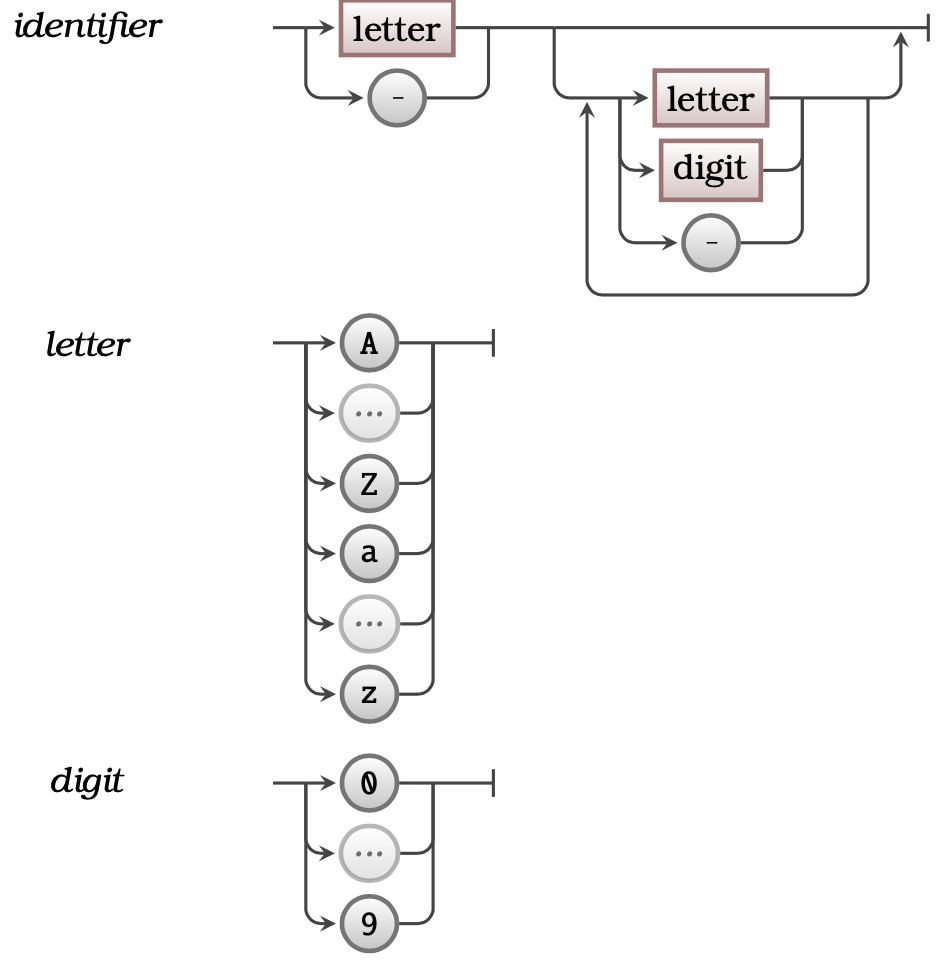

## Concept

An identifier is the technical term for the name/word that *identifies* something for the compiler. These can be the **name** of a programming artefact (such as a Program, Library, or Procedure) or words that have special meaning for the compiler. You will use identifiers to name the artefact you create, and to select the artefact you want to use.

[Figure 5.11](#FigureIdentifier) shows the concepts related to an Identifier.

<a id="FigureIdentifier"></a>


<div class="caption"><span class="caption-figure-nbr">Figure 5.11: </span>An Identifier is the name of a programming artefact such as a Program, Library, or Procedure.</div><br/>


## In C#

### User-created identifiers

In C#, as in most programming languages, <span class="review">a user-created</span> identifier must start with an underscore (`_`) or a letter; in other words your identifiers cannot start with a number or contain other symbols. This is because the compiler needs a way of distinguishing identifiers from numbers entered directly into the code.

In the syntax definition below, an identifier <span class="review">created by you</span> cannot contain spaces, or special characters other than underscores `_`.


<div class="syntaxBox">
<div class="syntaxHowToRead"><span class="review">
<ul>
<li>An identifier must start with either a single letter A-Z or a-z or an underscore <code>_</code>, then can be followed by one or more letters, underscores or digits.</li>
</ul>
</span>
</div>

<a id="FigureIdentifierSyntax"></a>


<div class="caption"><span class="caption-figure-nbr">Figure 5.12: </span>The syntax of an Identifier</div><br/>

</div>


### Inbuilt keyword identifiers

<span class="review">In addition to the identifiers you create in your source code, the inbuilt C# language keywords</span> are also identifiers that have special meaning to the language. These are listed in [Table 5.5](#TableKeywords) below. <span class="review">The second column shows some C# Library identifiers (like <code>printf</code>) and some user-created identifiers like (<code>height</code>). Can you spot the other C# Library Identifiers in that list?</span>


<a id="TablePermittedOperators"></a>

| Reserved Identifiers (Keywords) | Example C# Library and User Identifiers
----------------------------------|----------------------------
|  `auto` `break` `case` `char` `const` `continue` `default` `do` `double` `else` `enum`                  `extern` `float` `for` `goto` `if` `int` `long` `register` `return` `short` `signed` `sizeof` `static` `struct` `switch` `typedef` `union` `unsigned` `void` `volatile` `while` | `printf` `scanf` `bitmap` `sound_effect` `name` `draw_bitmap` `age` `my_alien` `height` `test` `alien` `name3` `_23` `i`

<div class="caption"><span class="caption-figure-nbr">Table 5.5: </span> C# Keywords and other example identifiers</div><br/>

## Examples

<span class="review">Some example valid user-created identifiers are:</span>

```csharp
_x
x
x1
x_33
```


## Activities
<span class="review">
1. Which of the following names are valid identifiers in C# and why/why not?

```csharp
1. `_`
2. `__`
3. `_ _`
4. `2_height`
5. `a2-height`
6. `y`
7. `HEIGHT_A`
```
<div class="caption"><span class="caption-figure-nbr">Listing 5.10: </span>Spot the valid C# identifiers</div>
<details class="review">
  <summary role="button">Answer</summary>
  <ul>
    <li><strong>Line 1: </strong>A single underscore is a valid ientifier</code></li>
    <li><strong>Line 2: </strong>Two consecutive underscores are a valid identifier</li>
    <li><strong>Line 3: </strong>This identifier is invalid because it contains spaces</li>
    <li><strong>Line 4: </strong>This identifier is invalid because it begins with a digit.</li>
    <li><strong>Line 5: </strong>This identifier is invalid because it contains a hyphen.</li>
    <li><strong>Line 6: </strong>A single character is a valid identifier</li>
    <li><strong>Line 7: </strong>This is a valid identifier because it begins with a letter and contains only letters and underscores (all valid)</li>
  </ul>
</details>
</span>

## Summary

:::note

- The **name** used to identify a programming artefact (such as a [Program](#program), [Library](#library) or [Method](../3-method) is an identifier.
- You use identifiers to indicate which libraries you want to access in your program.
- Each [Method Call](../2-method-call) uses the procedure’s identifier to determine which procedure is run.

:::


