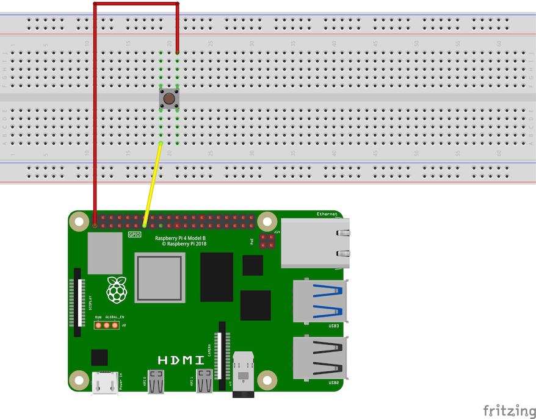
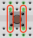

import { Accordion, AccordionItem } from "accessible-astro-components";

In this guided activity, you'll learn how you can use SplashKit to read the value of a GPIO pin on your Raspberry Pi, using a simple circuit with a push button.

When you run the program, you will be prompted 3 times to press your button (or you can choose not to press it), and then hit Enter to record the value of the pin connected to the button. The pin value will then be converted to an integer to print the number of times the button was pressed.

Here is an example of the terminal output for when the button is pressed only for readings 1 and 3:

```txt
Welcome to the button press counter!

You will be prompted to read the value of the button pin 3 times.
Press the button when prompted to increase the button counter.

Button Press - Reading 1
Press Enter to record the button reading: 

Button Press - Reading 2
Press Enter to record the button reading: 

Button Press - Reading 3
Press Enter to record the button reading: 

Results:

Reading 1: 1
Reading 2: 0
Reading 3: 1

The button was pressed 2 times!
```

---

For this activity, we'll be using a **tactile push button switch** (sometimes called a "momentary" push button switch) to provide input to the Raspberry Pi, as shown in the wiring diagram below:


<div class="caption">Image created with <a href="https://fritzing.org/">Fritzing</a></div>

Here are the steps to create the circuit shown above:

1. **Put the push button onto the breadboard:**

    Place the button across the center channel of the breadboard.

    :::note[Internal button connections]
    The 4 pins on the button are connected internally into two sets. The image below shows each set of connected pins circled in red:

    
    :::

2. **Connect the power using the 3.3V GPIO pin:**

    Attach a jumper wire from one side of the button to the 3.3V pin.  
    *(This is the red wire connected to pin 1 in the diagram above.)*

3. **Connect the button to the GPIO Pin:**

    Attach a jumper wire from the diagonally opposiste pin on the buttton to GPIO Pin 13.  
    *(This is the yellow wire connected to pin 13 in the diagram above.)*

---

Once you have completed the circuit above, create a new folder, and a dotnet project called ButtonCounter on your Raspberry Pi computer.

1. Open your terminal on your Raspberry Pi, and set up your project:

    ```zsh
    # Move you your code projects folder
    cd ~/Documents/Code # or cd /c/Users/andrew/Documents/Code
    
    # Create and move into a folder for the project
    mkdir ButtonCounter
    cd ButtonCounter

    # Create a blank dotnet project
    dotnet new console
    
    # Add the SplashKit library
    dotnet add package splashkit

    # Open in VS Code
    code .
    ```

2. Add the [using directives](/book/part-1-instructions/1-sequence-and-data/0-panorama/1-method-library) to access the SplashKit code and GPIO types:

    <Accordion>
      <AccordionItem header="Code with using directives">

      At this point you should just have these two lines of code.

      ```csharp
      using SplashKitSDK;
      using static SplashKitSDK.SplashKit;
      ```

      </AccordionItem>
    </Accordion>
