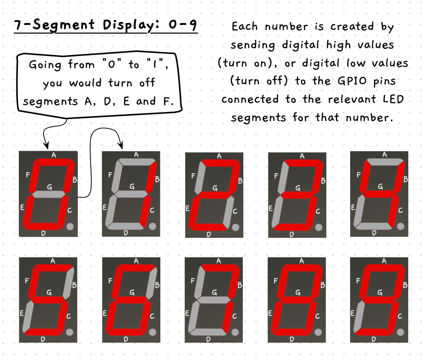
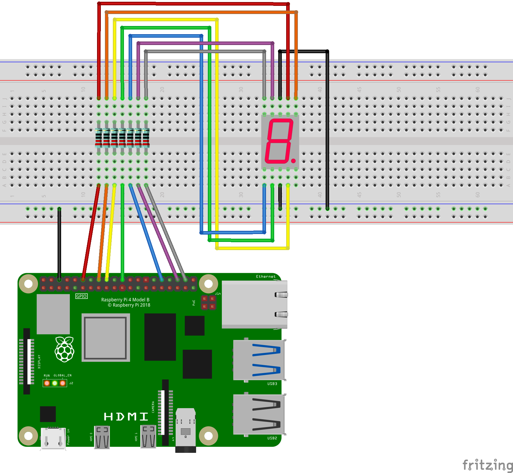

import { Accordion, AccordionItem } from 'accessible-astro-components';
import { Steps } from "@astrojs/starlight/components";

TODO: Decide if simple LED alternative activity needed? (It would need an alternative for test your knowledge though)

TODO: Add in pages similar to current activities:

- Page with Gif showing 0-9 showing on the actual 7-segment display.
- Page explaining the 7-segment numbers and going through wiring the circuit.
    With these images:
    
    
    
- Page going through code for each number (not sure how to set this up yet).

Potential Links that may be useful:

- [7 segment numbers guide from Geeks for Geeks](https://www.geeksforgeeks.org/digital-logic/seven-segment-displays/)
- [Hex decoder tutorial - possible use some of this](https://electronics-fun.com/7-segment-hex-decoder/)
- [SMA42056 Technical Data Sheet](https://cdn.velleman.eu/downloads/29/infosheets/vmp502_sma42056etc.pdf)

Final code with all numbers displayed in sequence:

<Accordion>
  <AccordionItem header="Final code">

  ```cs
  using SplashKitSDK;
  using static SplashKitSDK.SplashKit;

  // Initialise the GPIO system
  RaspiInit();

  // Define the pins for each segment
  GpioPin segmentA = GpioPin.Pin7;
  GpioPin segmentB = GpioPin.Pin11;
  GpioPin segmentC = GpioPin.Pin12;
  GpioPin segmentD = GpioPin.Pin13;
  GpioPin segmentE = GpioPin.Pin15;
  GpioPin segmentF = GpioPin.Pin16;
  GpioPin segmentG = GpioPin.Pin18;

  // Set the pin for each segment to output mode
  RaspiSetMode(segmentA, GpioPinMode.GpioOutput);
  RaspiSetMode(segmentB, GpioPinMode.GpioOutput);
  RaspiSetMode(segmentC, GpioPinMode.GpioOutput);
  RaspiSetMode(segmentD, GpioPinMode.GpioOutput);
  RaspiSetMode(segmentE, GpioPinMode.GpioOutput);
  RaspiSetMode(segmentF, GpioPinMode.GpioOutput);
  RaspiSetMode(segmentG, GpioPinMode.GpioOutput);

  // Display '0' on 7-segment display
  RaspiWrite(segmentA, GpioPinValue.GpioHigh);
  RaspiWrite(segmentB, GpioPinValue.GpioHigh);
  RaspiWrite(segmentC, GpioPinValue.GpioHigh);
  RaspiWrite(segmentD, GpioPinValue.GpioHigh);
  RaspiWrite(segmentE, GpioPinValue.GpioHigh);
  RaspiWrite(segmentF, GpioPinValue.GpioHigh);
  RaspiWrite(segmentG, GpioPinValue.GpioLow);
  Delay(1000);  // Hold for 1 second

  // Display '1' on 7-segment display
  RaspiWrite(segmentA, GpioPinValue.GpioLow);
  RaspiWrite(segmentD, GpioPinValue.GpioLow);
  RaspiWrite(segmentE, GpioPinValue.GpioLow);
  RaspiWrite(segmentF, GpioPinValue.GpioLow);
  Delay(1000);  // Hold for 1 second

  // Display '2' on 7-segment display
  RaspiWrite(segmentA, GpioPinValue.GpioHigh);
  RaspiWrite(segmentC, GpioPinValue.GpioLow);
  RaspiWrite(segmentD, GpioPinValue.GpioHigh);
  RaspiWrite(segmentE, GpioPinValue.GpioHigh);
  RaspiWrite(segmentG, GpioPinValue.GpioHigh);
  Delay(1000);  // Hold for 1 second

  // Display '3' on 7-segment display
  RaspiWrite(segmentC, GpioPinValue.GpioHigh);
  RaspiWrite(segmentE, GpioPinValue.GpioLow);
  Delay(1000);  // Hold for 1 second

  // Display '4' on 7-segment display
  RaspiWrite(segmentA, GpioPinValue.GpioLow);
  RaspiWrite(segmentD, GpioPinValue.GpioLow);
  RaspiWrite(segmentF, GpioPinValue.GpioHigh);
  Delay(1000);  // Hold for 1 second

  // Display '5' on 7-segment display
  RaspiWrite(segmentA, GpioPinValue.GpioHigh);
  RaspiWrite(segmentB, GpioPinValue.GpioLow);
  RaspiWrite(segmentD, GpioPinValue.GpioHigh);
  Delay(1000);  // Hold for 1 second

  // Display '6' on 7-segment display
  RaspiWrite(segmentE, GpioPinValue.GpioHigh);
  Delay(1000);  // Hold for 1 second

  // Display '7' on 7-segment display
  RaspiWrite(segmentB, GpioPinValue.GpioHigh);
  RaspiWrite(segmentD, GpioPinValue.GpioLow);
  RaspiWrite(segmentE, GpioPinValue.GpioLow);
  RaspiWrite(segmentF, GpioPinValue.GpioLow);
  RaspiWrite(segmentG, GpioPinValue.GpioLow);
  Delay(1000);  // Hold for 1 second

  // Display '8' on 7-segment display
  RaspiWrite(segmentD, GpioPinValue.GpioHigh);
  RaspiWrite(segmentE, GpioPinValue.GpioHigh);
  RaspiWrite(segmentF, GpioPinValue.GpioHigh);
  RaspiWrite(segmentG, GpioPinValue.GpioHigh);
  Delay(1000);  // Hold for 1 second

  // Display '9' on 7-segment display
  RaspiWrite(segmentE, GpioPinValue.GpioLow);
  Delay(1000);  // Hold for 1 second

  // Clean up the GPIO system
  RaspiCleanup();
  ```

  </AccordionItem>
</Accordion>
