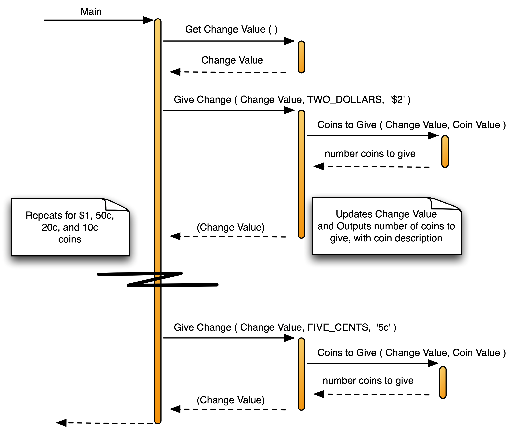

## Choosing Artefacts for the Change Calculator


The design for any program should involve thinking about the data as well as the tasks involved. You can start by dividing the program's tasks into functions and procedure, and then look at the data that will be needed by these in order to achieve their tasks.

### Designing the tasks for the Change Calculator

Think about the process of calculating change. At the start you need to determine the amount of change that needs to be given. Next you need to determine how many of each kind of coin you are going to give. These steps can be coded into their own functions and procedures. These functions and procedures are outlined in the following list, and shown in the structure chart in [Figure x.y](#FigureChangeCalculatorStructureChart).

- `Get Change Value`: This Function will be responsible for asking the user to enter the cost of the item, and the amount paid. It will then calculate the amount of change that needs to be given, in cents.
- `Give Change`: This Procedure will be responsible for the calculations related to giving one kind of coin as change. This will involve getting the number of coins to give, updating the amount of change remaining, and outputting the details (for that coin) to the Terminal.
- `Coins to Give`: This Function will be responsible for calculating the number of coins to give as change, given an amount of change and the value of the coin.


<a id="FigureChangeCalculatorStructureChart"></a>


<div class="caption"><span class="caption-figure-nbr">Figure x.y: </span>Structure chart for the Change Calculator</div><br/>

To understand how this is going to work you now need to think about how the kinds if data
these different tasks are going to need.

### Designing the data for the Change Calculator

Designing data is much like designing the procedures in your program. You need to think about the solution and try to identify the different values that are being used. Each of these values can then become either a Variable, a Parameter, or a Constant. Looking over the steps for calculating change you should be able to identify several different values you will need to work with. You need to be able to store things like the cost of the item being purchased, the amount of money paid, and the amount of change you need to give. A good way to approach this is to think about the values the program will output, as well as the values the user will need to input and any intermediate values you will need to perform the required calculations.

You can use the input/output/processing ideas to help you think about the data that will be required for each function or procedure. Let us examine each of the functions and procedures in turn.

#### Get Change Value

The first task we can examine if the `Get Change Value` Function. This task will be responsible for determining how much change needs to be given to the user. To design the data needed for this task you can think about its inputs, outputs, and temporary values.

When you are designing a function or procedure it can be given input by the calling code in the Function Call or Procedure Call. Inputs provided via the function or procedure call are coded using Parameters. To determine the parameters you need, think about the information that this function or procedure will need to be given to fulfil its responsibilities. In the case of the `Get Change Value`, it does not require any input from the caller.
- `Get Change Value` does not require any input from the calling code, so there is no need for any parameters with this function.
 
The `Get Change Value` task will be coded as a function because it has some output. The result returned by a function is an output, it is what makes it different from a procedure. When you call a function it runs some steps and then returns a value, the value returned is the output from the function. `Get Change Value` needs to return back the amount of change, this is why it is a function in this design.

- `Get Change Value` returns a number. The number returned is the value of the change to be given in cents.

Within the `Get Change Value` function there will need to be some values that it uses to calculate its output. `Get Change Value` will need to read the cost of the item from the user, and the amount paid. These two values need to be stored somewhere, so the design of this func- tion will require two Local Variables: they can be called `Cost of Item` and `Payment`. These will exist entirely within the function, being the values the function requires to calculate its output.

- `Get Change Value` will have two local variables: `Cost of Item` and `Payment`. 
  
The pseudocode for this function is shown in [Listing x.y](#listingGetChangeValuePseudoCode).


<br/>
<a id="listingGetChangeValuePseudoCode"></a>
```
Method: Get Change Value
--------------------------
Returns: An Integer - the value of the change to give in cents
Variables:
    - Cost of Item (Integer)
    - Payment (Integer)
Steps: 
    1. Output 'Cost of Item (in cents): '
    2. Read a number into Cost of Item
    3. Output 'Amount paid (in cents): '
    4. Read a number into Payment
    5. Return the result, Payment - Cost of Item
```
<div class="caption"><span class="caption-figure-nbr">Listing x.y: </span>Pseudocode for the Get Change Value function</div>

#### Give Change

The next task to consider is the `Give Change` Procedure. This procedure will be responsible for coordinating the actions for giving a certain coin in change. Once again you need to think about the inputs it requires (parameters), its outputs, and any values it will work with internally.

Put yourself in the place of the computer<sup>[1](#FootnoteComputer)</sup>. You (as the computer) have been *asked* to `Give Change`. What data will you need to complete this request? At a minimum you will need to know the total change value that is being given, and the value of the coin that you are issuing<sup>[2](#FootnoteCallOnce)</sup>.

There is one more input that you can only find by thinking about the tasks the computer needs to perform in this code. A part of giving the change will be to output a message, something like '3 x 20c' or '1 x $2'. The number of coins can be calculated within the procedure, but the text is another issue. The computer will not know what text to output. This data must, therefore, come as input into the procedure.

- `Give Change` needs to be *given* the `Change Value` variable, and it needs to be told value of the coin and the coin's description. These will be coded as parameters, with `Change Value` being passed by reference.

`Give Change` will output text to the Terminal, but it also needs to update the `Change Value` variable it is given. This can be considered as output from the procedure. As the `Change Value` variable is passed by reference, you can picture this as receiving the variable from the caller. Any changes this procedure makes on its `Change Value` parameter will actually be changing the value in the variable passed to the `Give Change` procedure. In this way the procedure is able to output a value<sup>[3](#FootnoteAlternativeImplementation)</sup>

-  `Give Change` will output the updated `Change Value`, as this is passed by reference.

Within `Give Change` you will need to store the number of coins to give in change. This will become a local variable that can be used to calculate the updated `Change Value` and to output the details to the Terminal.

- `Give Change` will have one local variable: `To Give` used to store the number of this coin to be given in the change.

The pseudocode for this procedure is shown in [Listing x.y](#ListingGiveChange).

<br/>
<a id="ListingGiveChange"></a>

```
Method: Give Change
--------------------------
Parameters:
    1. Change Value (Integer - by ref)
    2. Coin Value (Integer)
    3. Coin Description (String)
Variables: 
    - To Give (Integer)
Steps:
    1. To Give = Coins to Give (Change Value, Coin Value)
    2. Change Value = Change Value - To Give * Coin Value
    3. Output Number Given, ' x ', and the Coin Description
```

<div class="caption"><span class="caption-figure-nbr">Listing x.y: </span> Pseudocode for the `Give Change` function</div>


<hr class="footnote"/>
<div id="FootnoteComputer" class="footnote"><sup>1</sup>Remember the computer is unintelligent. You cannot rely upon your knowledge. Try to think about the information you are using and the steps you are performing to make sure you can capture what needs to be done in your code</div>
<div id="FootnoteCallOnce" class="footnote"><sup>2</sup>In this design the `Give Change` procedure will be called once for each coin.</div>
<div id="FootnoteAlternativeImplementation" class="footnote"><sup>3</sup>An alternative implementation could have been to code this as a Function, with the new change value being returned. It would then be the responsibility of the caller to assign this into their change variable.</div>

#### Coins to give

The `Coins to Give` function is used to calculate the number of coins to give. This code could have been written within the `Give Change` procedure, but it was decided to code this in its own function.

`Coins to Give` will need to be told the value of the change, and the value of the coin. Both of these parameters will be passed by value, as it is only the values that are required. Internally `Coins to Give` will not require any additional data, as it can calculate its output from the two input values.

- `Coins to Give` needs to be told the value of the change and the value of the coin, it can then use these values to calculate the number of these coins that need to be given in the change.
- `Coins to Give` will output the number of the indicated coin that needs to be given in the change.

The pseudocode for this procedure is shown in <a href="#ListingCoinsToGive">Listing x.y</a>.

<br/>
<a id="ListingCoinsToGive"></a>

```
Method: Coins to Give
--------------------------
Returns: An Integer - the number of coins to give in change
Parameters:
    1. Change (Integer)
    2. Coin Value (Integer)
Steps:
    1. Return the result of Change divided by Coin Value
```

<div class="caption"><span class="caption-figure-nbr">Listing x.y: </span> Pseudocode for the `Coins to Give` function</div>

#### Entry Point (Main)

The program’s code always performs the same task. It coordinates the actions the program is performing. The pseudocode for this was shown in Listing 2.1. This code will need to store the value of the change. It will get the value to store in this by calling `Get Change Value`. It will call `Give Change` for each of the coin values, and pass this variable to the procedure for it to update. These actions are shown in [Figure x.y](#FigureChangeCalculatorSequenceDiagram).

- The `Entry Point (Main)` needs a local variable to store the `Change Value`.

Thinking further about the program there are also the constant values of the different coins. These values are almost taken for granted when you think about giving change yourself, but remember the computer is unintelligent so you need to specify *everything* for it. The values of the coins can be coded using a constant for each coin. Using constants is a better option than hard coding these values directly in the program, as the name helps provide a context for the value when it is used.

:::note

- Notice that the functions and procedures are isolated from each other. They have defined inputs and outputs, but their local variables are hidden within their code.
- This means you can focus on the function/procedure you are working on, and do not have to think much about the details of the other functions/procedures in your code.
- Parameters allow you to pass data into a function/procedure.
- Passing a parameter by reference allows you to output a value by updating the vari-
able you are passed. This means a procedure can output values by having param- eters passed by reference, and functions can also use this mechanism to update values in variables as well.

:::

<br/>
<a id="FigureChangeCalculatorSequenceDiagram"></a>


<div class="caption"><span class="caption-figure-nbr">Figure x.y: </span>Sequence diagram for the Change Calculator</div><br/>


### Change Calculator Design Overview

The Change Calculator program contains the following artefacts:

-   **Constants**:
    -   `TWO_DOLLARS` with value 200, represents the value of a \$2 coin
    -   `ONE_DOLLAR` with value 100, represents the value of a \$1 coin
    -   `FIFTY_CENTS` with value 50, represents the value of a 50c coin
    -   `TWENTY_CENTS` with value 20, represents the value of a 20c coin
    -   `TEN_CENTS` with value 10, represents the value of a 10c coin
    -   `FIVE_CENTS` with value 5, represents the value of a 5c coin

-   **Functions**:
    -   `Get Change Value`: Calculates and returns the amount of change that needs to be given by the program. This function has the following:
        -   **Local Varaibles**:
            -   **`Cost of Item`**: Stores the value of the item being purchased. This design uses cents as its base to make the calculations easier, avoiding rounding issues involved in using floating point values.
            -   `Payment`: This is used to store the value of the payment being made. Once again this will be in cents.
    -   `Coins to Give`: Calculates the number of coins to give, returning how many of these coins should be dispensed as part of giving this change. This has the following:

        -   **Parameters**:
            -   `Change`: The value of the change that is to be given.
            -   `Coin Value`: The value of the coin that is being dispensed.

-   **Procedures**:

    -   `Give Change`: Calculates the change, and outputs the coin details to the Terminal. This shows the number and description of the change given. This requires the following:
        -   **Parameters**:
            -   **`Change Value`** (by reference): The variable that is storing the amount of change to be given.
            -   **`Coin Value`**: The value of the coin to issue.
            -   **`Coin Description`**: The description of the coin.
        -   **Local Variables**:
            -   `To Give`: Stores the number of the coin to give in change, used to update the `Change Value` and to output the message.

    -   **`Entry Point (Main)`**: this coordinates the overall activity of the program. Getting the amount of change using `Get Change Value`, and using `Give Change` to issue the change for each coin.
        -   **Variables**:
            -   `Change Value`: Keeps track of the current amount of change that has to be given to the user.

In addition to these artefacts the program will make use of some procedures from the available libraries. This will include the following:

-   **Output**: You need to use your language's procedures to write output to the Terminal.
-   **Input**: Languages also provide a means of reading values from the user. In C and Pascal these input procedures need to be passed the variables that you want the value assigned to. This uses pass by reference to enable the input procedure to store the values read into a variable for you.

### Reviewing the design diagrams 

[Figure x.y](#FigureChangeCalculatorStructureChart) shows the Structure Chart for the Change Calculator. This shows the structure of the solution, visually showing the functions and procedures and the calls between them. This diagram has been enhanced to show the parameter values being passed into the functions and procedures, and the values being returned. These data flows are shown alongside the call arrow, with their own smaller arrow to indicate the direction of the flow.

By reading [Figure x.y](#FigureChangeCalculatorStructureChart) you can tell that `Coins to Give` is going to be a function as it is returning data to `Main`. `Give Change` could be a function or a procedure as it is accepting and returning the `Change Value`, in this design it is a procedure, and updates the value in the `Change Value` variable using
pass by reference. You can also see that `Coins to Give` and `Give Change` both require parameters to accept the data being passedinto them.

The Structure Chart shows the static structure of the code, indicating the calls between the functions and procedures, but not communicating when these are called, or how many times. This dynamic information is
captured in the Sequence Diagram shown in [Figure x.y](#FigureChangeCalculatorSequenceDiagram). This diagram shows the sequence in which the function and procedure calls are performed. Notice that this diagram has also been enhanced to show the data that flows into and out
of the functions and procedures.

The Sequence Diagram indicates how values are being returned. The return of a function's value is shown by indicating the value on the returning arrow. Notice the indication of this value on the arrow returning from
the call to `Get Change Value`, this indicates that `Get Change Value` is a function. On the other hand, the brackets around the return value from `Give Change` indicates that this is being performed by updating a
parameter that was passed using pass by reference. You can use this information to determine how the design intends these to be coded. As `Get Change Value` is directly returning a value it must be a function,
`Give Change` updates a parameter and does not return a value itself so it must be a procedure.

:::note

- A **structure chart** shows the static structure of the program. This tells you which procedure/functions call which, and the data that is passed between them. It shows you what is written in the code.
- A **sequence diagram** shows the dynamic operation of a program. This tells you how the functions and procedures interact to achieve some goal. It shows you what is happening when the code is run.

:::

