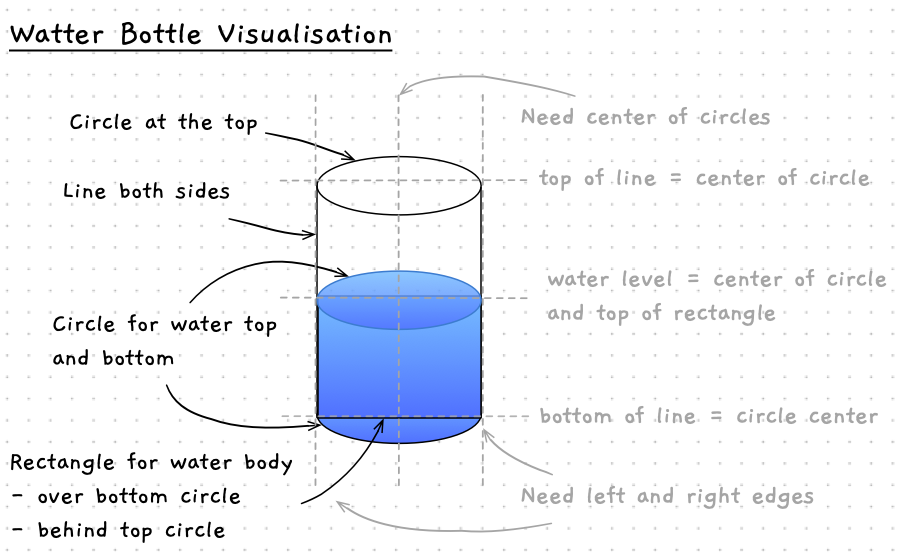

In this program we can see how to think through algorithms to draw shapes to the screen. 

In the section on [variables](../../1-concepts/07-variable) we say how to calculate the volume of water in a bottle. For this program, let's see how we could use SplashKit to draw this to the screen.

## The Algorithm

Drawing something to the screen needs us to think through the algorithm in the same way as we did for the change calculator and the airspeed programs. In the [graphics primer](../../1-concepts/13-graphics) there is a list of different methods that we can call to perform the drawing for us, so we just need to work out what values we need to provide these to achieve our goals.

We can start by planning out the algorithm at a high level, and then work out the details. The plan I came up within involves the following steps:

1. Set up the coordinates for the water bottle
2. Show a welcome message
3. Read in how full the water bottle is (we can do this as a percentage)
4. Calculate the height of the water
5. Open the Window
6. Draw the bottle
7. Wait so that the user can see this

Setting up the coordinates will require us to think through the values that we need to position the shapes on the screen. Pencil and paper are great here. Draw out what you want the scene to look like, and then note the coordinates that you will need to get the computer to create this. I have sketched out a plan for the water bottle below.



Showing a welcome message and reading in values from the user will involve the same steps that we saw in the change calculator and the airspeed programs.

We can use a simple calculation to determine the height of the water based upon the height of the bottle and the percentage that it is full. If we convert the **percent full** to a value between 0 and 1, then we can simply multiple this by the bottle's height to work out the height of the water. For example, 15% full would be stored as 0.15 in the percent full variable, a height of 100 pixels would then result in a water height of `0.15 * 100` = `15` pixels. If the user enters the percent fill as an integer, then we can divide this by 100 to achieve this.

Opening the window is a call to the `OpenWindow` method in SplashKit, so it is straight forward. We just need to think about the title we want, and how large it will be.

The main logic will come in the drawing of the water bottle. Drawing up the visual plan should also help you think through the steps needed to draw this. We need to think through the steps the computer will need to draw these shapes. Here are a few notes:

- We can **fill** to show the water, but can **draw** over the top to get an outline. So we will use both `FillCircle` and `DrawCircle`, as well as `DrawLine` and `FillRectangle`.
- We need to draw the rectangle over the bottom circle. Then it will draw over the part of the circle that should be behind the water.
- The order of drawing will need to be:
  - Bottom of the bottle - water and outline
  - Water - rectangle to water height
  - Side lines and top of bottle - outline

This gives us something like the following for the pseudocode for the program:

```
Determine bottle dimensions
 - radius of the circles = a set value... experiment
 - height of the bottle = a set value... experiment
 - diameter of the bottle = twice the radius
 - center x of the bottle = half window width maybe?
 - left x of the bottle = centre x - the radius
 - right x of the bottle = centre x + the radius
 - base of the bottle = a set value... experiment
 - top of the bottle = base - height (remember top is at 0)

Show the program details

Get the percent fill
Calculate the height of the water = bottle height * percent full / 100

Open the window - experiment with sizes
Clear the screen white

Fill the Circle at the top of the water

Fill and Draw the Circle at the bottom of the bottle

Draw the body of the water as a rectangle

Draw the outline of the bottle
  Draw the two lines, one on the left one on the right
  Draw the circle at the bottom

Refresh the screen to show the user

Delay for 5 seconds, so the user can see it
```

We can play around with different values for the bottle size, and window dimensions. By using constant, we can just change the value of the constant and see what it looks like.

:::tip[Practice makes perfect!]

Notice how you can for a general plan for how to achieve certain things, like reading values from a user. Building a catalogue of these small plans will help you start to quickly solve problems, as you recall and reuse strategies you have applied previously. This is why practice is so important with programming. You need to experience many situations so that you can develop these plans.

:::

## The Building Blocks

As you can see from above, we will need a whole range of constants and variables to achieve this. We can use constants to set up the dimensions of the bottle, and we let the user provide the `percentFull` so that we can calculate the water level they want.

For the bottle drawing we will need to capture the following. These can be constants as we won't change these in this program. We can pick an appropriate name for these now. In C#, and most other languages, constants should be all UPPERCASE with underscores between the words, so we can use:

- `BOTTLE_RADIUS` for the size of the circle. We can use this to draw circles at the top, bottom, and at the top of the water.
- `BOTTLE_HEIGHT` the height of the water bottle cylinder.
- `BOTTLE_DIAMETER` to store the full width of the circle. We need this to draw the water. This will be a rectangle drawn on top of the middle of the circle.  We can calculate this from the radius.
- `BOTTLE_CENTER_X` for the position of the bottle - this is the distance from the left of the screen. We can calculate this from the width of the window to position the bottle in the middle of the screen.
- `BOTTLE_LEFT_X` and `BOTTLE_RIGHT_X` to store the left and right sides of the bottle. We can use this for the position of the rectangle, and the lines for the side of the bottle. They can be calculated from the bottle's radius and center x.
- `BOTTLE_BASE_Y` and `BOTTLE_TOP_Y` can be created to store the distance from the top of the screen to the top and bottom of the bottle. This will tell us where to draw the circles, lines, and rectangles. The base can be calculated from the height of the window, and the top can be calculated from the base and the bottle's height.

For the water height, we need a few variables as this can change.

- `percentFull` will capture how full the bottle is. This can be an integer. We can then divide this by 100 to get the proportion to apply to the bottle's height to calculate the water height.
- When we know the `percentFull`, we can calculate the `waterHeight`.
- We need to know where the water should be drawn. When we know its height, we can use that to calculate a `waterY` value. This will represent where the water is up to within the bottle.

As with the previous program, we also need a string (we called it `line`) to store the text data from the user before we convert it to a number for us to use.

:::tip[Are all programs this mathematical?]

The programs so far have been focused on mathematical calculations. This is not all we can do with computing. Most of the code in your program will not involve this level of mathematical modelling. We will soon see how we can wrap this kind of calculations into neat, reusable, packages. This is about as complex as the calculations will get in this guide.

:::

To help communicate how this works, we can capture this in a comment in the code using ASCII art to output the bottle's shape and indicate what the different constants and variables represent. See the following comment as an example. Read through the pseudocode and match up the comment with the constants, and their calculations. Notice how easy it will be to resize the bottle - you can change the radius or height and the other values will all be updated to reflect this!

```csharp
/*-------------------------------------\
| Water bottle shape...
|
| BOTTLE_LEFT_X     BOTTLE_RIGHT_X
|        |             | 
|        v             v 
|          ___________
|         /           \
|   ^    |      x      | <-- x = BOTTLE_CENTER_X
|   |    |\___________/|       + BOTTLE_TOP_Y
|   |    |             |
|   |    | ___________ |
|   |    |/           \|
|   |    |             | <-- waterY
|   |    |\___________/| ^
|   |    | ___________ | | waterHeight
|   |    |/           \| v
|   v    |             | <-- BOTTLE_BASE_Y
|         \___________/
| BOTTLE_HEIGHT
|         <-----x-----> BOTTLE_RADIUS
|        BOTTLE_DIAMETER        
\-------------------------------------*/
```

:::tip
This kind of comment is really awesome - it **shows** the reader what we intend. Comments should aim to be useful, and this is an example of how you can achieve this without writing lots of text.
:::

These constants will also help when we write the drawing code. The names of the constants will help make it clear what is being drawn. Imagine if this were all just raw values. The code would be a jumble of numbers. Creating constants helps make it clearer what you are doing in the code.


Have a go at coding this plan up yourself! Here are the steps that I suggest following:

1. Show the welcome message, show the window, and delay. This gets these steps out of the way.
2. Draw the outline of the bottle - draw the circle at the bottom and top, and the lines. Make sure it looks right before you move on.
3. Play around with sizes and positions until you are happy.
4. Add the water with a fixed percent full.
5. Add the code to read the percent full from the user.
6. Test - empty, full, midway, etc.
7. Test more - what about crazy values? What happens? (we can fix these later)
8. Celebrate.

:::tip
Hopefully you get a buzz out of getting these things working. The compiler is not forgiving, and programming can be challenging. Work on your persistence and attention to detail, these will help you get through these challenges. Then make sure to celebrate the successes along the way!
:::
