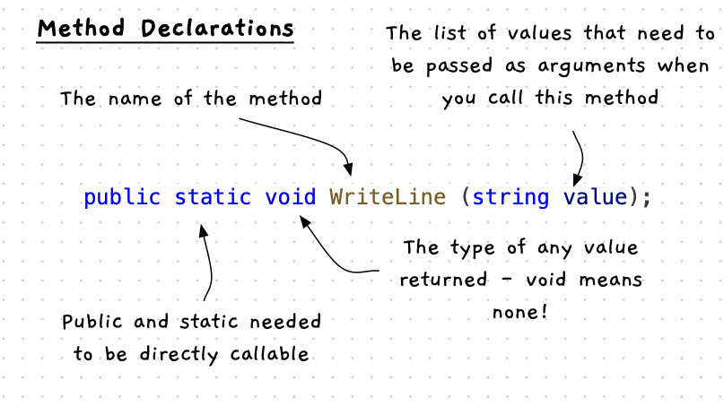

At this point the programs we create will include sequences of method calls, with variables that we can use to work with data within our program.

To build programs we will need to have some [methods](/book/part-1-instructions/1-sequence-and-data/1-concepts/02-method) that we can [call](/book/part-1-instructions/1-sequence-and-data/1-concepts/03-method-call). The great this is that [library](/book/part-1-instructions/1-sequence-and-data/1-concepts/10-library) creators will describe the methods that they have created so that we can find and use them. In order to use this documentation we need to know how these methods will be described.

## Method Declarations

Methods are usually communicated using part of their declaration. We will look at building these ourselves in [Part 2](/book/part-2-organised-code/2-organising-code/0-overview), but for now we need to know some basics so that we can start calling methods.



The above image helps show the components of a method declaration. The key parts are:

- The *name* of the method. Remember, to call the method you use its name.
- The variables and types of any *arguments* you will need to pass when you call the method. These will be listed as variables after the method name in parentheses.
- You can also see the type of data that is returned (where `void` means none).
- You also need to check that the method is `public` and `static`. We can call these directly if you have `using static ClassName;` at the top of your code file. For example, `WriteLine` is in the `System.Console` code, so you can call it if you have `using static System.Console` at the top of the code.

The following code snippets show example method declarations.

In the details of the [Console code](https://learn.microsoft.com/en-us/dotnet/api/system.console.writeline?view=net-8.0#system-console-writeline(system-string)) in the .NET documentation, there is the following documentation to show one of the `WriteLine` methods.

```cs
public static void WriteLine (string? value);
```

This is available to call directly, as it is `public` and `static`. We can use this in our code using:

```cs
using static System.Console;

WriteLine("Hello World");
```

The following shows the declaration of the [Open Window](https://splashkit.io/api/windows/#open-window) method from the SplashKit documentation. It is similar to the code above, but also includes the class name so that you know where the method exists. We can call it directly as it is `public` and `static`.

```cs
public static Window SplashKit.OpenWindow(string caption, int width, int height);
```

This is in the `SplashkitSDK.SplashKit` class, so you can call the `OpenWindow` method using the following code. This will pass "This is the caption" to the `caption` data, 800 to the `width`, and 600 to the `height`. This code will return a `Winddow` value, which we can ignore or store in a `Window` variable.

```cs
using static SplashkitSDK.SplashKit;

OpenWindow("This is the caption", 800, 600);
```

For the final example let's look at [Fill Circle](https://splashkit.io/api/graphics/#fill-circle-3) and [Color Red](https://splashkit.io/api/color/#color-red). These have the following declaration on the SplashKit website.

```cs
public static void SplashKit.FillCircle(Color clr, double x, double y, double radius);
public static Color SplashKit.ColorRed();
```

We can see from its declaration that we can call these (they are public and static). Their names are `FillCircle` and `ColorRed`. Will `FillCircle` we need to pass it a Color, and three double values. `ColorRed` does not need to be passed anything, and will return a Color value. The following is an example of calling this method. Here we use the result of `ColorRed()` as the value passed into the color for `FillCircle`.

```cs
using static SplashkitSDK.SplashKit;

OpenWindow("This is the caption", 800, 600);
ClearScreen(ColorWhite());

FillCircle(ColorRed(), 400, 300, 100);
RefreshScreen();
```

In the next pages we will list the different methods that you will use to complete the activities in this chapter both for terminal and graphical programs.

## Other Websites

You can call these methods on the *class* in which they are defined, and we will work up to this over the next few parts. To simplify things, we want to avoid doing this for now and instead call these directly as we have seen here.

When you read other websites, you will often see them calling methods like this: `Console.WriteLine();`. This is the equivalent of calling `WriteLine();` when you have `using static System.Console;` at the top of your code. When you find code like this, you will need to convert it so that you can call the method directly.
