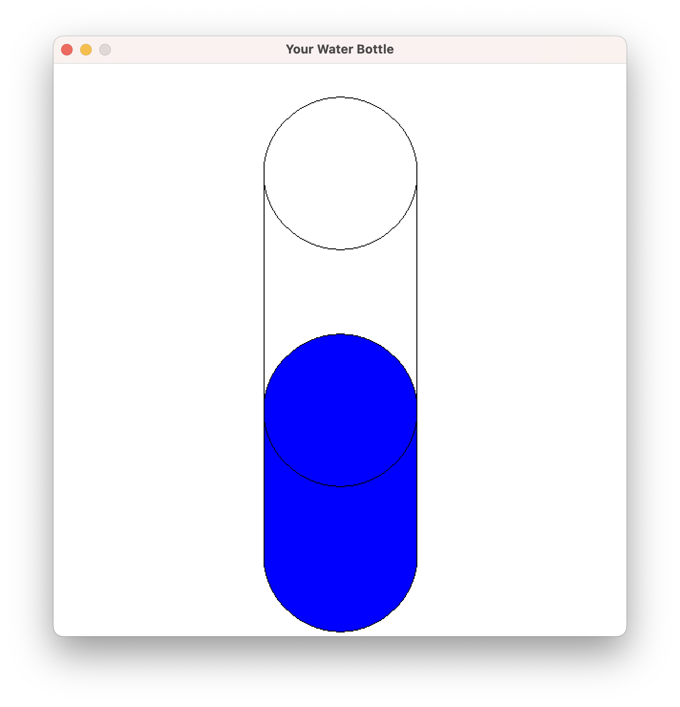

import { YouTube } from 'astro-embed';

## Airspeed Velocity

On your journey, you encountered a strange person who mentioned something about coconuts and queries you vigorously about the airspeed velocity of unladen swallows.

<div class="not-content">
  <YouTube id="w8Rn_f75UHs" params="fs=1&start=104&modestbranding=1&rel=0&autoplay=1"/>
</div>

To answer this age old question, you can mock up the following program to calculate the airspeed velocity of these important birds. With a quick search, you find [an equation](http://www.style.org/strouhalflight) based on the Strouhal Number and some [details on swallows](http://style.org/unladenswallow/). We can use this information to create a program that can be used to calculate the airspeed velocity of African and European Swallows.

From these articles we can determine that the air speed velocity of a swallow can be calculated using `Speed = Frequency * Amplitude / Strouhal`. Code this into a program and then test out the different airspeeds.

- We can use two set Strouhal values - An efficient Strouhal number of 0.20 and low efficiency Strouhal of 0.40.
- African Swallow: frequency 15hz, amplitude 21cm
- European Swallow: frequency 14hz, amplitude 22cm

To create this program, we have a few set values, and some values that we want to be able to be different each time the program runs. We can create the following building blocks to help us work with this into our program:

- Two constants:
  - `STROUHAL_LOW_EFFICIENCY` to store 0.4
  - `STROUHAL_HIGH_EFFICIENCY` to store 0.2
- Six variables:
  - Two strings:
    - `birdName` to capture the name of the bird the user enters
    - A `line` to store the numbers they enter, until we can convert them to a double we can use.
  - Four double values:
    - `freq` to store the frequency of the birds wing stroke, in beats per second.
    - `amp` to store the amplitude in meters.
    - `resultMax` and `resultMin` to store the two speed calculations based on the low and high efficiency Strouhal values.

We will need to use `double` for these numberic values, and we will not have issues with limit of precision or accumulated rounding issues. We need the `line` to read the value, and read line returns us the text they entered.

For our **algorithm**, we will need the program to step through the following actions:

1. Show the start details
2. Read in the name, frequency, and amplitude
3. Calculate min and max speeds
4. Output results

Reading in the frequence and amplitude will require a few steps each:

1. Show the prompt to the user (tell them what we want them to enter)
2. Read in their response as a string - they enter text
3. Convert the line entered to a double, and store in the variable

```csharp
using static System.Console;
using static System.Convert;

const double STROUHAL_LOW_EFFICIENCY = 0.4;
const double STROUHAL_HIGH_EFFICIENCY = 0.2;

string birdName, line;
double freq, amp;

WriteLine("Welcome to the Airspeed Calculator");
WriteLine();
WriteLine("What is the name of the bird?");
Write("Name: ");

WriteLine("What is the frequency of its wing stroke? (beats per second)");
Write("Frequency: ");

// Read and convert frequency to double
line = ReadLine();
freq = ToDouble(line);

WriteLine("What is the amplitude of its wings? (centi)");
Write("Amplitude: :");
line = ReadLine();
amp = ToDouble(line);

// calculate the air speed, given a fixed Strouhal value
double resultMax, resultMin;
resultMax = freq * amp / STROUHAL_HIGH_EFFICIENCY;
resultMin = freq * amp / STROUHAL_LOW_EFFICIENCY;

// output the airspeed of the bird
WriteLine($"Bird {birdName} ");
WriteLine($" - f: {freq} A: {amp} Speed: {result} m/s");
WriteLine($" - f: {freq} A: {amp} Speed: {result} m/s");

```

## Water Bottle Visualiser

Now we have calculated the volume of water in a bottle, let's draw it to the screen.

The following program uses a whole range of constants and variables. The constants set up the dimensions of the bottle, and we let the user provide the `percentFull` so that we can calculate the water level.

We can plan the **algorithm** in this program to have the following steps:

1. Setup the coordinates for the water bottle
2. Show a welcome message
3. Read in how full the water bottle is (we can do this as a percentage)
4. Calculate the height of the water
5. Open the Window
6. Draw the bottle
7. Wait so that the user can see this

For the bottle drawing we will need to capture a few dimensions. These can be constants as we wont change these in this program:

- `BOTTLE_RADIUS` for the size of the circle. We can use this to draw circles at the top, bottom, and at the top of the water.
- `BOTTLE_HEIGHT` the height of the water bottle cyclinder.

- `BOTTLE_DIAMETER` to store the full width of the circle. We need this to draw the water. This will be a rectangle drawn on top of the middle of the circle.  We can calculate this from the radius.
- `BOTTLE_CENTER_X` for the position of the bottle - this is the distance from the left of the screen. We can calculate this from the width of the window to position the bottle in the middle of the screen.
- `BOTTLE_LEFT_X` and `BOTTLE_RIGHT_X` to store the left and right sides of the bottle. We can use this for the position of the rectangle, and the lines for the side of the bottle. They can be calculated from the bottle's radius and center x.
- `BOTTLE_BASE_Y` and `BOTTLE_TOP_Y` can be created to store the distance from the top of the screen to the top and bottom of the bottle. This will tell us where to draw the circles, lines, and rectangles. The base can be calculated from the height of the window, and the top can be calculated from the base and the bottle's height.

For the water height, we need a few variables as this can change.

- `percentFull` will capture how full the bottle is. This can be an integer. We can then divide this by 100 to get the proportion to apply to the bottle's height to calculate the water height.
- When we know the `percentFull`, we can calculate the `waterHeight`.
- We need to know where the water should be drawn. When we know its height, we can use that to calculate a `waterY` value. This will represent where the water is up to within the bottle.

As with the previous program, we also need a string (we called it `line`) to store the text data from the user before we convert it to a number for us to use.

:::tip[Are all programs this mathematical?]

The two programs here are both very focused on mathematical calculations. This is not all we can do with computing. Most of the code in your program will not involve this level of mathematical modelling. We will soon see how we can wrap this kind of calculations into neat, reusable, packages. This is about as complex as the calculations will get in this guide.

:::

We need to think through the steps the computer will need to draw the water. Here are a few notes we took:

- We can fill to show the water, but can draw over the top to get an outline.
- We will need to draw the rectangle over the bottom circle. Then it will draw over the part of the circle that should be behind the water.
- The order of drawing will need to be:
  - Bottom of the bottle - water and outline
  - Water - rectangle to water height
  - Side lines and top of bottle - outline

To help communicate how this works, there is a comment in the code that uses ASCII art to output the bottle's shape and indicate what the different constants and variables represent. Read through the code and match up the comment with the constants, and their calculations. Notice how easy it is to resize the bottle - you can change the radius or height and the other values will all be updated to reflect this.

Also, look at the drawing code. See how the constants help make it clear what is being drawn. Imagine if this were all just raw values. The code would be a jumble of numbers. Creating constants helps make it clearer what you are doing in the code.

```csharp
using static System.Convert;
using static SplashKitSDK.SplashKit;

const int WINDOW_WIDTH = 600;
const int WINDOW_HEIGHT = 600;

/*-------------------------------------\
| Water bottle shape...
|
| BOTTLE_LEFT_X     BOTTLE_RIGHT_X
|        |             | 
|        v             v 
|          ___________
|         /           \   x = BOTTLE_CENTER_X
|   ^    |      x      | <--  BOTTLE_TOP_Y
|   |    |\___________/|       
|   |    |             |
|   |    | ___________ |
|   |    |/           \|
|   |    |             | <-- waterY
|   |    |\___________/| ^
|   |    | ___________ | | waterHeight
|   |    |/           \| v
|   v    |             | <-- BOTTLE_BASE_Y
|         \___________/
| BOTTLE_HEIGHT
|         <-----x-----> BOTTLE_RADIUS
|        BOTTLE_DIAMETER        
\-------------------------------------*/

const int BOTTLE_RADIUS = 80;
const int BOTTLE_HEIGHT = 400;
const int BOTTLE_DIAMETER = BOTTLE_RADIUS * 2; 
const int BOTTLE_CENTER_X = WINDOW_WIDTH / 2;
const int BOTTLE_LEFT_X = BOTTLE_CENTER_X - BOTTLE_RADIUS;
const int BOTTLE_RIGHT_X = BOTTLE_CENTER_X + BOTTLE_RADIUS;
const int BOTTLE_BASE_Y = WINDOW_HEIGHT - BOTTLE_RADIUS - 5; // 5 pixel gap
const int BOTTLE_TOP_Y = BOTTLE_BASE_Y - BOTTLE_HEIGHT;

string line;
int percentFull;

WriteLine("Water Bottle Visualiser!");
WriteLine();
WriteLine("How full us your bottle? (0-100)");
WriteLine();
Write("Percent: ");
line = ReadLine();

// Convert the text entered to a double
percentFull = ToInt32(line);

double waterHeight = BOTTLE_HEIGHT * (percentFull / 100.0);
double waterY = BOTTLE_BASE_Y - waterHeight;

OpenWindow("Your Water Bottle", WINDOW_WIDTH, WINDOW_HEIGHT);
ClearScreen(ColorWhite());

// Draw the water
// Circle at the bottom of the bottle
FillCircle(ColorBlue(),  BOTTLE_CENTER_X, BOTTLE_BASE_Y, BOTTLE_RADIUS);
DrawCircle(ColorBlack(), BOTTLE_CENTER_X, BOTTLE_BASE_Y, BOTTLE_RADIUS);

//Draw the water
FillRectangle(ColorBlue(), BOTTLE_LEFT_X, waterY, BOTTLE_DIAMETER, waterHeight);
DrawCircle(ColorBlack(), BOTTLE_CENTER_X, waterY, BOTTLE_RADIUS);

// Outline bottle
// Draw the left wall of the bottle
DrawLine(ColorBlack(), BOTTLE_LEFT_X, BOTTLE_BASE_Y, BOTTLE_LEFT_X, BOTTLE_TOP_Y);
// Draw the right wall of the bottle
DrawLine(ColorBlack(), BOTTLE_RIGHT_X, BOTTLE_BASE_Y, BOTTLE_RIGHT_X, BOTTLE_TOP_Y);
DrawCircle(ColorBlack(), BOTTLE_CENTER_X, BOTTLE_TOP_Y, BOTTLE_RADIUS);
// Circle at the top of the water
FillCircle(ColorBlue(),  BOTTLE_CENTER_X, waterY, BOTTLE_RADIUS);

RefreshScreen();
Delay(5000);
```

Run this and you should see something like the following.



## Wrap Up

Programming with sequence and data involves two things:

1. Thinking about the values you will need in your program.
2. Thinking about the sequence of steps you will need to get the outcome you want.

You need to think about both of these together. The data you have, and need, will help you think about the steps to acheive this. Break down your problems into small discete steps, each performing a small step toward your goal.

With each piece of data, think "Does this need to change?" If the answer is yes, then use a variable. If no, use a constant. At the same time, think "What kind of value is this?" If it is a number, is it a whole number (`int`) or a real number (`double`)? This will help you make the many small decisions you need to make as you craft your code.
