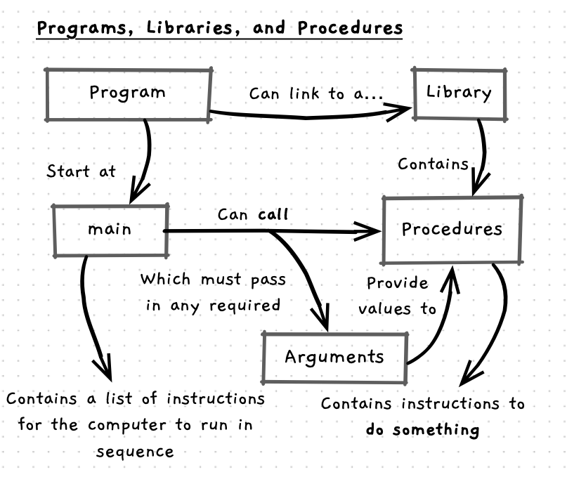
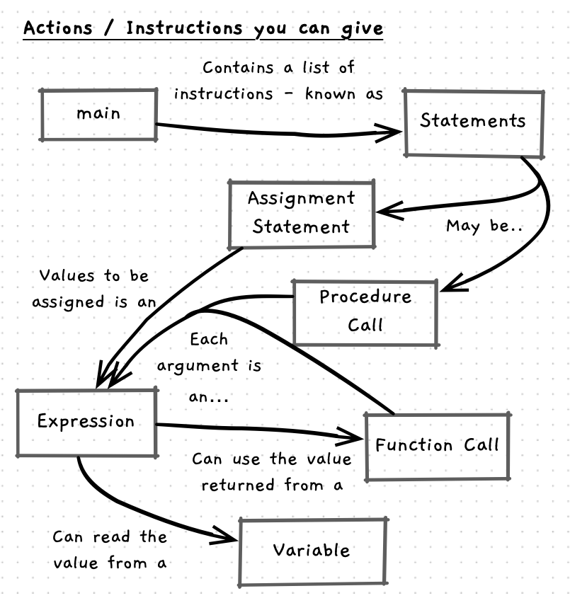

There are a couple of concepts that we introduce in this chapter:

- Functional constructs that help organise the functionality which we can use.
- Different kinds of instructions to perform different actions.

This page gives a brief overview of how these concepts are interconnected. You can use this to help orient yourself as you progress through the remaining material.

## Functional Constructs: Program, Procedure, Function

- Program: the overall construct within which we create and use other constructs that come together as a program the uses can execute to achieve a goal.
- Procedures: constructs that encapsulation the steps needed to perform a specific task within a program.
- Functions: constructs that encapsulate the steps needed to calculate a value.
- Library: a construct that packages up reusable functions and procedures that you can use if you link to the library.

## Kind of Instructions

- Statement: the technical name we give to an action/instruction within our code.
- Expression: the technical name for the places within a statement where a value can be calculated.
- Procedure call: the name of the instruction to run a procedure.

