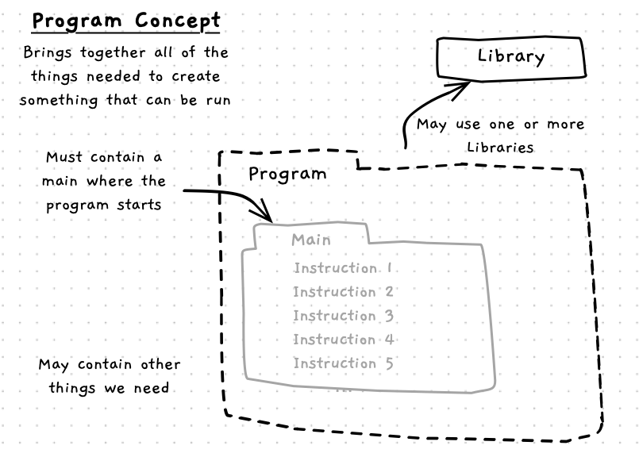
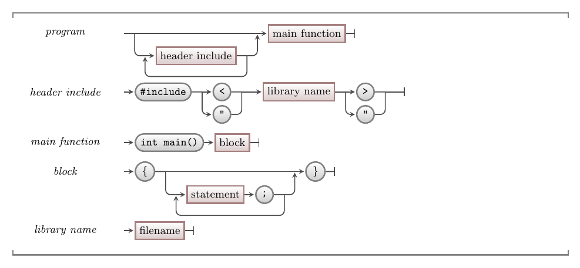
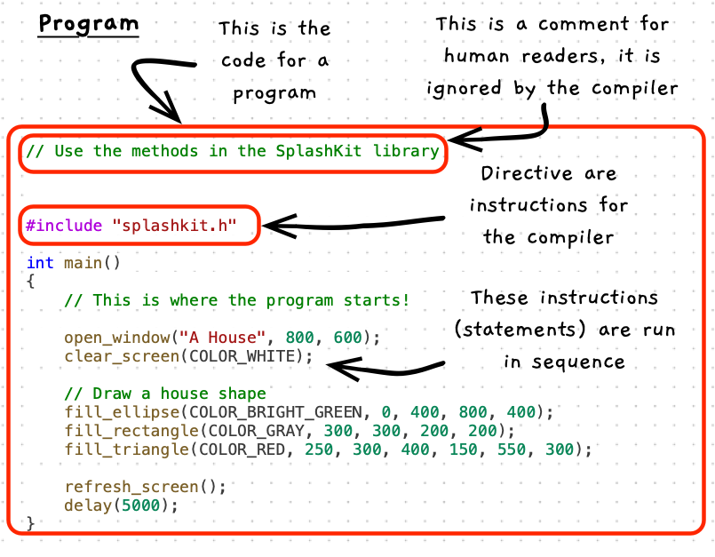

import CommmonLink from '/src/components/CommonLink.astro'

In most software projects the top-level building block you are aiming to create is a **program**. A program is something the user can **run** to get the computer to do something.

Each program consists of a **list of instructions** ([statements](/book/part-1-instructions/1-sequence/5-reference/02-statement) in programming terminology) that the computer will perform when the program is run. When you create a program, think about the goal of that program and the steps you need the computer to perform to achieve that goal.

The image below shows a sketch of the program concept. It shows a program consisting of instructions (written in **source code**).



## Program -- when, why, and how

Generally when we are building software, you will be creating a program. A large software system may have several programs, but each program will create its own digital reality when it is executed.

When you think about a program, you are thinking **big picture**.
What do you want this program to do, and what are the steps to achieve this?
Each program will contain and use other constructs to achieve its goals.
As you continue your journey, you will pick up more tools to expand what you can create in your programs.
For now, a program is simply a list of instructions that are followed when the program runs.

:::tip[Memorising syntax]

To master these concepts you will need to memorise the syntax so that you can start to use these concepts in programs of your own design. As you read through these, make sure to keep notes and create small test programs so that you can practice using these ideas and memorise the language syntax as you go. This is an important part of the process of learning to program.

:::

## In C++

:::tip[Syntax]
In a C++ project, you have one source code file that will contain the program's main code. The following illustration shows the structure of the syntax for this, for the concepts we've covered so far.


<CommmonLink type="syntaxDiagramGuide"/>
:::

Each program starts with an optional list of **header includes**.
These allow you to tell the compiler to give you access to [procedures](/book/part-1-instructions/1-sequence/5-reference/10-procedure) declared in [libraries](/book/part-1-instructions/1-sequence/5-reference/30-library) you want to use.

After this you can declare a `main` function - then between the braces (`{ }`) you provide a list of instructions that each end with a semicolon (`;`). These instructions are known as [statements](/book/part-1-instructions/1-sequence/5-reference/02-statement) and are run in [sequence](/book/part-1-instructions/1-sequence/5-reference/01-sequence) when the program is executed.

:::tip[Directive?]
A directive is an instruction for the compiler, rather than an instruction that gets added to the program created by the compiler. You use these to let the compiler know something about the code you are writing.

For example, the `#include` preprocessor directive tells the compiler to literally paste in the code from the file specified. Files like `splashkit.h` contain declarations of the library's functions/procedures, which then allows you to use them in your code.
:::

Here is an illustration showing the code for a program.



## Examples

The following code shows a basic Hello World C++ Program. You should be able to match this up with the syntax defined above. This program uses code from the `SplashKit` library, giving you access to the `write_line` procedure. When you call `write_line`, it outputs a message to the terminal. The important thing to see here is that **all** of this code is the program -- each line is a part of the program.

```c++
#include "splashkit.h"

int main()
{
    write_line("Hello World!");
}
```

The following program uses SplashKit to open a window and draw some shapes to it. Once again, the important thing to think about for now is that the program is **all** of these instructions. They all come together to create the program that gets the computer to do what we want.

```c++
#include "splashkit.h"

int main()
{
    open_window("A House", 800, 600);
    clear_screen(COLOR_WHITE);

    // Draw a house shape
    fill_ellipse(COLOR_BRIGHT_GREEN, 0, 400, 800, 400);
    fill_rectangle(COLOR_GRAY, 300, 300, 200, 200);
    fill_triangle(COLOR_RED, 250, 300, 400, 150, 550, 300);

    refresh_screen();
    delay(5000);
}
```

:::tip[Code Comments]
C++ source code is [abstracted](/book/part-0-getting-started/1-building-programs/5-reference/6-source-code/#programming-with-a-third-generation-language) to make it more understandable for humans, but ultimately it is still written for computers.
Because of this, C++ and virtually all programming languages include syntax for writing [**code comments**](/book/part-1-instructions/1-sequence/5-reference/20-comments).

In the code above the line starting with `//` is a code comment and will be ignored by the compiler.

You can also write "block comments" (multi-line comments) by starting them with `/*` and ending them with `*/`
:::

Data, which we'll explore in more detail in the next chapter, is also key within every program. Can you spot data in the examples above?

We use data to capture information we need a program to work with. The data in the above examples are all **fixed** or [literal](/book/part-1-instructions/1-sequence/5-reference/14-literal) values. That means these values can not change when the program runs. They are fixed, being literally the value that appears in the code.

:::note[Summary]

- You can create something the user can run from a program's **source code**.
- Most importantly, you can't really *see* the program in the code. The program is **all** of the code together.
- The program has an **entry point** that indicates where the program’s instructions start -- in this case that is the first instruction in the `main` function.
- Your program can use code from [libraries](/book/part-1-instructions/1-sequence/5-reference/30-library), giving it access to procedures (and other constructs) others have created.

:::
