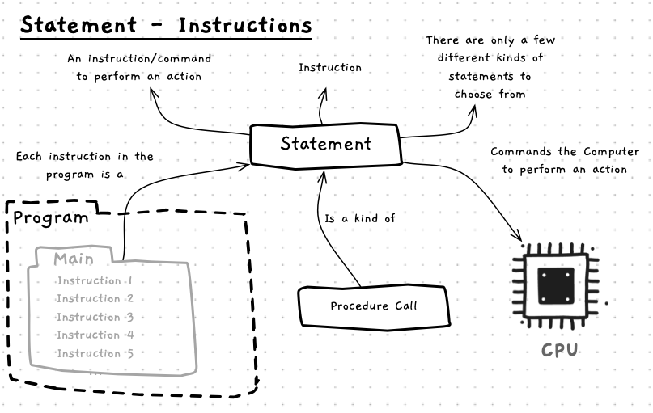
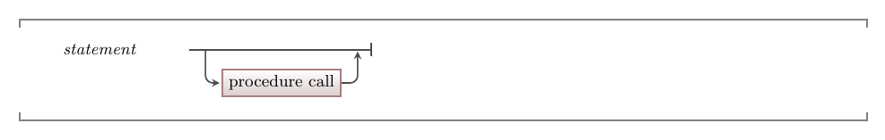

When you are creating a program you define the actions the computer will perform when the program is run. Each of these instructions is coded as a **statement** within the program. This style is [imperative programming](/book/part-1-instructions/1-sequence/5-reference/12-other-languages#imperative-programming-paradigms). Imperative means to give authoritative commands, and that is what we do in our programs. Our programs are lists of authoritative commands (statements) that *tell* the computer the actions it is to perform.

The concept map below shows the concepts related to statements. A statement is a term used to describe the instructions in your code, and as such represent an **instruction** or **command** to perform an action. As we have seen, a [program](/book/part-1-instructions/1-sequence/5-reference/00-program) has a list of statements that are followed when it is executed. For example, a [procedure call](/book/part-1-instructions/1-sequence/5-reference/04-procedure-call) is a kind of statement that tells the computer to run the code in a [procedure](/book/part-1-instructions/1-sequence/5-reference/03-procedure).



## Statement -- when, why, and how

As you learn to program, you will need to learn all the different kinds of instructions you can give the computer. These will be **statements** in the programming languages you learn. Just knowing that **statement** means **instruction** will help you engage with these conversations and documentation.

## In C++

:::tip[Syntax]
The following diagram shows the current C++ syntax we will use for the statements in our programs. We will continue to expand these options as we move through the guide.


:::

In a statement you are commanding the computer to perform an action. There are only a few statements you can choose from in a programming language. At this stage we only need to know one, the [procedure call](/book/part-1-instructions/1-sequence/5-reference/04-procedure-call).

## Examples

The following code shows an example of some procedure call statements in a simple C++ program. We will be looking at the procedure call syntax next.

```c++
#include "splashkit.h"

int main()
{
    // Introduce knights
    write_line("We are the knights who say 'Ni!'");
    write("We are the keepers of the sacred words:");
    write_line(" 'Ni', 'Peng', and 'Neee-wom !'");
    write_line("The Knights Who Say 'Ni' demand a sacrifice.");
    write_line("We want .... a shrubbery!");
}
```

:::note[Summary]

- A statement is a term used to describe the instructions (commands) in your code.
- Learning a language involves learning the different kinds of statements and how to write them in code.

:::
