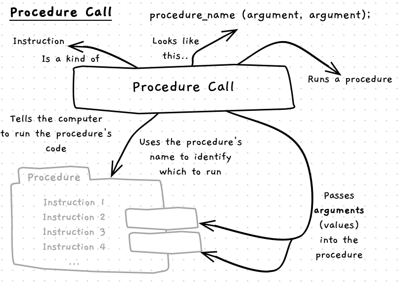
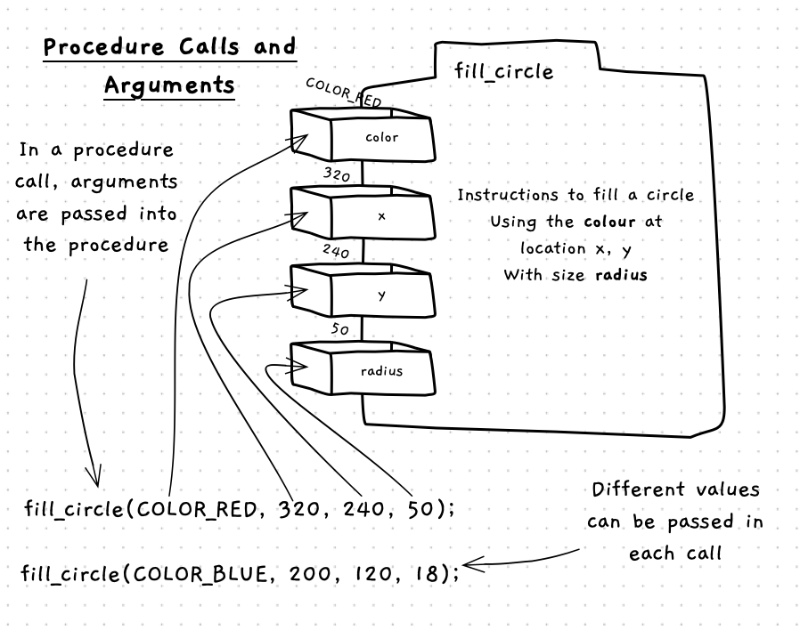
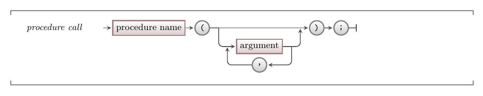

import MySwiper from '/src/components/react/myswiper.jsx';
import CommmonLink from '/src/components/CommonLink.astro'
import Slide1 from './images/procedure-call/Slide1.png';
import Slide2 from './images/procedure-call/Slide2.png';
import Slide3 from './images/procedure-call/Slide3.png';
import Slide4 from './images/procedure-call/Slide4.png';
import Slide5 from './images/procedure-call/Slide5.png';
import Slide6 from './images/procedure-call/Slide6.png';
import Slide7 from './images/procedure-call/Slide7.png';
import Slide8 from './images/procedure-call/Slide8.png';
import Slide9 from './images/procedure-call/Slide9.png';

export const sliderImages = [
  {
    src: Slide1.src,
    altText: "Program is loaded into memory, and ready to run",
    tipStart: 1,
    tips: [
      "The program has been loaded by the operating system and its first instruction is ready to be executed.",
      "Instruction 1 is a procedure call with three arguments. Each procedure call has two steps: evaluate and load the arguments, then call the procedure.",
      "For this call we need to evaluate all three arguments, then execute the procedure. This means the one instruction (the procedure call) actually has four steps - a, b, c, and d.",
    ]
  },
  {
    src: Slide2.src,
    altText: "Instruction 1 shows a procedure call with three arguments",
    tipStart: 5,
    tips: [
      "All arguments are literal values in this call. They need to be loaded into registers 0, 1, and 2, so they are in the CPU when the procedure starts. The first argument is the string literal \"Test Color\". It is loaded into the first register.",
      "As with sequence before, the instruction counter is incremented as we step through each instruction. So 1a becomes 1b for our visualisation."
    ]
  },
  {
    src: Slide3.src,
    altText: "Evaluate and load arguments 2",
    tipStart: 7,
    tips: [
      "The second argument is loaded into register 1, then the program counter is incremented to 1c.",
    ]
  },
  {
    src: Slide4.src,
    altText: "Evaluate and load arguments 3",
    tipStart: 7,
    tips: [
      "The third argument is loaded into register 2, then the program counter is incremented to 1d.",
    ]
  },
  {
    src: Slide5.src,
    altText: "Save the old program counter, so we can resume here when the call returns",
    tipStart: 9,
    tips: [
      "Instruction 1d starts the procedure call. There are a few steps at this point that the compiler takes care of, but it is good to see how this works.",
      "First, we need to save the old program counter into memory. When the procedure returns this will be used to resume the code from where the procedure was called."
    ]
  },
  {
    src: Slide6.src,
    altText: "Shows the CPU switching into the instructions of the called procedure",
    tipStart: 11,
    tips: [
      "The code for this procedure was also loaded into memory when the program started. So we can just set the program counter to the address of the first instruction in the open window procedure.",
      "As the program counter is now in open window's instructions, the sequence will run from there.",
      "By convention, the procedure's arguments are loaded into the CPU registers in order. So, Open Window knows that it can access the title of the window in register 0, its width in register 1, and its height in register 2."
    ]
  },
  {
    src: Slide7.src,
    altText: "Shows the CPU at the end of Open Window's instructions",
    tipStart: 14,
    tips: [
      "At this point, the procedure has done its work. In this case, a window has appeared for the user.",
      "The program counter is now up to an instruction telling the computer that the procedure is finished."
    ]
  },
  {
    src: Slide8.src,
    altText: "Shows the CPU restoring the old program counter from memory",
    tipStart: 16,
    tips: [
      "To get back to the code where the procedure was called, the compiler reads in the old program counter value from memory.",
      "The value read from memory is now loaded into the program counter.",
      "The sequence will now continue from here."
    ]
  },
  {
    src: Slide9.src,
    altText: "Shows the CPU continuing within the code we wrote",
    tipStart: 17,
    tips: [
      "The instructions on line 1 have now been executed, so we add one to the program counter.",
      "We are now running the code on line 2.",
      "This procedure will be executed in the same way: evaluate and load the arguments, then call the procedure. Again, the value of the program counter will be saved to memory, so we can return once the procedure is finished.",
      "This process will repeat until the program is finished."
    ]
  },
]

A procedure call is an instruction that gets the computer to run the code in a [procedure](/book/part-1-instructions/1-sequence/5-reference/02-procedure). You use the name of the procedure to identify which procedure you want to run. Some procedures require data, which you must pass as **arguments** to the procedure as part of the procedure call.



## Procedure Call -- when, why, and how

As you have seen, [procedures](/book/part-1-instructions/1-sequence/5-reference/02-procedure) are building blocks that contain instructions that do a task -- sort of like mini-programs. A large part of your code will be calling procedures to get them to do things you need done, in the order you need them done.

When you are thinking about calling a procedure, you need to know what it does, what to give it, and what it will give you back. Writing the code to call a procedure is then simple: you just provide the name, and a list of values for arguments.

:::note[Procedure Call]

- Know what the procedure does
- Know what arguments you need to give it
- Know what it gives you back

:::

The name of a procedure should help you know what that procedure does, and the procedure's documentation will help you understand what you need to provide the procedure for it to do its job.

### Arguments



When you call a procedure, you need to pass a value for each argument. This value can be a [literal](/book/part-1-instructions/1-sequence/5-reference/05-literal) or calculated value known as an [expression](/book/part-1-instructions/1-sequence/5-reference/04-expression).

You can determine the arguments that are needed from a procedure's signature.

### Signature

The signature of a procedure lists its name and arguments. The following is an example procedure signature, and its components.

```c++
// void indicates a procedure
// fill_circle is its name (an identifier)
// it needs 4 arguments:
//  - a color
//  - a double for the x value
//  - a double for the y value
//  - a double for the radius
void fill_circle(color clr, double x, double y, double radius);
```

The void at the start of the signature indicates that this is a procedure that does something. When you are checking documentation you may see other types in this location. These are functions, which we will look at in the next chapter. In many cases you can call functions as if they are procedures. This can be useful if the function does something, as well as calculating or returning something. The following is a signature of the `open_window` function.

```c++
// window indicates that this returns details of the window created
// open_window is the name of the function
// it needs 3 arguments:
//  - a string for its caption (title)
//  - a integer for its width 
//  - a integer for its height
window open_window(string caption, int width, int height);
```

### Overloading

Languages like C++ support something called **overloading**. Overloading lets programmers create multiple procedures with the same name but different arguments. Each procedure with the same name should do the same general action, but provide a different option for the data you can pass in. For example, library might provide two versions of a procedure to print data to the terminal -- one where you can pass in text, and another where you can pass in a number.

Overloading gives programmers even more flexibility in how they ask the computer to do things. If you look at the [SplashKit documentation](https://splashkit.io/api/) you will see several examples of overloaded procedures. So make sure to pay attention to which version of a procedure you want to call, and the arguments you will need to pass for that version.

### Procedure Calls and Sequence

Procedure calls are one instruction that gives you control of the **program counter**. A procedure call will save the current state of your program, and then set the program counter to the first instruction within the procedure. The sequence will then progress through the procedure, and when it ends, the location of the next instruction after the procedure call will be put into the program counter. In this way, the procedure is called and then **returns** to where it was called from. This allows us to maintain our focus on **sequence**. A procedure call lets you *direct* the sequence into the procedure and then back to your next instruction. As you read, design, or work with code for your program, you can focus on the program's **sequence** and not worry about what happens within the procedures you call.

## In C++

A procedure call allows you to run the code in a [procedure](/book/part-1-instructions/1-sequence/5-reference/02-procedure), getting its instructions to run before control returns to the point where the procedure was called.

:::tip[Syntax]
A procedure call looks like a single instruction in your source code.
The C++ syntax for one is structured like this:


<CommmonLink type="syntaxDiagramGuide"/>
:::

A procedure call consists of a procedure's name followed by an opening parenthesis, zero or more arguments (delimited by commas), a closing parenthesis, then a semicolon.

## Examples

### Basic Example

The code below contains a C++ program with four procedure calls. Each procedure call runs the `write_line` procedure to output text to the terminal.

The procedure call starts with the procedure's name that indicates the procedure to be called is `write_line`.
Following the identifier is a list of values within parenthesis.
These are the arguments passed to the procedure for it to use.

As the `write_line` procedure comes from SplashKit, this example program starts with a [`#include` directive](/book/part-1-instructions/1-sequence/5-reference/00-program/#in-c) to tell the compiler to look in the SplashKit library for any procedures that are called.
Remember that programs run in [sequence](/book/part-1-instructions/1-sequence/5-reference/01-sequence), so we need to provide this directive *before* writing any code that calls a procedure from this library.
This is why it is convention to put using directives at the start of a program's source code.

:::caution
C++ is case sensitive so using `write_Line` instead of `write_line` will not work.
:::

```c++
#include "splashkit.h"

int main()
{
    write_line("Count back from 2...");
    write_line(2);
    write_line(1);
    write_line(0);
}
```

### SplashKit Example

The following code uses three different procedures from the [SplashKit](https://splashkit.io) library. You can see the details for these on the [procedures page](/book/part-1-instructions/1-sequence/5-reference/02-procedure#examples), but the names should give you a good idea of what this does.

```c++
#include "splashkit.h"

int main()
{
    download_sound_effect("hello", "https://programmers.guide/resources/code-examples/part-0/hello-world-snippet-saddle-club.ogg", 443);
    play_sound_effect("hello");
    delay(5000);
}
```

All of the arguments in this code are using literal values.

<div style = "display: none" TODO Move to Data section in Functions>
### Example using result

Some procedures return data, which you can use within any calculated value ([expression](/book/part-1-instructions/1-sequence/5-reference/04-expression)) within your code. The following code demonstrates the use of this with the ReadLine procedure. The result of this is being stored in a variable and then used to output a message.

```c++
int main()
{
    string name;
    write("Please enter your name: ");
    name = read_line();

    write_line("Hello " + name + "!");
}
```

The following code demonstrates the use of the values returned by the `random_color` and `rnd` procedures.

```c++
#include "splashkit.h"

int main()
{
    open_window("Test Color", 800, 600);
    clear_screen(random_color());
    refresh_screen();
    delay(1000 * rnd(10));
}
```

Line 4 demonstrates the use of the result from calling `random_color` within the call to `clear_screen`. In this case, the value returned from the `random_color` procedure becomes the value for the argument passed to `clear_screen`. As you would expect, this will clear the screen to a Test color.

Line 6 demonstrates this again, where the result of `1000 * rnd(10)` is passed to `delay`. The easiest way to approach this is to consider each value independently. `rnd(10)` will return a random value between 0 and 10 -- let us imagine this returns `6`. In this case, `1000 * rnd(10)` would become `1000 * 6`, as the value **returned** by `rnd(10)` was `6`. This is then evaluated, and `delay` will be passed the argument `6000`, causing it to delay for 6 seconds.
</div>

## Procedure Calls Up Close

Review the following images to explore how procedure calls work within the computer.

<MySwiper client:only height="" images={sliderImages}></MySwiper>

:::note[Summary]

- A procedure call is an **instruction** that commands the computer to run the code in a procedure.
- Use a procedure's name to identify the procedure to run.
- Data values passed to a procedure are called **arguments**. These are put between parentheses after the procedure name.
- When a procedure’s task is complete the program continues with the next instruction after the procedure call.

:::
