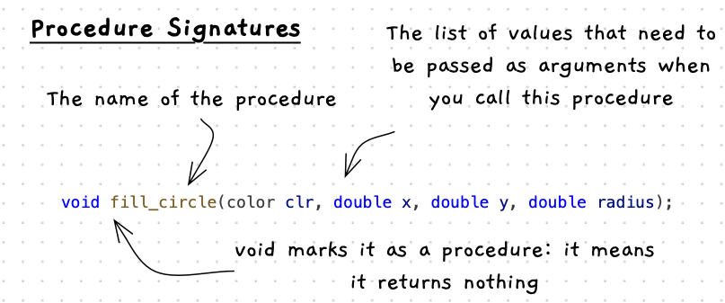

At this point the programs we create will include sequences of procedure calls, with variables that we can use to work with data within our program.

To build programs we will need to have some [procedures](/book/part-1-instructions/1-sequence/5-reference/02-procedure) that we can [call](/book/part-1-instructions/1-sequence/5-reference/03-procedure-call). The great this is that [library](/book/part-1-instructions/1-sequence/5-reference/10-library) creators will describe the procedures that they have created so that we can find and use them. In order to use this documentation we need to know how these procedures will be described.

## Procedure Signatures

Procedures are usually communicated using part of their declaration - the signature. We will look at building these ourselves in [Part 2](/book/part-2-organised-code/2-organising-code/0-overview), but for now we need to know some basics so that we can start calling procedures.



The above image helps show the components of a procedure's signature. The key parts are:

- The *name* of the procedure. Remember, to call the procedure you use its name.
- The names and types of any *arguments* you will need to pass when you call the procedure. These will be listed after the procedure name in parentheses.
- The `void` at the start indicates this is a procedure - it does something and returns nothing.

The following code snippets show example procedure signature.

```c++
void write_line(string value);
```

```c++
#include "splashkit.h"

int main()
{
    write_line("Hello World");
}
```

Functions are similar to procedures, and there are a few that you will need to use for now. One is the [Open Window](https://splashkit.io/api/windows/#open-window) function. We will introduce other things you can do with functions in the next chapter. Open Window has the following signature:

```c++
window open_window(string caption, int width, int height);
```

You can call the `open_window` as if it were a procedure using the following code. It will pass the text "This is the caption" to the `caption`, 800 to the `width`, and 600 to the `height`.

```c++
#include "splashkit.h"

int main()
{
    open_window("This is the caption", 800, 600);

    delay(1000); // delay for 1 second
}
```

For the final example let's look at [Fill Circle](https://splashkit.io/api/graphics/#fill-circle). This has the following signature:

```c++
void fill_circle(color clr, double x, double y, double radius);
```

We can see it is named `fill_circle`, and that we need to pass it a `color`, and three `double` values. The following is an example of calling this procedure, along with some others to create a window and draw a circle on it.

```c++
#include "splashkit.h"

int main()
{
    open_window("This is the caption", 800, 600);
    clear_screen(COLOR_WHITE);

    fill_circle(COLOR_RED, 400, 300, 100);
    refresh_screen();

    delay(1000); // show the window for 1 second
}
```

In the next pages we will list the different procedures that you will use to complete the activities in this chapter both for terminal and graphical programs.
