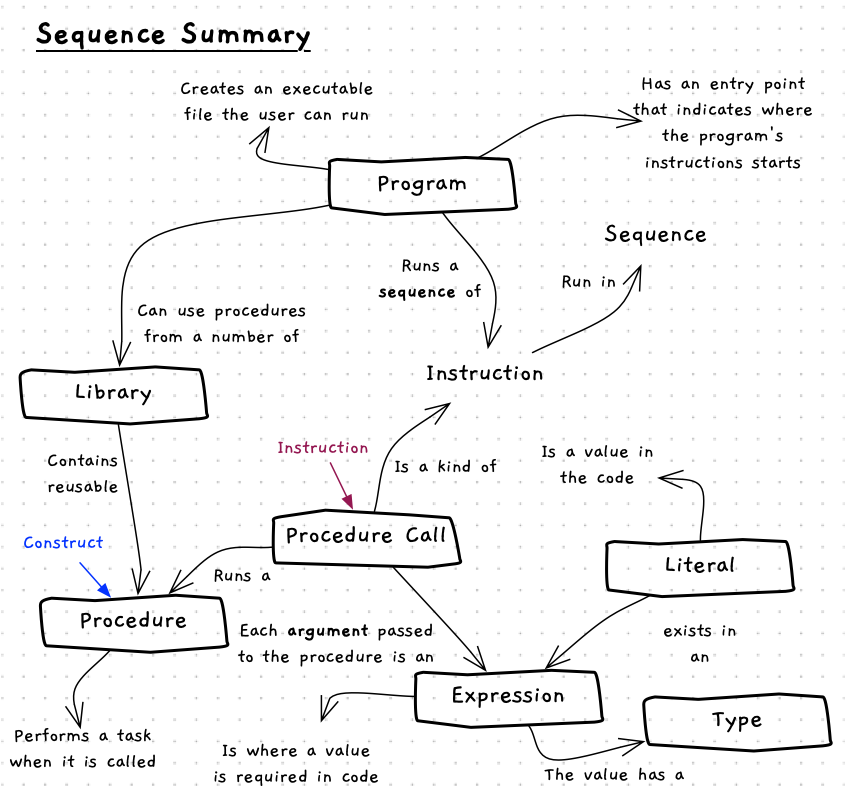

Programming with sequence involves the following:

- Thinking about the sequence of steps you will need to get the outcome you want.
- Thinking about the libraries, and the procedures in those libraries, that you have available.

Break down your problems into small discrete steps, each of which gets you a little closer toward your goal.

An overview of these concepts is shown in the concept map below.

:::note[Summary]

- Constructs, or building blocks, are things that exist inside a program or library that you can use.
- Instructions capture the different *things* you can command the computer to perform.
- Your program is a **sequence** of instructions that use **data** (for now just literals) that get the computer to do something when it is run.

:::

In the next chapter we will look into how we can manipulate and store _data_ in our programs, before we move on to the coding statements we need to make our programs more dynamic and interactive.
