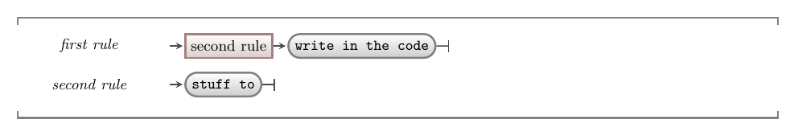

Programming languages are driven by the compilers and interpreters that read and convert your code to machine code instructions. The developers who create these tools have the challenge of writing programs to read and make sense of the code you write. To help with this, they create a **grammar** that describes how code must be written to work with the compiler or interpreter. This section looks at how grammar will be expressed in this guide.

## Syntax Diagrams

In this book syntax rules are expressed using **syntax diagrams**. An example is shown in image below. This diagram shows the syntax related to two sample rules, **first rule**, and **second rule**, which we can use to explore the four main parts of all syntax diagrams.



1. Text found at the start of a line (not contained in a box) is the name of a **rule**. There are two rules in the sample syntax: *first rule*, and *second rule*.
2. Arrows show the **order** in which the parts of the rule are applied. They start at the rule name, and point in the direction you need to follow. Each box pointed to by an arrow represents either another rule to apply, or text that must written.
3. Rectangular boxes (nodes) on a line indicate points where other rules need to be applied. For example, the node within the **first rule** indicates that you **must** apply the *second rule* at this point.
4. Boxes with rounded corners represent **text** that must be entered into the code. For example, the rounded box within the **first rule** indicates that you **must** write the text `write in the code` at that point in your code.

In order to make use of these syntax diagrams, you must know what it is that you *want* to write in code. For this sample, let's assume we want to add *first rule* into our code. To do this we must:

1. Find *first rule* in the grammar.
2. Follow the arrow from the rule through the different boxes, following any branches or loops to achieve your desired effect.

Following these two steps means to write *first rule* in our code, we would:

1. Reading *first rule*, we follow the arrow to the right. It encounters the *second rule* box. This is another rule that must now apply.
2. Find *second rule* in the grammar, and follow its arrows.
3. Following the arrows from *second rule*, you encounter a grey box indicating that you must write the text '*stuff to*' in your code.
4. The vertical bar at the end of the line indicates the end of the *second rule*. This means at this stage the code is:

```txt
stuff to
```

5. Having finished the *second rule*, you return back to finish the *first rule*.
6. Continuing to follow the arrow, this indicates that you need to write '*write in the
code*' in the code.
7. Following the arrow on, we get to the end of the *first rule*.
  
This is the end of the *first rule*, and so the code needed to write a *first rule* from the syntax diagram is:

```txt
stuff to write in the code
```

## Example

Let's have a look at a more realistic example. The syntax diagram for an identifier is shown below.


There are three **rules** in this diagram: the **identifier** rule
itself and rules for **letter** and **digit**. These rules show arrows
that give you *options*, and the ability to *repeat* parts of the rules.

- A **letter** is one alphabetic character: i.e. one of 'A' to 'Z' or 'a' to 'z'. This is an example of options in the syntax, where you follow **one** of the available arrows.
- A **digit** is a single number: i.e. a number between '0' and '9'.
- The **identifier** has a more complicated rule with the following parts:
    1. The first thing in an must be either a *letter* or an underscore (`_`).
    2. Next you have the **option** of following the top line and ending
        the identifier, or following the downward arrow and including
        other letters, numbers, and underscores.
    3. Following the downward arrow, you have a new option where you can
        choose to either return to the top line and end the identifier, or
        have either a *letter*, a *digit*, or an underscore as
        the second character in your identifier.
    4. If you choose to add a second character to your identifier, step 3
        repeats until you choose to return to the top line and end the identifier.

Syntax diagrams can help you to map a concept to actual code that needs to be written in your source code. To use these diagrams you must first know *what* it is that you want to create or use, and then you can *look up* the related syntax. This is where pseudocode code comes into play. It contains a description of the things that need to be created.

Let's assume we want to create an identifier for our "backpack items" variable. Following the rules for an identifier we can choose to start with a `b` and then follow through the options to repeat characters for `ackpack`. Now we have an *issue*. We have two words, but there isn't anywhere in the rules that lets us put a space inside the identifier. Instead we can make our identifier **camel case**, so we choose `I` next and finish off with `tems`. So we end up with the valid identifier `backpackItems`.

:::tip
You have to know what you want then use the rules to get it. While we came up with `backpackItems` to match the name we had originally, you could have called it `a` or `_1` or `_anythingYoUwAnt_tHatFOLLOWS_the_RULES`. These are all valid, but not great choices.

The rules don't help you work out what you want - they just tell you how to structure your code to work with the compiler.
:::
