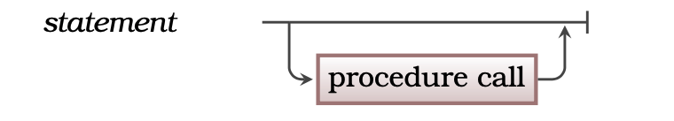

## Concept


When you are creating a program you define the actions the computer will perform when the program is run. Each of these *actions* is coded as a **statement** within the program. This style of programming is known as **imperative** programming. Imperative means to give authoritative commands, and that is what we do in our programs. Our programs are lists of *authoritative commands*, statements, that *tell* the computer the actions it is to perform.

[Figure 5.2](#FigureStatement) shows the concepts related to statements. A statement is a **term** used to describe the instructions in your code, and as such represent a **command** to perform an action. As we have seen, a [Program](../00-program) has a list of statements that are followed when it is executed. A [Method Call](../02-method-call) is a kind of statement that tells the computer to run the code in a [Method](../03-method).

<a id="FigureStatement"></a>


<div class="caption"><span class="caption-figure-nbr">Figure 5.2: </span> A statement is a command for the computer to perform an action</div><br/>

## In C#

<div class="review">
In C#, there are two basic types of statements:

- a single line of code that ends in a semi-colon that performs an action or actions
- a block of code (called a block-statement) that consists of a series of single line statements grouped together by opening and closing braces {}

</div>

:::tip[Syntax]
In a Statement you are commanding the computer to perform an action. There are only a small number of statements you can choose from. At this stage the only statement is the [Method Call](../02-method-call), technically the method statement in C#. This is shown in [Figure 5.x](#FigureStatementSyntax), where we can see that at this stage all Statements are calls to Methods.

<a id="FigureStatementSyntax"></a>


<div class="caption"><span class="caption-figure-nbr">Figure 5.x: </span>C# Syntax for a method call statement</div><br/>

:::


## Examples

- [Listing 5.x](#ListingMethodCallStatement) below shows an example of method call statements in the program "C# Knights".

<a id="ListingMethodCallStatement"></a>

```csharp
#include "splashkit.h"

int main() {
  // Introduce knights
  write_line("We are the knights who say 'Hi!'");
  write("We are the keepers of the sacred words:");
  write_line(" 'Ni', 'Peng', and 'Neee-wom !'");
  write_line("The Knights Who Say 'Hi' demand a sacrifice.");
  write_line("We want .... a shrubbery!");

  return 0;

}
```
<div class="caption"><span class="caption-figure-nbr">Listing 5.x: </span>C++ Knights</div>

<div class="review">
Examples of single-line and block-statments include:<br/>

#### Single-line statement

- A **[Variable](../12-variable) declaration**: Here we declare to our program the existance of a variable (or multiple variables) in a **single line** of code that ends with a semi-colon.

```csharp
  int radius, diameter, circumference;
```
<div class="caption"><span class="caption-figure-nbr">Listing 5.3: </span>Single-line statement</div>

#### Block statement

- An **if statement**: In this example we use the inbuilt C# "*if*" keyword, which encapsulates a series of single line statements within a **block**, defined by the opening and closing braces on the if statement.
  - **Note:** The second single line statement "*calculateCircumference();*" is an example of a method call which we will look at later. 

```csharp
if(x > 10) {
    radius = radius + 1;
    calculateCircumference();
}
```
<div class="caption"><span class="caption-figure-nbr">Listing 5.4: </span>Block statement</div>

</div>
## Activities
<div class="review">
Identify the statements in the C# code below. The line numbers are for reference only.

```csharp
1.  int x=0;
2.  int y=0;
3.
4.  // our loop
5.  while(x < 10) {
6.    x = x +1;
7.    y = x + 1;
8.  }
```
<div class="caption"><span class="caption-figure-nbr">Listing 5.5: </span>C# code with statements</div>
<details>
  <summary role="button">Answer</summary>
  <div>There are 5 statements:</div>
  <ul>
    <li>Lines 1, 2, 6 and 7 are single-line statements</li>
    <li>The line 5-8 block is a while statement block</li>
    <li>Line 4 starts with double forward slashes is a comment in C# and is not a statement because it is ignored by the compiler</li>
  </ul>
</details>

</div>

:::note[Summary]
- A statement is a **term** used to describe the instructions (**commands**) in your code used to perform an action or actions.
- In C#, statements can be **single-lines of code ending in a semi-colon**, or **block statements** which are a group of single-lines of code encapsulated by curly braces {}
- Statements are the basic units of programs
:::

## Further reading

:::docs

- [Microsoft C# guide - Statements, expressions, and operators](https://learn.microsoft.com/en-us/dotnet/csharp/programming-guide/statements-expressions-operators/statements)
- [Microsoft C# guide - C# 7.0 draft specification](https://learn.microsoft.com/en-us/dotnet/csharp/language-reference/language-specification/statements)

:::


