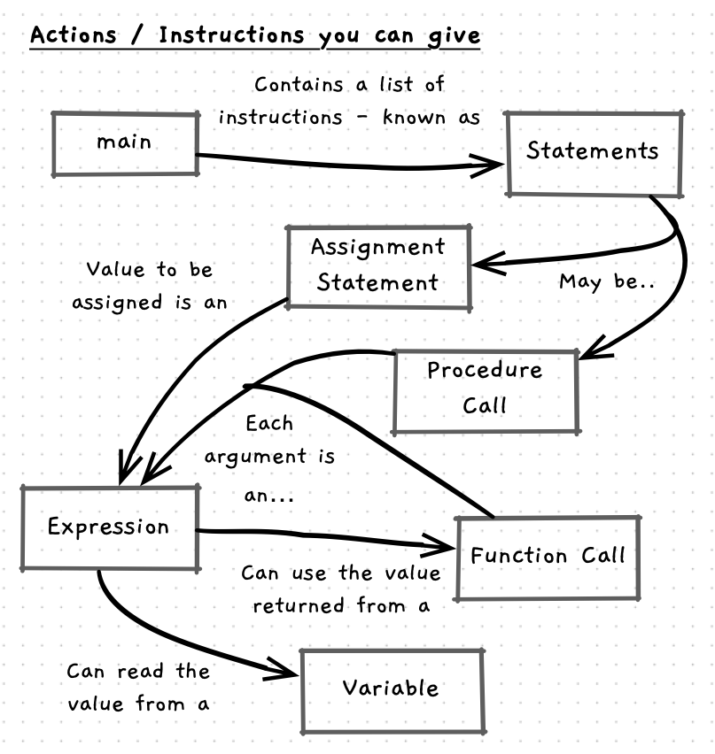
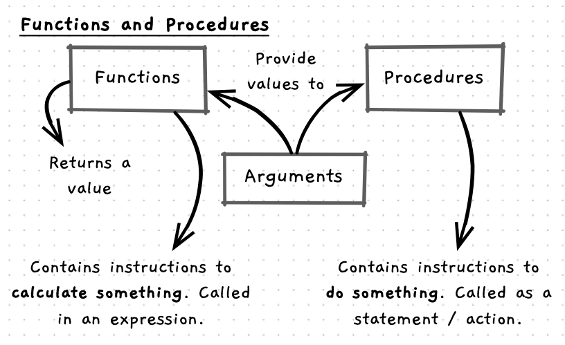

There are several concepts that we introduce in this chapter:

- Functional constructs that help organise the functionality which we can use.
- Data constructs to allow you to store and work with data.
- Different kinds of instructions to perform different actions.

This page gives a brief overview of how these different concepts are all interconnected. You can use this to help orient yourself as you progress through the remaining material.

## Data Constructs: Variables, and Types

- Variable: a holder of a value that can be read and changed during the program's execution.
- Constant: a holder of a value that can be read during the program's execution, but cannot be changed.
- Type: a construct that defines a kind of data and the things that can be done with it.

## Kind of Instructions

- Statement: the technical name we give to an action/instruction within our code.
- Expression: the technical name for the places within a statement where a value can be calculated.
- Assignment statement: the name of the instruction to store a value in a variable.
- Procedure call: the name of the instruction to run a procedure.
- Function call: the ability to call a function within an expression, to use the returned value.

## Functional Constructs: Functions

- Program: the overall construct within which we create and use other constructs that come together as a program the uses can execute to achieve a goal.
- Procedures: constructs that encapsulation the steps needed to perform a specific task within a program.
- Library: a construct that packages up reusable functions and procedures that you can use if you link to the library.
