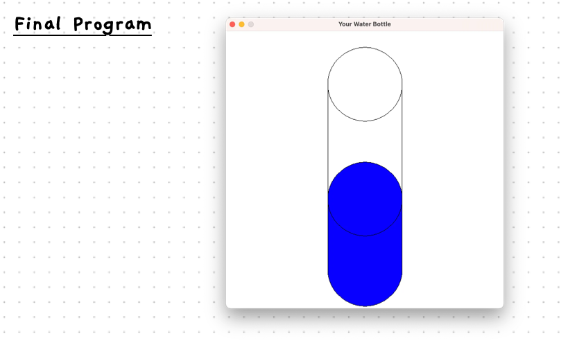

import { YouTube } from 'astro-embed';
import { Accordion, AccordionItem } from 'accessible-astro-components'

<div class="not-content">
  <YouTube id="WjxF1hHfWu8" params="fs=1&modestbranding=1&rel=0"/>
</div>

Now we can put together all of these concepts to build a small visual program.

Watch this video to:

- See how to combine the new tools from this chapter to create a program.

When you are done, have a go with these concepts yourself.

## Continuing with Bottle Drawing

In the video we walked through creating a visualisation of a water bottle where we let the user input the height of the water.
Now, let's update the look of the water bottle to be a bit less blocky.
We're aiming to end up with something that looks like this:



### The Plan

After a few iterations, our final plan for the updated bottle drawing looks like this:


### Constants and Variables

To make this, we'll need a range of variables and constants.

- `BOTTLE_RADIUS` for the size of the circle. We can use this to draw circles at the top and bottom of the bottle, and at the top of the water.
- `BOTTLE_HEIGHT` the height of the water bottle cylinder.
- `BOTTLE_DIAMETER` to store the full width of the circle, which can be calculated from `BOTTLE_RADIUS`. We need this to draw the water. This will be a rectangle drawn on top of the middle of the circle.
- `BOTTLE_CENTER_X` for the position of the bottle. This is the distance from the left of the screen. We can calculate this from the width of the window to position the bottle in the middle of the screen.
- `BOTTLE_LEFT_X` and `BOTTLE_RIGHT_X` to store the left and right sides of the bottle. We can use this for the position of the rectangle, and the lines for the side of the bottle. They can be calculated from the bottle's radius and centre x.
- `BOTTLE_BASE_Y` and `BOTTLE_TOP_Y` to store the distance from the top of the screen to the top and bottom of the bottle. This will tell us where to draw the circles, lines, and rectangles. The base can be calculated from the height of the window, and the top can be calculated from the base and the bottle's height.

For the water height, we need a few variables as it will change based on the user's input.

- `percent_full` will capture how full the bottle is. This can be an integer. We can then divide this by 100 to get the proportion to apply to the bottle's height to calculate the water height.
- When we know the `percent_full`, we can calculate the `water_height`.
- We need to know where the water should be drawn. When we know its height, we can use that to calculate a `water_y` value. This will represent where the water is up to within the bottle.
- We also need a string (we will call it `line`) to store the text data from the user before we convert it to a number.

### Visual Comments

To help communicate how this works, we can capture this in a comment in the code using ASCII art.
This comment can show what we're aiming for, including what the different constants and variables represent as follows:

```c++
/*--------------------------------------
| Water bottle shape...
|
| BOTTLE_LEFT_X     BOTTLE_RIGHT_X
|        |             | 
|        v             v 
|          ___________
|         /           \
|   ^    |      x      | <-- x = BOTTLE_CENTER_X
|   |    |\___________/|       + BOTTLE_TOP_Y
|   |    |             |
|   |    | ___________ |
|   |    |/           \|
|   |    |             | <-- water_y
|   |    |\___________/| ^
|   |    | ___________ | | water_height
|   |    |/           \| v
|   v    |             | <-- BOTTLE_BASE_Y
|         \___________/
| BOTTLE_HEIGHT
|         <-----x-----> BOTTLE_RADIUS
|        BOTTLE_DIAMETER        
--------------------------------------*/
```

:::tip
This kind of comment is really awesome because it **shows** the reader what we intend. Comments should aim to be useful, and this is an example of how you can achieve this without writing lots of text.
:::

### Steps to build

Have a go at coding this plan up yourself! Here are the steps that we suggest following:

1. Show the welcome message, show the window, and delay. This gets the basic structure of your program ready.
2. Draw the outline of the bottle -- just a rectangle to start. Run to make sure it looks right.
3. Add the water with a fixed percent full, using a rectangle to represent the water.
4. Play around with sizes and positions until you are happy.
5. Add code to read the percent full value from the user.
6. Make it look pretty by adding circles to the top and bottom. We suggest you do this in several steps, building and running as you add the top, bottom, and water level circles to see how it looks. Adjust values as needed until it looks right.
7. Test your program with a variety of percent full values such as empty, full, midway, and so on.
8. Test even more! What about crazy values? What happens? (we can fix any issues later)
9. Celebrate 🥳

Follow along in the video to get started with the first few steps, then see if you can do the rest. Use our completed code below if you get stuck.

<Accordion>
    <AccordionItem header="Final Watter Bottle Code">

    ```c++
    #include "splashkit.h"

    const int WINDOW_WIDTH = 600;
    const int WINDOW_HEIGHT = 600;

    int main()
    {
        /*-------------------------------------\
        | Water bottle shape...
        |
        | BOTTLE_LEFT_X     BOTTLE_RIGHT_X
        |        |             |
        |        v             v
        |          ___________
        |         /           \
        |   ^    |      x      | <-- x = BOTTLE_CENTER_X
        |   |    |\___________/|       + BOTTLE_TOP_Y
        |   |    |             |
        |   |    | ___________ |
        |   |    |/           \|
        |   |    |             | <-- water_y
        |   |    |\___________/| ^
        |   |    | ___________ | | water_height
        |   |    |/           \| v
        |   v    |             | <-- BOTTLE_BASE_Y
        |         \___________/
        | BOTTLE_HEIGHT
        |         <-----x-----> BOTTLE_RADIUS
        |        BOTTLE_DIAMETER
        \-------------------------------------*/

        const int BOTTLE_RADIUS = 80;
        const int BOTTLE_HEIGHT = 400;
        const int BOTTLE_DIAMETER = BOTTLE_RADIUS * 2;
        const int BOTTLE_CENTER_X = WINDOW_WIDTH / 2;
        const int BOTTLE_LEFT_X = BOTTLE_CENTER_X - BOTTLE_RADIUS;
        const int BOTTLE_RIGHT_X = BOTTLE_CENTER_X + BOTTLE_RADIUS;
        const int BOTTLE_BASE_Y = WINDOW_HEIGHT - BOTTLE_RADIUS - 5; // 5 pixel gap
        const int BOTTLE_TOP_Y = BOTTLE_BASE_Y - BOTTLE_HEIGHT;

        string line;
        int percent_full;

        write_line("Water Bottle Visualiser!");
        write_line();
        write_line("How full us your bottle? (0-100)");
        write_line();
        write("Percent: ");
        line = read_line();

        // Convert the text entered to a double
        percent_full = to_integer(line);

        double water_height = BOTTLE_HEIGHT * (percent_full / 100.0);
        double water_y = BOTTLE_BASE_Y - water_height;

        open_window("Your Water Bottle", WINDOW_WIDTH, WINDOW_HEIGHT);
        clear_screen(color_white());

        // Draw the water
        // Circle at the top of the water
        fill_circle(color_blue(),  BOTTLE_CENTER_X, water_y, BOTTLE_RADIUS);

        // Circle at the bottom of the bottle
        fill_circle(color_blue(),  BOTTLE_CENTER_X, BOTTLE_BASE_Y, BOTTLE_RADIUS);
        draw_circle(color_black(), BOTTLE_CENTER_X, BOTTLE_BASE_Y, BOTTLE_RADIUS);

        // Draw the rest of the water
        fill_rectangle(color_blue(), BOTTLE_LEFT_X, water_y, BOTTLE_DIAMETER, water_height);
        draw_circle(color_black(), BOTTLE_CENTER_X, water_y, BOTTLE_RADIUS);

        // Outline bottle
        // Draw the left wall of the bottle
        draw_line(color_black(), BOTTLE_LEFT_X, BOTTLE_BASE_Y, BOTTLE_LEFT_X, BOTTLE_TOP_Y);
        // Draw the right wall of the bottle
        draw_line(color_black(), BOTTLE_RIGHT_X, BOTTLE_BASE_Y, BOTTLE_RIGHT_X, BOTTLE_TOP_Y);
        draw_circle(color_black(), BOTTLE_CENTER_X, BOTTLE_TOP_Y, BOTTLE_RADIUS);

        refresh_screen();
        delay(5000);
    }
    ```

    </AccordionItem>
</Accordion>

:::tip[Is drawing always this hard?]
If you create things from shapes, then there is lots of math involved. Mostly you can just work with pre-built images...that is much easier.
:::