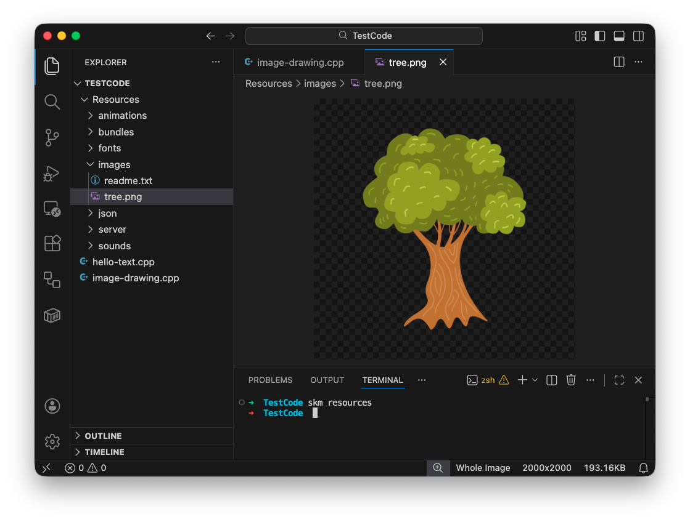
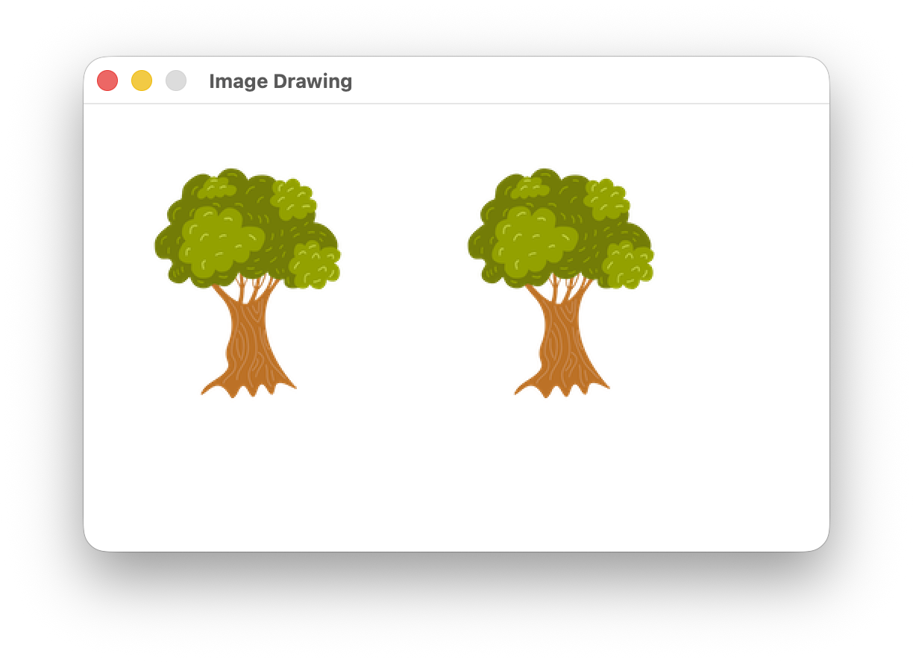
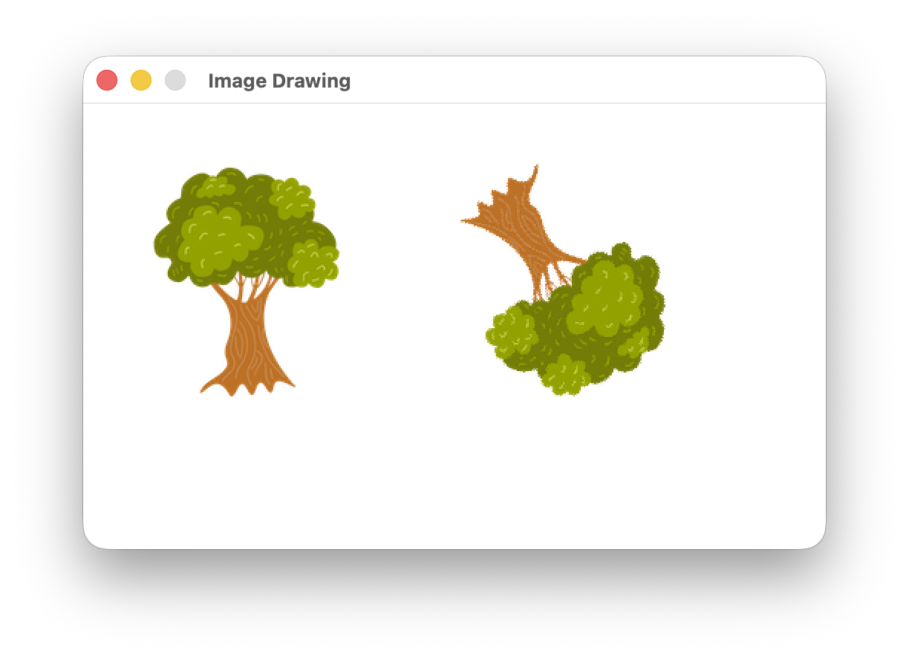

import { Accordion, AccordionItem } from 'accessible-astro-components'
import { Steps } from '@astrojs/starlight/components';

In the [Sequence](/book/part-1-instructions/1-sequence/4-activities/3-drawing) chapter we started working with graphics by create a [House Drawing program](/book/part-1-instructions/1-sequence/3-guided-tour/01-00-house-drawing/) that worked with manual coordinates. Let's try something a little different in this chapter, and use SplashKit to draw an image for us.

## Finding your image

<Steps>
1. Run VS Code, and open the folder with your code or create and open a new folder for this project. If you get stuck, refer back to your notes on how to [get started with VS Code](/book/part-0-getting-started/1-building-programs/3-guided-tour/3-first-project/).
2. Create a new C++ file for your code. I called mine *image-drawing.cpp*.
3. Open the Terminal, and run `skm resources`. This should create a *Resources* folder with subfolders for images.
4. Find and download an image you can use. Place the image in the *Resources/images* folder.
    There are many free image resources available on the internet. Search for an image you would like to draw and manipulate in your program.

   I searched for a "tree sprite image", and found some on [Freepix](https://www.freepik.com/search?ai=excluded&file_type=png&format=search&last_filter=selection&last_value=1&query=Tree+sprite&selection=1). I choose a png format so that it could have a transparent background.
5. Rename the file so that it will be easy to refer to in your program. I called mine *tree.png*. I also resized my image so that it was 200 pixels wide, you can do this in Paint on a PC or Preview on a Mac, or in other image editors.

   Here is what I have so far:

   
</Steps>

## Adding boilerplate code

Now we need to add some code to get started. With a graphical program you will always start off with pretty much the same thing. This is called *boilerplate* code as it is standard, reusable code.

<Steps>
6. Switch to your C++ code in Visual Studio, and add the following:

    1. Include SplashKit
    2. Create main
    3. Open a window - I went with one titled "Image Drawing", with dimensions 500 x 300.
    4. Refresh the screen
    5. Delay - I decided 5 seconds was enough.

   Have a go at this yourself. You can check my code here if you get stuck.

    <Accordion>
      <AccordionItem header="Main with an open window">

      ```c++
        #include "splashkit.h"

        int main()
        {
            open_window("Image Drawing", 500, 300);
            refresh_screen();
            delay(5000);
        }
      ```

      </AccordionItem>
    </Accordion>

 7. Compile and run to make sure things are going ok so far. When this runs you should see an empty window appear.

    <Accordion>
      <AccordionItem header="Compile in the Terminal">

      ```sh
      clang++ image-drawing.cpp -o test -l SplashKit -Wall
      ./test
      ```

      </AccordionItem>
    </Accordion>
</Steps>

## Drawing the image

Now we can load and draw our image. SplashKit includes the following functions you can use to load and draw bitmaps.

    ```c++
    // Loading images
    bitmap load_bitmap(string name, string filename);

    // Drawing using name or bitmap variable
    void draw_bitmap(string name, double x, double y);
    void draw_bitmap(bitmap bmp, double x, double y);

    // Drawing with options
    void draw_bitmap(string name, double x, double y, drawing_options opts);
    void draw_bitmap(bitmap bmp, double x, double y, drawing_options opts);
    ```

Let's use this to load our tree and then draw it to the window we have opened.

<Steps>
8. Create a variable with the `bitmap` type. This is a type that SplashKit created to store bitmaps (images). I called mine `tree`.
9. Add an assignment statement to call `load_bitmap`, and store the result in your variable. Make sure that this is after loading the window (it will work before, but is more efficient after).
10. Draw your image using the `bitmap` variable as the first argument. I picked the coordinates 10,20 (10 pixels from the left and 20 from the top). Make sure this is after you load the image, but before you refresh the screen.

    <Accordion>
      <AccordionItem header="Drawing the image">

      ```c++ {5,9-12}
      #include "splashkit.h"

      int main()
      {
          bitmap tree;

          open_window("Image Drawing", 500, 300);

          // Load the image
          tree = load_bitmap("tree", "tree.png");

          draw_bitmap(tree, 10, 20);

          refresh_screen();
          delay(5000);
      }
      ```

      </AccordionItem>
    </Accordion>    
11. Compile and run to make sure this works. If you can't see the image, check that the filenames match and that you have the image in the *Resources/images* folder.
12. Also draw it using its name - SplashKit can locate images you have loaded using their name. For this one I picked the coordinates 220,20.
13. Compile and run again. Make sure you can see both images. Here is what mine looked like.

    

    <Accordion>
      <AccordionItem header="Code so far">

      ```c++ {13}
      #include "splashkit.h"

      int main()
      {
          bitmap tree;

          open_window("Image Drawing", 500, 300);

          // Load the image
          tree = load_bitmap("tree", "tree.png");

          draw_bitmap(tree, 10, 20);
          draw_bitmap("tree", 220, 20);

          refresh_screen();
          delay(5000);
      }
      ```

      </AccordionItem>
    </Accordion>    

</Steps>

:::tip
In SplashKit you can work with images using `bitmap` variables or using the images *name* (a `string`). In many cases it will be easier to use the name, but using the `bitmap` is a more efficient.
:::

## The bitmap name

If we are going to use the name to draw the bitmap, then we don't want this string value scattered throughout our program. Let's create a [constant](/book/part-1-instructions/2-data/5-reference/20-constant) to manage this, and switch the current literal values to that constant.

<Steps>
14. Create a new `IMAGE_NAME` constant. I gave mine the value "tree".
15. Change the bitmap name in the load and draw bitmap calls to use this constant.
16. Compile and run to make sure things still work as expected.

    <Accordion>
      <AccordionItem header="Code so far">

      ```c++ {3,12,15}
      #include "splashkit.h"

      const string IMAGE_NAME = "tree";

      int main()
      {
          bitmap tree;

          open_window("Image Drawing", 500, 300);

          // Load the image
          tree = load_bitmap(IMAGE_NAME, "tree.png");

          draw_bitmap(tree, 10, 20);
          draw_bitmap(IMAGE_NAME, 220, 20);

          refresh_screen();
          delay(5000);
      }
      ```

      </AccordionItem>
    </Accordion>    

</Steps>

:::tip[Use Constants]
Using a constant in this way makes sure that things are consistent throughout the program. This becomes more and more important as the size and complexity of your program grows.
:::

## Rotating an image

SplashKit provides drawing options that let you alter how a bitmap is drawn. Let's use this now to allow the user to rotate the 2nd image we drew. For this we will need to use the SplashKit [option rotate bitmap](https://splashkit.io/api/graphics/#option-rotate-bmp) function. It will return us drawing options we can pass into draw bitmap. This has the following signature:

    ```c++
    drawing_options option_rotate_bmp(double angle);
    ```

<Steps>
17. Create a `rotation` variable - it will need to store a real number, so we use `double` to indicate that.
18. Create a `user_input` variable, as you did in the earlier program. This will be used to store the text the user types.
19. Display a message to the user asking them to enter the number of degrees to rotate the image.
20. Use an assignment statement to read in the angle from the user.
21. Use another assignment statement to convert the user input to a double, and store it in the `rotation` variable.
22. Now update the 2nd draw bitmap call. Pass an additional argument that will call `option_rotate_bmp`, where you pass `option_rotate_bmp` the value from the `rotation` variable.
23. Compile and run. Here is what it looked like for me when I rotated the image by 147 degrees.

    

    <Accordion>
      <AccordionItem header="Code so far">

      ```c++ {7,8,11-13,21}
      #include "splashkit.h"

      const string IMAGE_NAME = "tree";

      int main()
      {
          double rotation;
          string user_input;
          bitmap tree;
          
          write("Enter rotation degrees: ");
          user_input = read_line();
          rotation = to_double(user_input);

          open_window("Image Drawing", 500, 300);

          // Load the image
          tree = load_bitmap(IMAGE_NAME, "tree.png");

          draw_bitmap(tree, 10, 20);
          draw_bitmap(IMAGE_NAME, 220, 20, option_rotate_bmp(rotation));

          refresh_screen();
          delay(5000);
      }
      ```

      </AccordionItem>
    </Accordion>

</Steps>

## Scale an image

SplashKit also provides an [option scale bitmap](https://splashkit.io/api/graphics/#option-scale-bmp) function that lets you scale the x and y size of the image being drawn. This function is passed two values indicating the amount to scale the x and y dimensions. If you pass these 1.0 the image is drawn at the same size, if you pass it 0.5 then the image will be half the size. Here is the signature:

```c++
drawing_options option_scale_bmp(double scale_x, double scale_y)
```

<Steps>
24. Adjust the program to allow the use to provide a scale of the first image drawn - so one image is scaled and the other is rotated. Add additional variables to handle this, and read the value from the Terminal as you did with the rotation.
25. Compile and run, and check that you can scale the image as you want.
</Steps>

## Scale and Rotate Challenge

If you want a challenge, try rotating and scaling a third image. You will need to have a look at the different versions of the [option scale bitmap](https://splashkit.io/api/graphics/#option-scale-bmp) and [option rotate bitmap](https://splashkit.io/api/graphics/#option-rotate-bmp) functions. You should be able to chain these function calls together to achieve both effects.

:::note[This is a challenge]
You should be able to see if this worked as you can see the image rotated and scaled. If you get stuck, feel free to skip this and come back later.
:::
