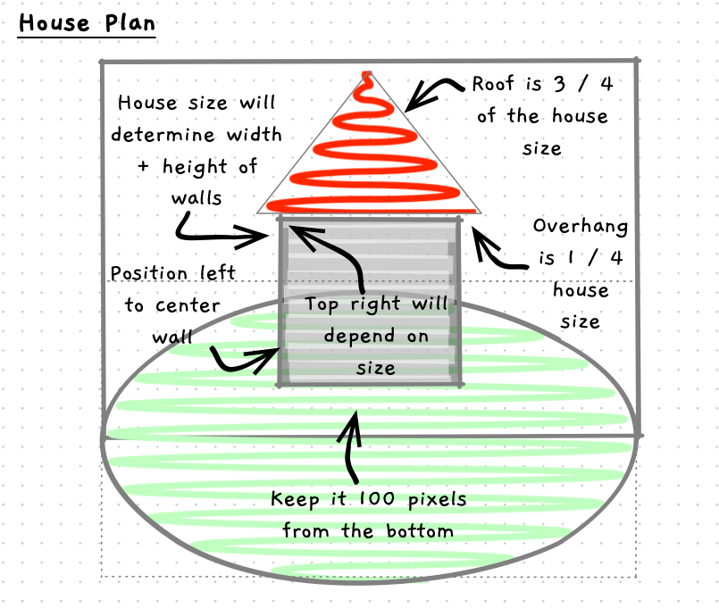

import { Accordion, AccordionItem } from 'accessible-astro-components'
import { Steps } from '@astrojs/starlight/components';


Let's look at adding some constants and variables to make this more dynamic. We will let the user tell us what size the house should be, then calculate the positions for the shapes.



---

<Steps>
1. Start with positioning the walls. Determine what we need to calculate.

    We will need to determine:

    - the screen size. Create constants for `SCREEN_WIDTH` and `SCREEN_HEIGHT`.
    - the house size - which the user will provide via the terminal at the start
    - to read in house size we will need to read and convert data. So a `user_input` variable could be created for this.
    - the wall position (its x and y) - this is where we draw the wall.

    :::tip
        -  Assign `wall_x` a value to center the wall - use `(SCREEN_WIDTH - house_size) / 2`.
        -  Calculate `wall_y` from the bottom of the screen - this will be `SCREEN_HEIGHT - BOTTOM_GAP - house_size`.
    :::

2. Code this up and test it out:

    - Add constants for screen width and height - Where else could you use these?
    - Add variables for `house_size` and `user_input` - write the terminal code to read these in
    - Add variables for `wall_x` and `wall_y` - calculate these as noted above.
    - Compile and run and try different wall sizes.

    <Accordion>
      <AccordionItem header="Calculated walls">

      As I coded this I realised I needed an extra constant - `BOTTOM_GAP`. When you find you are hard-coding values you should think if there is a meaningful name to describe the value. Naming the "bottom gap" helps make it clearer what that 100 was about, whereas the 2 does not need a different name. We are dividing by 2 to get half the value.

      ```c++ {3-5, 9-18,23,25}
      #include "splashkit.h"

      const int SCREEN_WIDTH = 800;
      const int SCREEN_HEIGHT = 600;
      const int BOTTOM_GAP = 100;

      int main()
      {
          int house_size;
          string user_input;
          int wall_x, wall_y;

          write_line("Enter the size of the house: ");
          user_input = read_line();
          house_size = to_integer(user_input);

          wall_x = (SCREEN_WIDTH - house_size) / 2;
          wall_y = SCREEN_HEIGHT - BOTTOM_GAP - house_size;

          open_window("House Drawing by Andrew", SCREEN_WIDTH, SCREEN_HEIGHT);

          clear_screen(color_white());
          fill_ellipse(color_bright_green(), 0, 400, SCREEN_WIDTH, 400);

          fill_rectangle(color_gray(), wall_x, wall_y, house_size, house_size);
          fill_triangle(color_red(), 250, 300, 400, 150, 550, 300);

          refresh_screen();

          delay(5000);
      }
      ```

      </AccordionItem>
    </Accordion>

3. Connect the roof. Ok, this may be a bit of a challenge for you. Have a go at coding the roof based on the plan above.

    :::tip
    I used variables for:

      - `roof_overhang` - based on `house_size`
      - `roof_height` - based on the `house_size`
      - `roof_left` - based on `wall_x` and subtracting the overhang.
      - `roof_middle` - center of the house - you can calculate it from `wall_x` and `house_size`
      - `roof_right` - based on `wall_x`, plus the house size, and the overhang.
      - `roof_top` - based on `wall_y`, minus the `roof_height`
    :::

4. Compile and run, then check your calculation if it doesn't look right.
5. Finally, adjust the code so that the size of the hill is calculated from the size of the screen. It is as wide as the screen, appears 2/3rds of the way down the screen, and is 2/3rds the height of the screen. 

    Once you change this, try different screen sizes!

    <Accordion>
      <AccordionItem header="Final code">

      ```c++ {5,14-15,24-29,34,37}
      #include "splashkit.h"

      const int SCREEN_WIDTH = 1280;
      const int SCREEN_HEIGHT = 720;
      const int HILL_HEIGHT = SCREEN_HEIGHT * 2 / 3;

      const int BOTTOM_GAP = 100;

      int main()
      {
          int house_size;
          string user_input;
          int wall_x, wall_y;
          int roof_left, roof_middle, roof_right, roof_top;
          int roof_overhang, roof_height;

          write("Enter the size of the house: ");
          user_input = read_line();
          house_size = to_integer(user_input);

          wall_x = (SCREEN_WIDTH - house_size) / 2;
          wall_y = SCREEN_HEIGHT - BOTTOM_GAP - house_size;

          roof_overhang = house_size / 4;
          roof_height = house_size * 3 / 4;
          roof_left = wall_x - roof_overhang;
          roof_middle = wall_x + house_size / 2;
          roof_right = wall_x + house_size + roof_overhang;
          roof_top = wall_y - roof_height;

          open_window("House Drawing by Andrew", SCREEN_WIDTH, SCREEN_HEIGHT);

          clear_screen(color_white());
          fill_ellipse(color_bright_green(), 0, HILL_HEIGHT, SCREEN_WIDTH, HILL_HEIGHT);

          fill_rectangle(color_gray(), wall_x, wall_y, house_size, house_size);
          fill_triangle(color_red(), roof_left, wall_y, roof_middle, roof_top, roof_right, wall_y);

          refresh_screen();

          delay(5000);
      }
      ```

      </AccordionItem>
    </Accordion>
</Steps>

When you have this working you should feel confident that you can start working with graphical programs.
