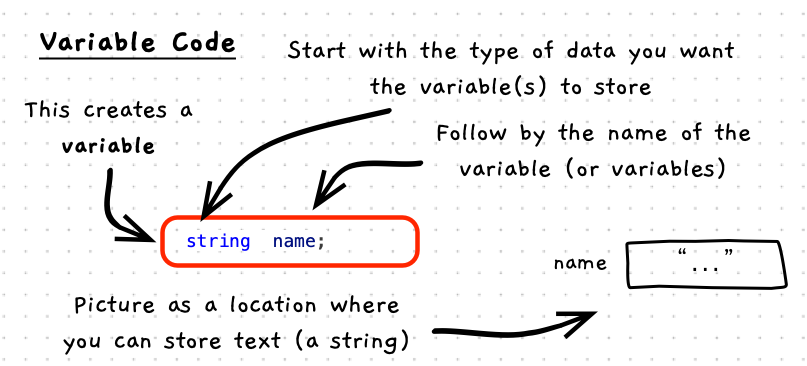

import CommmonLink from '/src/components/CommonLink.astro'
import { YouTube } from 'astro-embed';

While fixed literal values are useful, to make programs dynamic you need to be able to work with values that change.

A **variable** is a **construct** you can create to store a value that you can change as the program runs. You can picture a variable as a **named container** into which you can store a value and retrieve it later.


## Variables -- when, why, and how

Variables are an invaluable tool to help you build digital realities.
They allow you to capture simple values, associate them with a name -- the variable's **identifier** -- and change the value within your code.
You can also use the variable to retrieve (i.e., read) the value it contains.

When you think about your program, try to identify the different things (data/information) that you want to change. For each of these, create a variable.

You will need to give each variable a [data type](/book/part-1-instructions/1-sequence/5-reference/15-type/). This will determine the kind of information stored and what you can do with it. For example, if you want text use the `string` type, use `int` for whole numbers, or `double` for real numbers. We will learn about other types you can use and create in later chapters.

You also need to name your variables. The name should reflect the kind of data stored in the variable, so make it descriptive. In syntax, the name of a variable is its **identifier**.

After you define a variable with an **identifier** and [**data type**](/book/part-1-instructions/1-sequence/5-reference/15-type), you need to **initialise** it with a starting value.
Then, you can then read the current value and store new values in the variable as the program runs and the information the variable represents changes.

## In C++

:::tip[Syntax]
Variables can be created in C++ using the following syntax:


<CommmonLink type="syntaxDiagramGuide"/>
:::

Variable declarations need to include the [type](/book/part-1-instructions/1-sequence/5-reference/15-type) of data you want to store. The name of the type is followed by the name (identifier) you want to give the variable.
A variable can optionally be given a value when it is declared.
You can also declare multiple variables of the same type in the one line of code.

By convention, variables should use **snake_case** for their name. This is where the first letter is lowercase and each new word in the identifier is separated with an underscore character (`_`). For example, `bottle_volume`, `my_name`, and `this_is_a_long_name` are all in snake case.



## Examples

### Basic Example

In this program, we create a `name` variable, initialise it with a value, and then print that value to the terminal.

```c++
#include "splashkit.h"

int main()
{
    // Create a variable called name
    // it can store a string
    string name = "Jingyu";

    write_line();
    write_line("Hello " + name);
}
```

### Example using multiple variables

This program calculates the area of a rectangle, by creating and initialising variables for width, height, and area.

```c++
#include "splashkit.h"

int main()
{
    // Create variables width, height, and area
    double width = 100.0, height = 53.2;
    double area = width * height;

    write_line();
    write("Area ");
    write(area);
    write_line(" cm^2");
}
```
