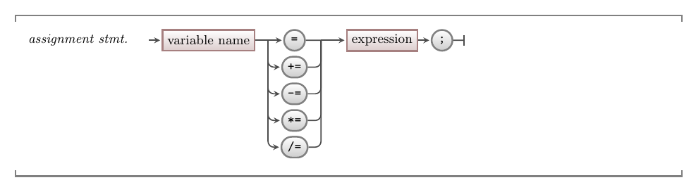

import CommmonLink from '/src/components/CommonLink.astro'

In C++ the assignment operator can optionally be modified with `+`, `-`, `*`, or `/`, which are shorthand for adding to, subtracting from, multiplying by, or dividing the variable identified on the left-hand side of the statement, with the value on the right-hand side.

:::tip[Syntax]

<CommmonLink type="syntaxDiagramGuide"/>
:::

The following code illustrates how to use these different shorthand assignment operators.

```c++
int count = 0;

// The following is the same as count = count + 10;
count += 10;

// The following is the same as count = count - 5;
count -= 5;

// The following is the same as count = count * 2;
count *= 2;

// The following is the same as count = count / 3;
count /= 3;
```

You can use these shorthand versions to reduce the code you need to write when updating the value of a variable.

:::note[Summary]

- Shorthand operators allow you to add to, remove from, multiply by, or divide the variable on the left-hand side by the expression on the right-hand side.
- Use these to reduce the code you need to write.

:::
