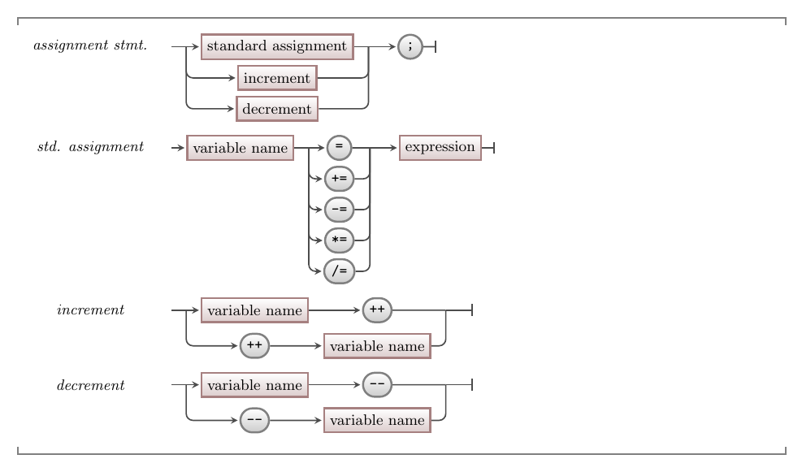

import CodeScroll from '/src/components/CodeScroll.astro'
import CommmonLink from '/src/components/CommonLink.astro'

To help further, C++ provides increment and decrement operators that allow you to add one or subtract one, from a variable. You will find these options very useful when performing any kind of counting action.

:::tip[Syntax]


<CommmonLink type="syntaxDiagramGuide"/>
:::

Increment uses `++` and decrement uses `--`. For example, `x = x - 1`, `x -= 1`, and `x--` are all assignment statements which do the same thing -- assign the variable `x` a new value that is one lower than its current value.

```c++
int count = 10;

// Subtract one from count, and store new value back in count
count = count - 1;

// is the same as
count -= 1;

// is the same as
count--;
```

## Example

The following code shows an example of how to use the shorthand assignment statements.

<CodeScroll maxHeight="500px">
```c++
#include "splashkit.h"

int main()
{
    int count = 17;

    write("Count is ");
    write_line(count);

    // Add one to count
    //
    // count is the left-hand side - where to store the value
    // |
    // |    count + 1 is calculated first
    // |      |
    // v <--- v
    count = count + 1;

    write("After count = count + 1...count is now ");
    write_line(count);

    // We can use shorthand to do this too
    //
    // count is the left-hand side - where to store the value
    // |
    // |  This is the same as count = count + 5
    // |  |
    // v  v
    count += 5;

    write("After count += 5...count is now ");
    write_line(count);

    // We can make this shorter version for + 1
    //
    // count is the left-hand side - where to store the value
    // |
    // | This is the same as count = count + 1
    // | |
    // v v
    count++;

    write("After count++ ...count is now ");
    write_line(count);

    // You can also use shorthand with -
    count -= 3;

    write("After count -= 3 ...count is now ");
    write_line(count);

    // With -- to subtract 1
    count--;

    write("After count-- ...count is now ");
    write_line(count);
}
```
</CodeScroll>

If you ran the above code you should get this output:

```txt
Count is 17
After count = count + 1...count is now 18
After count += 5...count is now 23
After count++...count is now 24
After count -= 3...count is now 21
After count--...count is now 20
```

:::note[Summary]

- Counting is performed by adding or subtracting one from a value.
- In C++, the `++` and `--` operators allow you to do this with little code.

:::
