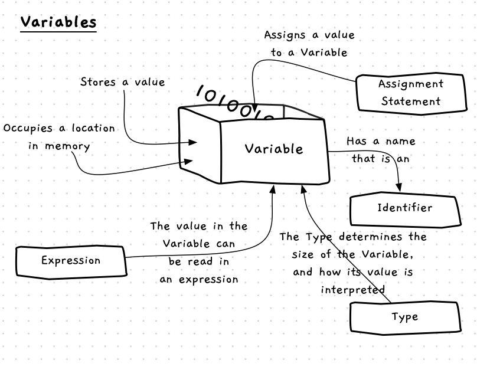

import CommmonLink from '/src/components/CommonLink.astro'
import { YouTube } from 'astro-embed';

While fixed literal values are useful, to make programs dynamic you need to be able to work with values that change.

A **variable** is a **building block** you can use to store a value that you can change as the program runs. You can picture a variable as a **container** into which you can store a value and retrieve it later.



## Variables -- when, why, and how

Variables are an invaluable tool to help you build digital realities.
They allow you to capture simple values, associate them with a name -- the variable's **identifier** -- and change the value within your code.
You can also use the variable to retrieve (i.e., read) the value it contains.

Whenever you have information in your program that you want to be able to change, you create a variable to store it. Every variable has a [data type](/book/part-1-instructions/2-data/5-reference/06-type/), which needs to match the kind of data you want to store.
After you define a variable with an **identifier** and [**data type**](/book/part-1-instructions/2-data/5-reference/06-type/), you need to **initialise** it with a starting value.
Then, you can then read the current value and store new values in the variable as the program runs and the information the variable represents changes.

## Constants

A **constant** is similar to a variable, in that they have a name and a data type. Constants are declared within a program and must be given a value when they are created. However, they differ from a variable because once they are created the value within a constant cannot be changed. This is useful for data that should not change during the program's execution.


## Constants -- Why, When, and How

*Literals are values that are fixed within the code, so why do we need constants?*

With programming, the biggest challenge is making sure your code is **understandable**. Scattering your program with literal values becomes confusing very quickly. When you see a value like `10` in code it doesn't mean much, and potentially could represent anything. There will often be lots of these values that are easy to lose track of. Using a constant lets you name the value, which gives it meaning. When you see `MAX_ITEMS` in the code instead of `10`, you are reminded of its meaning.

Another advantage of using a constant is that you can change the value in one place. If you want to change the maximum number of items in your pack from 10 to 42, you change it in one place. Updating the value of the constant means that everywhere that reads it will get the new value.

## In C++

:::tip[Syntax]
Variables can be declared in C++ using the following syntax:


The syntax for declaring a constant is very similar:

<div class="caption">The syntax for constant declarations in C++</div><br/>
<CommmonLink type="syntaxDiagramGuide"/>
:::

Variable and constant declarations use almost identical syntax in C++. The main difference between a variable and a constant is the `const` keyword at the start of the declaration. If you include `const`, you are creating constants. Without it, you are creating variables.

Both variables and constant declarations need to include the [type](/book/part-1-instructions/2-data/5-reference/06-type/) of data you want to store.Then, you provide a name (identifier) for the variable or constant.
A variable can optionally be given a value when it is declared, but a constant must be given a value.
You can also declare multiple variables or constants in the one line of code, as long as they are of the same data type.

By convention, all constants should have an **UPPERCASE** name. Where the name has multiple words, separate them with underscores (`_`). For example: `MAX_ITEMS`.
Variables should have a **snake_case** name, where the first letter is lowercase and each new word in the identifier is separated with an underscore character (`_`). For example, `bottle_volume`.

## Examples

### Basic Example

In this program, we want to capture the user's name and greet them using it. We need a variable for the name, as it may change each time the program runs. Within the program, the variable will represent the name of the user.

```c++
#include "splashkit.h"

// Create a constant called message
const string MESSAGE = "Welcome to The Greeting";

int main()
{
    // Create a variable called name
    // it can store a string
    string name;

    // Output the message
    write_line(MESSAGE);
    write_line();
    write_line("What is your name?");
    write("name: ");

    // Read user input and store it in the name variable
    name = read_line();

    write_line();
    write_line("Hello " + name);
}
```

### Example using multiple variables

The next example will help us calculate the volume of our water bottles, assuming they are cylinders. To achieve this, we need the following variables:

- A `PI` constant for the calculation.
- Numbers for `radius` and `height` which the user will enter.
- A string `line` to store the text the user enters before we convert it to a number.
- Numbers for `bottle_volume` and `litres` to store calculated values.

```c++
#include "splashkit.h"

// Create a const called PI
const double PI = 3.1415;

int main()
{

    // Create variables radius, height, line, bottle_volume, and litres
    double radius, height;
    string line;
    double bottle_volume, litres;

    write_line("Water Bottle Volume");
    write_line();
    write_line("Enter the radius and height of the bottle in centimetres");

    write("radius: ");
    line = read_line();
    radius = to_double(line);

    write("height: ");
    line = read_line();
    height = to_double(line);

    bottle_volume = PI * radius * radius * height;

    litres = bottle_volume / 1000;

    write_line();
    write_line("Volume " + to_string( bottle_volume ) + " cm^3");
    write_line("       " + to_string( litres ) + " litres");
}
```

:::tip
Notice how the names of the variables help us understand how the program works. In this, we are building the things we need in the digital reality that exists as the program runs.

Adding in additional line breaks also helps group the steps in our code to make it more readable.
:::

### Circle Drawing Example

Let's use SplashKit to look how variables can be used in a graphical program. The following program captures a radius for a circle and uses that to draw to the screen. To achieve this we need two variables, `line` and `radius`. We use `read_line` to read a `string` from the user, and `to_double` to convert the text read into a `double` value. This value is stored in the `radius` variable, which can then be used in the call to `fill_radius`.

```c++
#include "splashkit.h"

const double SATURATION = 0.8;
const double BRIGHTNESS = 0.8;

int main()
{
    string line;
    int radius;
    double hue;

    write_line("Welcome to Circle Drawer!");
    write_line();
    write_line("Enter the radius of the circle to draw. (a whole number)");

    // Read value from the user and convert to double for radius
    write("Circle radius: ");
    line = read_line();
    radius = to_integer(line);

    // Read value from the user and convert to double for hue
    write_line("What color? Enter hue between 0 to 1");
    write("Hue: ");
    line = read_line();
    hue = to_double(line);

    // Draw scene and delay
    open_window("Circle Drawing", 800, 600);
    clear_screen(color_white());
    fill_circle(h_s_b_color(hue, SATURATION, BRIGHTNESS), 400, 300, radius);
    refresh_screen();
    delay(5000);
}
```

## Activities

For each piece of information, identify whether it would make the most sense to store it in a variable or constant. Then, try writing the C++ code to declare that variable or constant. Remember that variables and constants both need an appropriate name and data type, and constants must also be initialised when declared.

1. The number of hours in a day.
2. The amount of water, in litres, left in your water bottle.
3. The number of meters walked so far in the day.
4. The name of the species of wildlife you have most recently seen.

<details>
  <summary role="button">Answers</summary>
  There are other acceptable answers for the identifiers.
  The key to a good identifier is that it is short and meaningful.
  It should also follow the C++ conventions, by using all upper case letters with words separated by underscores for constants, and snake_case for variables.
  <ul>
    <li><strong>1: </strong>Constant, because this value will not change. <code>const int HOURS_IN_DAY = 24;</code></li>
    <li><strong>2: </strong>Variable, because it will change if you drink from or fill up your bottle. <code>double water_left;</code></li>
    <li><strong>3: </strong>Variable, because it will increase as you walk. <code>int meters_walked;</code></li>
    <li><strong>4: </strong>Variable, because it will change when you see something new. <code>string last_species_seen;</code></li>
  </ul>
</details>

:::note[Summary]

- Variables and constants are **building blocks** you can create to store values in your programs.
- You can think of a variable or constant as a box. The variable or constant is the box, and its value is stored within it.
- Each variable and constant has a ...
  - **name** (identifier) that can be used to refer to it.
  - **type** that determines its size and how its value is interpreted.
  - **value** that it is storing.
- The first time you assign a value to a variable or constant, you are **initialising** it.
- Constants are just like variables, but you can only assign them a value once, when they are created.
- You can **read** the value from variables and constants in your instructions.
- A variable **is not** its value -- it is a container that stores a value, but its value can change over time as you write new values into the variable.

:::

<div style="display: none" todo="TODO: Update video? Or just remove?">
## Debugging
Variables are fundamental and powerful tools in programming, but with that power comes the possibility for new types of bugs to emerge. Let's see how to view and manipulate variables in VS Code's debugger!

<div class="not-content">
  <YouTube id="N_lgAN7lVHM" params="fs=1&modestbranding=1&rel=0"/>
</div>
</div>
