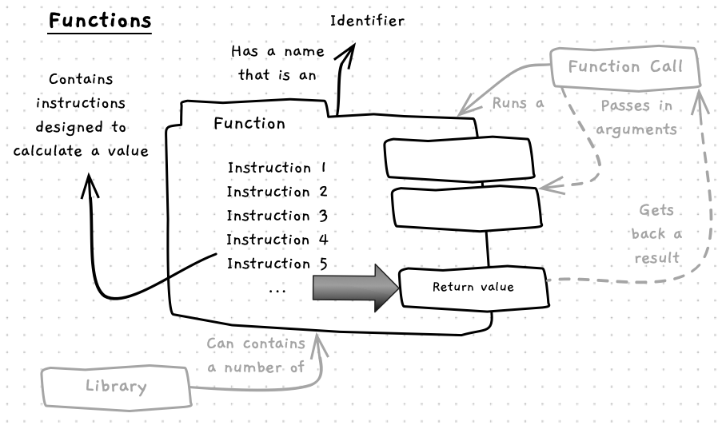

In the previous chapter we were introduced to [procedures](/book/part-1-instructions/1-sequence/5-reference/10-procedure). These programming constructs provide a set of instructions that perform a task. Functions are very similar to procedures with one main difference - a function returns a value.

A function:

- Has a name used to identify it - just like a procedure.
- May accept arguments when called - in the same way as a procedure.
- Contain instructions - similar to a procedure, but these instructions calculate a value.
- Returns a value

## Functions -- when, why, and how

Let's think about the difference between a function and a procedure. You can think of this as similar to the difference between asking someone to do something for you, and asking them a question.

Asking someone to do something is like a procedure call, you are asking them to perform an action. For example, you could ask someone to "close the door". They can then carry out this action.

Alternatively, you can ask someone a question like "What is your name?" In this case you are after an answer. This may be something they know, like their name, or the time, but it could also be something they calculate like "What is the square root of 9?" These questions are like function calls. You expect a response, a value to be *returned* from the function.

Another way to think of this is like a machine where you give it some input material, and it gives you back something, or as a mathematical function -- you give it some values, and it comes back with a result. For example, an `add` function might take two arguments and return the sum of their values.

## Examples

For the moment, let's have a look at some example functions from the SplashKit library.

| 
**Function**
 | **Required Arguments** | **Description** |
| ------------ | ------------------------ | ----------------- |
| `read_line` | none | Reads a line of data (string) from the terminal (standard input) and returns it for you to use. You can use this to get user input. |
| `to_integer` | A string | Converts the string to a integer (`int`) and returns it to you. You can use this to convert data entered into a number. |
| `open_window` | A title, and two numeric values for the width and height | We already used this as if it were a procedure, but this is actually a function that returns a `window` value. You could store and use this value if needed. |
| `hsb_color` | three double values: hue, saturation, and brightness | Calculates a color from a given hue, saturation, and brightness. |

As with procedures, the function's name should identify its purpose. This helps ensure that your code is readable. We will have a look at some function usage examples on the next page.

:::note[Summary]

- A function is a programming **construct**, something that can be created in code.
- A function can be called to calculate and return a value.
- [Libraries](/book/part-1-instructions/1-sequence/5-reference/30-library) can contain many functions.
- The SplashKit library contains functions for common actions as well as graphics, audio, and other tools to help get you started.

:::
