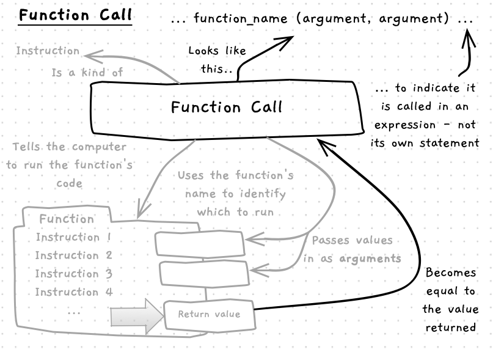
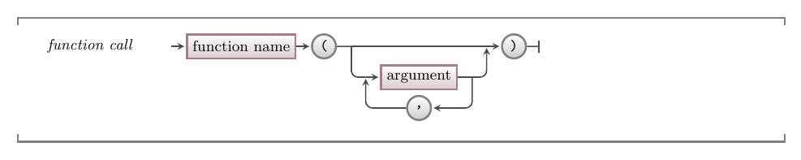

A function call is very similar to a [procedure call](/book/part-1-instructions/1-sequence/5-reference/11-procedure-call). The key differences are that a function call:

- Returns a value.
- Can be called as part of an expression.

Key similarities are:

- You use the function's name to identify which function to call.
- You pass arguments to the function between parenthesis `(...)`.



## Function Call -- when, why, and how

Functions capture the steps needed to calculate or retrieve a value. As a result, you generally call a function as part of an expression. This allows you to use the value that is returned.

You can use function calls anywhere you have an expression. So these can occur in the expression within an [assignment statement](/book/part-1-instructions/2-data/5-reference/11-assignment-statement), or in the expressions used to get the value for an [argument](/book/part-1-instructions/1-sequence/5-reference/11-procedure-call/#arguments) in a procedure or function call.

You will use function calls throughout your program. The key thing is to know a few useful functions, and use these when you need to perform that calculation.

## In C++

:::tip[Syntax]
The C++ syntax for a function call is almost identical to a procedure call - the only difference is that the [identifier](/book/part-1-instructions/1-sequence/5-reference/) (the function name) refers to a function not a procedure:



<CommmonLink type="syntaxDiagramGuide"/>
:::

## Examples

### Reading Input

In this example we use the `read_line` function, with an assignment statement to get input from the user and store it in a `name` variable.

```c++
#include "splashkit.h"

int main()
{
    // Declare a variable - somewhere we can store a string
    string name;

    write("Enter your name: ");

    // Assign a value to name
    //
    // name is the left-hand side - where to store the value
    // |
    // |   read_line() is the right-hand side. It is called
    // |      |        to get a value to assign to name
    // v      v
    name = read_line();

    // We can now use the value read and stored in name
    write_line("Hello " + name);
}
```

### Conversion and Simple Mathematical Functions

This example will help us calculate the volume of our water bottles, assuming they are cylinders. To achieve this, we need to use the following functions:

- [read_line](https://splashkit.io/api/terminal/#read-line): a SplashKit function to read a string from the Terminal.
- [to_double](https://splashkit.io/api/utilities/#to-double): a SplashKit function to convert a string into a double value.
- `to_string`: a SplashKit function to convert a number into a string, with overloads to format double values to a number of decimal places.
- [pow](https://cplusplus.com/reference/cmath/pow/): a built-in C++ function to calculate the value of the first argument to the power of the second argument.

```c++
#include "splashkit.h"

// Create a const called PI
const double PI = 3.1415;
// ...and another called CUBIC_CENTIMETRES_PER_LITRE
const int CUBIC_CENTIMETRES_PER_LITRE = 1000;

int main()
{
    // Create variables radius, height, line, bottle_volume, and litres
    double radius, height;
    string line;
    double bottle_volume, litres;

    write_line("Water Bottle Volume");
    write_line();
    write_line("Enter the radius and height of the bottle in centimetres");

    write("radius: ");
    line = read_line();  // Call readline - assign the result to line
    radius = to_double(line); // Call to_double to convert line to a number

    // Read in and convert line to a double for height
    write("height: ");
    line = read_line();
    height = to_double(line);

    // Calculate the bottle volume - using pow to square radius
    bottle_volume = PI * pow(radius, 2) * height;

    litres = bottle_volume / CUBIC_CENTIMETRES_PER_LITRE;

    // Use to_string to convert numbers to text for output
    write_line();
    write_line("Volume " + to_string( bottle_volume, 4 ) + " cm^3");
    write_line("       " + to_string( litres ) + " litres");
}
```

:::note[Summary]

- A function call calculates a value.
- You can call functions in any expression.
- Use function calls to calculate values where ever you need them.

:::
