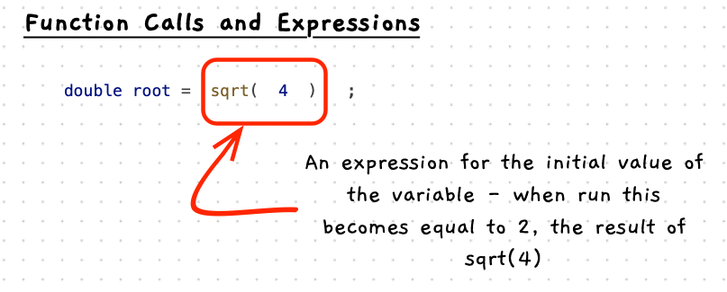
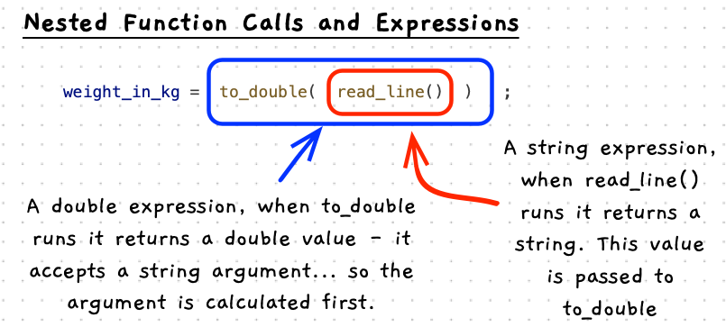

import CommmonLink from '/src/components/CommonLink.astro'

A function call is very similar to a [procedure call](/book/part-1-instructions/1-sequence/5-reference/11-procedure-call). The key differences are that a function call:

- Returns a value.
- Can be called as part of an expression.

Key similarities are:

- You use the function's name to identify which function to call.
- You pass arguments to the function between parenthesis `(...)`.


## Function Call -- when, why, and how

Functions capture the steps needed to calculate or retrieve a value. As a result, you generally call a function as part of an expression. This allows you to use the value that is returned.

You can use function calls anywhere you have an expression. So these can occur in the expression within an [assignment statement](/book/part-1-instructions/2-data/5-reference/11-assignment-statement), or in the expressions used to get the value for an [argument](/book/part-1-instructions/1-sequence/5-reference/11-procedure-call/#arguments) in a procedure or function call.

You will use function calls throughout your program. The key thing is to know a few useful functions, and use these when you need to perform that calculation.

## In C++

:::tip[Syntax]
The C++ syntax for a function call is almost identical to a procedure call. The only difference is that the [identifier](/book/part-1-instructions/1-sequence/5-reference/16-identifier) (the function name) refers to a function not a procedure:


<CommmonLink type="syntaxDiagramGuide"/>
:::

### Function call illustration

The following illustration shows a function call in an expression used to initialise a variable. When this runs, `sqrt` is called and passed the value 4. This returns the value 2 (the square root of 4), which becomes the value of the expression. 2 is then stored in the `root` variable.



### Nested function calls
The following illustration shows two function calls: `to_double` and `read_line`. Each of these is called as part of two different expressions:

- `to_double` is called in the expression of an [assignment statement](/book/part-1-instructions/2-data/5-reference/11-assignment-statement). Its value will be stored in the `weight_in_kg` variable.
- `read_line` is called as an argument in a function call. Its value will be passed to `to_double` as its first argument.

This will be evaluated as follows:

- `to_double` has one argument. The argument value must be calculated before it can run.
  - `read_line` runs and returns a string, meaning it becomes a string value.
  - `to_double` runs and accepts the string value returned by `read_line`.
  - When `to_double` ends, it returns a double value.
- Finally, the value returned from `to_double` is stored in `weight_in_kg`.



## Example

This example makes use of a number of functions from SplashKit and the maths library.

- [sqrt](https://cplusplus.com/reference/cmath/sqrt/?kw=sqrt): gets the square root of a number.
- [rnd](https://splashkit.io/api/utilities/#rnd): get a random double value between 0.0 and 1.0.
- [fabs](https://cplusplus.com/reference/cmath/fabs/?kw=fabs): gets the absolute value for a double.
- [pow](https://cplusplus.com/reference/cmath/pow/?kw=pow): calculates the first argument raised to the power of the second.
- [sin](https://cplusplus.com/reference/cmath/sin/?kw=sin): computes the sine of an angle in radians.
- [cos](https://cplusplus.com/reference/cmath/cos/?kw=cos): computes the cosine of an angle in radians.

:::note
Don't worry about memorising all of these. Documentation is there to be searched! The important thing is to remember what is possible so you know what syntax to look up.
:::

```c++
#include "splashkit.h"

// Create a constant called PI
const double PI = 3.1415;

int main()
{
    double x = 4.0, y = 3.0;
    double angle, hypotenuse, result1, result2;
    
    // Function call in variable initialisation
    double root = sqrt(x);
    
    // Get a random angle - radians between 0 and 2π
    angle = rnd() * 2 * PI;

    // Function calls as arguments to other functions
    hypotenuse = sqrt(pow(x, 2) + pow(y, 2));

    // More examples
    result1 = sin(angle) + cos(angle);
    result2 = pow(x, 3) / fabs(y);
    
    // Multiple function calls combined
    double complex = pow(sin(angle), 2) + pow(cos(angle), 2);
    double distance = sqrt(pow(fabs(x - y), 2) + pow(angle, 2));
    
    write_line(root);
    write_line(angle);
    write_line(hypotenuse);
    write_line(result1);
    write_line(result2);
    write_line(complex);
    write_line(distance);
}
```

:::note[Summary]

- A function call calculates a value.
- You can call functions in any expression.
- Use function calls to calculate values where ever you need them.

:::
