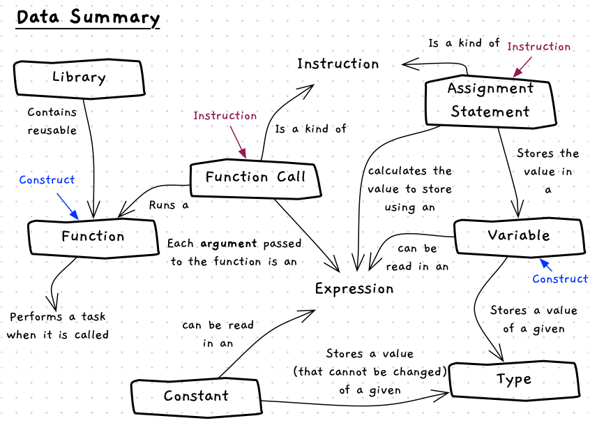

This chapter introduced constructs you can use to work with data:

- [Variables](/book/part-1-instructions/2-data/5-reference/10-variable) where you can store values you want to change as the program runs.
- [Constants](/book/part-1-instructions/2-data/5-reference/20-constant) for managing values that do not change.
- [Functions](/book/part-1-instructions/2-data/5-reference/30-function) as a means of calculating or fetching values.

To work with these we have some additional instructions we can use:

- [Assignment Statement](/book/part-1-instructions/2-data/5-reference/11-assignment-statement) to store a new value in a variable.
- [Function Calls](/book/part-1-instructions/2-data/5-reference/31-function-call) to use (call) a function in an expression.

These constructs and tools extend what you have learnt in the [sequence chapter](/book/part-1-instructions/1-sequence/0-overview/). You need to think about sequence and data together. Break down your problems into small discrete steps, each of which gets you a little closer toward your goal.

With each piece of data, think "Does this need to change?" If the answer is yes, then use a variable. If no, use a constant or literal value. At the same time, think "What kind of value is this?" If it is a number, is it a whole number (`int`) or a real number (`double`)? This will help you make the many small decisions you need to make as you craft your code.

An overview of these concepts is shown in the concept map below.

:::note[Summary]

- Constructs are things that exist as *things* in your code that you can use. You can create and use constructs, or access them from libraries.
- Instructions capture the different commands you can get the computer to perform.
- Your program is a **sequence** of instructions that use **data** (in variables, constants, and literals) that get the computer to do something when it is run.

:::
