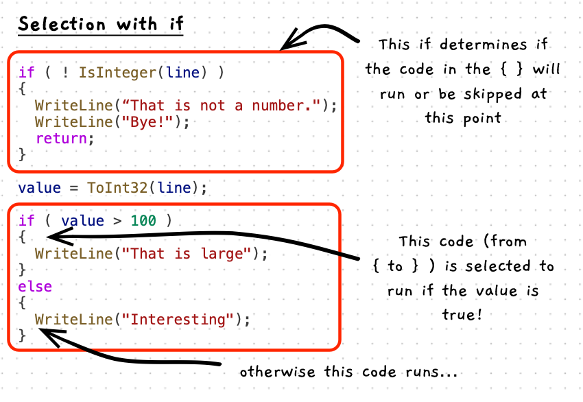

Selection, also known as branching, represents one of the control flow mechanisms. This allows you to create a decision that will choose between different paths - selecting which branch of the instructions it will take.

You use selection/branching to add a point in the code where you decide if some code should run or not, or choose between alternate options.



:::note[The if statement...]

- uses the condition to determine which branch to select to run next.
- has one branch to run when the condition is true.
- can optionally have an else branch to run when the condition is false.

:::

:::tip

When you are thinking through your steps, you can now have points where you decide if some code should be run or not. Do this, then do that, then if this is true, do this, otherwise (else) do this other thing, then (after the if) do this next thing.

:::

## Example

```cs
using static SplashKitSDK.SplashKit;
using static System.Convert;

string line;
int value;

Write("Enter a number: ");
line = ReadLine();

// Add a decision point
if ( ! IsInteger(line) )
{
  // The code will come through this branch only
  // if the line is not an integer
  WriteLine("Nice try... that is not a number.");
  WriteLine("Bye!");
  return;
}

value = ToInt32(line);

// Check if value is larger than 100
if ( value > 100 )
{
  // if it is run this...
  // so we know value is > 100 here!
  WriteLine("That is larger than I thought");
}
else
{
  // here we know value is <= 100
  WriteLine("Interesting");
}

// You can add conditions within the else to have multiple paths
if ( value < 0)
{
  WriteLine("A negative number");
}
else if (value > 0)
{
  WriteLine("A positive number");
}
else
{
  // You only get here if value is not < 0 and
  // value is not > 0... 
  // so it is...
  WriteLine("Zero!");
}
```
