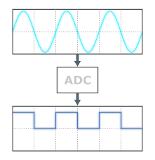

Our journey so far has been powered by digital sensors, which are great for simple tasks—but they can be limiting because they only tell us yes or no. With analog sensors, we can capture much more detail.

## Analog to Digital

The Raspberry Pi on its own is only capable of working with digital data. To use analog sensors, the analog data from the sensor needs to be converted to digital data that the Raspberry Pi can work with.

This can be done using an **A**nalog-to-**D**igital **C**onverter, commonly known as an ***ADC***.

An **ADC** converts analog signals into digital data that your Raspberry Pi can understand and process.

Image from <a href="https://datacapturecontrol.com/articles/data-acquisition/analog-inputs/analog-to-digital-converters">Data Capture Control</a>

### ADC Modules

To read analog data using SplashKit's Raspberry methods, you will need the **ADS7830** module.
<!-- Update if PCF8591 module can be added -->

<!--  -->

<!-- TODO: Discuss the pins on the ADS7830 module -->

### Analog Sensors  

Analog sensors produce a range of values, instead of just “on” or “off”. With the 8-bit ADS7830 ADC module, the analog values will range from 0 to 255.

**Examples:**

- **Potentiometers:** Detect changes in position (rotation).  
- **Joystick Module:** Detect changes in position, in two directions - x and y.
- **Light Sensors:** Measure varying light intensities.  
- **Analog Temperature Sensors:** Provide a continuous range of temperature readings.

The next pages