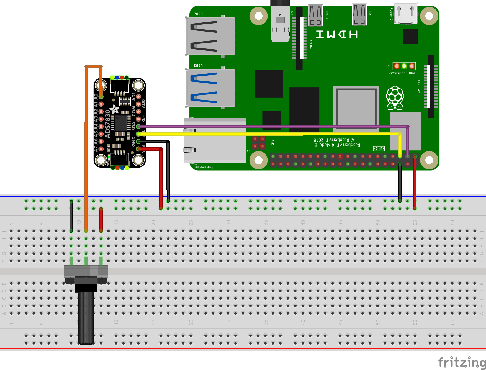

## Exploring the Potentiometer

A potentiometer is a variable resistor that produces a variable voltage as you turn its knob, making it a versatile sensor for many applications.

<!--  -->

A potentiometer has three terminals:

- **Two Outer Terminals:** These connect to a fixed voltage (e.g., one to 3.3V and the other to Ground).
- **Middle Terminal (Wiper):** This connects to the ADC module, and provides a variable voltage that changes as you rotate the knob.

### Wiring the Potentiometer

Image created with <a href="https://fritzing.org/">Fritzing</a>

1. **Insert the potentiometer into the breadboard:**

    Place the potentiometer on the breadboard by inserting the 3 pins into 3 separate rows, as shown above.

2. **Connect the outer pins:**

    Connect the "left" outer terminal to Ground (GND), as shown with the black wire above.

    Connect the "right" outer terminal to the 3.3V supply, as shown with the red wire above.

3. **Connect the middle pin:**

    Connect the middle terminal to the **A0** analog channel on the ADS7830 module so that the variable voltage can be read by your Raspberry Pi.

### Reading the Potentiometer

<!-- TODO: Update -->
- The ADC converts the analog voltage from the potentiometer into a digital value.
- This value can be scaled (for example, 0 to 100) to represent a percentage.

## Exploring the Joystick Module

<!-- TODO: Explain joystick module -->

<!--  -->

A joystick module has five terminals:

<!-- TODO: Explain Joystick pins -->

### Wiring the Joystick

<!-- TODO: Add Wiring diagram image -->

1. **Connect the ground and voltage pins:**

    <!-- TODO: Add steps -->

2. **Connect the VRx and VRy (analog) pins:**

    <!-- TODO: Add steps -->

3. **Connect the button switch pin:**

    <!-- TODO: Add steps -->

### Reading the Joystick

<!-- TODO: Add -->
