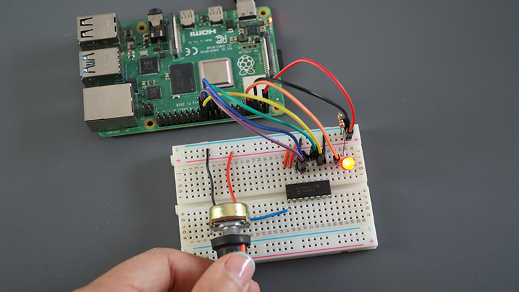

# Exploring the Potentiometer

In this guide, we’ll explore how a potentiometer works and how you can use it in your Raspberry Pi projects. A potentiometer is a variable resistor that produces a variable voltage as you turn its knob, making it a versatile sensor for many applications.

## What Is a Potentiometer?

A potentiometer has three terminals:
- **Two Outer Terminals:** These connect to a fixed voltage (e.g., one to 3.3V and the other to Ground).
- **Middle Terminal (Wiper):** This provides a variable voltage that changes as you rotate the knob.

## How to Use a Potentiometer

1. **Wiring the Potentiometer:**
   - Connect one outer terminal to the 3.3V supply.
   - Connect the other outer terminal to Ground (GND).
   - Connect the middle terminal to an ADC channel (such as on the ADS7830) so that the variable voltage can be read by your Raspberry Pi.

2. **Reading the Potentiometer:**
   - The ADC converts the analog voltage from the potentiometer into a digital value.
   - This value can be scaled (for example, 0 to 100) to represent a percentage.

3. **Practical Application:**
   - Create a project where you adjust the potentiometer to match a target percentage.
   - **Tip:** Use the random number function `rnd()` as a fun way to generate target values or simulate sensor noise. Checkout 

## Example Scenario

Imagine a game where your goal is to adjust the potentiometer so that the digital reading comes as close as possible to a randomly generated target percentage. Even though we haven’t yet implemented ADC functionality in our SplashKit setup, this guide prepares you for working with analog inputs and designing interactive projects.

---

This guide helps you understand the role of the potentiometer in embedded systems. By learning how to wire and read a potentiometer, you unlock a key component for more dynamic and responsive projects on your Raspberry Pi.

