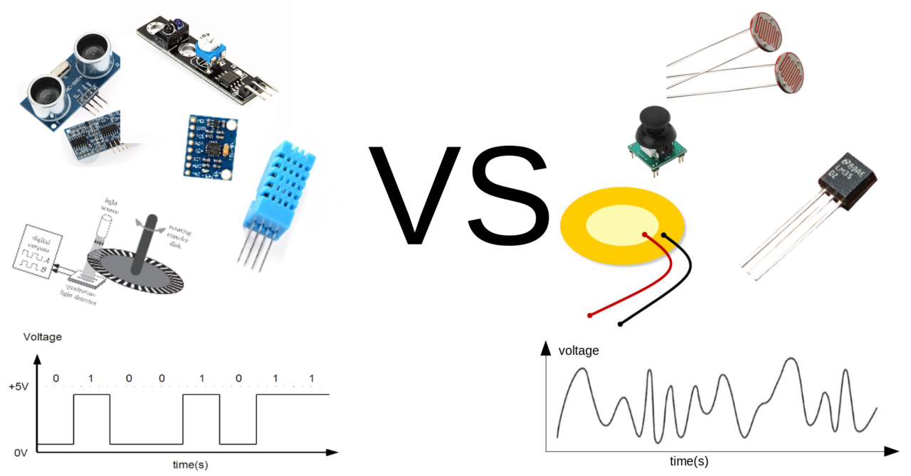

# Unlocking Analog Potential: ADC, Digital vs. Analog Sensors, and Beyond

Welcome to the exciting world of Control and Flow! In this chapter, we’re expanding our horizons by moving beyond simple digital signals. As you may know, the Raspberry Pi doesn’t have a built-in ADC (Analog-to-Digital Converter). That’s why we’re introducing the ADS7830 module to bridge the gap and let us work with analog sensors. Let’s break it down in a fun and friendly way.

---

## What is an ADC?

An **ADC (Analog-to-Digital Converter)** is like a magical translator. It takes continuously varying analog signals—think of them as smooth, flowing waves—and converts them into digital numbers that your Raspberry Pi can understand and process.  
- **Why use an ADC?**  
  Because while digital signals are like on/off switches, many real-world signals (like light, sound, or temperature) vary continuously. Without an ADC, our Pi would miss out on all that rich, detailed information!

---

## Digital Sensors vs. Analog Sensors

### Digital Sensors  
- **What are they?**  
  Digital sensors output one of two states: HIGH or LOW (think binary 1 or 0).  
- **Examples:**  
  - **Push Buttons:** When pressed, they switch from LOW to HIGH.  
  - **Digital Temperature Sensors:** They might simply indicate if the temperature is above or below a set threshold.  

### Analog Sensors  
- **What are they?**  
  Analog sensors produce a range of values. Instead of just “on” or “off,” they can tell you exactly how bright it is, how loud it is, or even how hot it is!  
- **Examples:**  
  - **Light Sensors:** Measure varying light intensities.  
  - **Potentiometers:** Detect changes in position or rotation.  
  - **Analog Temperature Sensors:** Provide a continuous range of temperature readings.

---

## Why Are We Moving to Analog Sensors?

Our journey so far has been powered by digital sensors, which are great for simple tasks—but they can be limiting because they only tell us yes or no. With analog sensors, we can capture much more detail. Imagine being able to measure subtle changes in light or temperature; that opens up a whole new world of possibilities for creative projects and deeper control logic.

Using an ADC like the ADS7830, we can convert these nuanced analog signals into digital data that our Raspberry Pi can work with. This upgrade lets us think bigger and design more sophisticated projects that can react to a rich variety of real-world inputs.

:::caution
Currently, our SplashKit setup doesn’t include an ADC connection. We’re laying the groundwork for future lessons where we’ll dive into interfacing with the ADS7830 and making full use of analog sensors. Stay tuned!
:::

By unlocking analog sensor capabilities, we’re not just overcoming a limitation—we’re opening the door to a broader, more dynamic world of programming and electronics. Enjoy this new adventure in Control and Flow, and get ready to explore a whole new level of creativity with your Raspberry Pi!