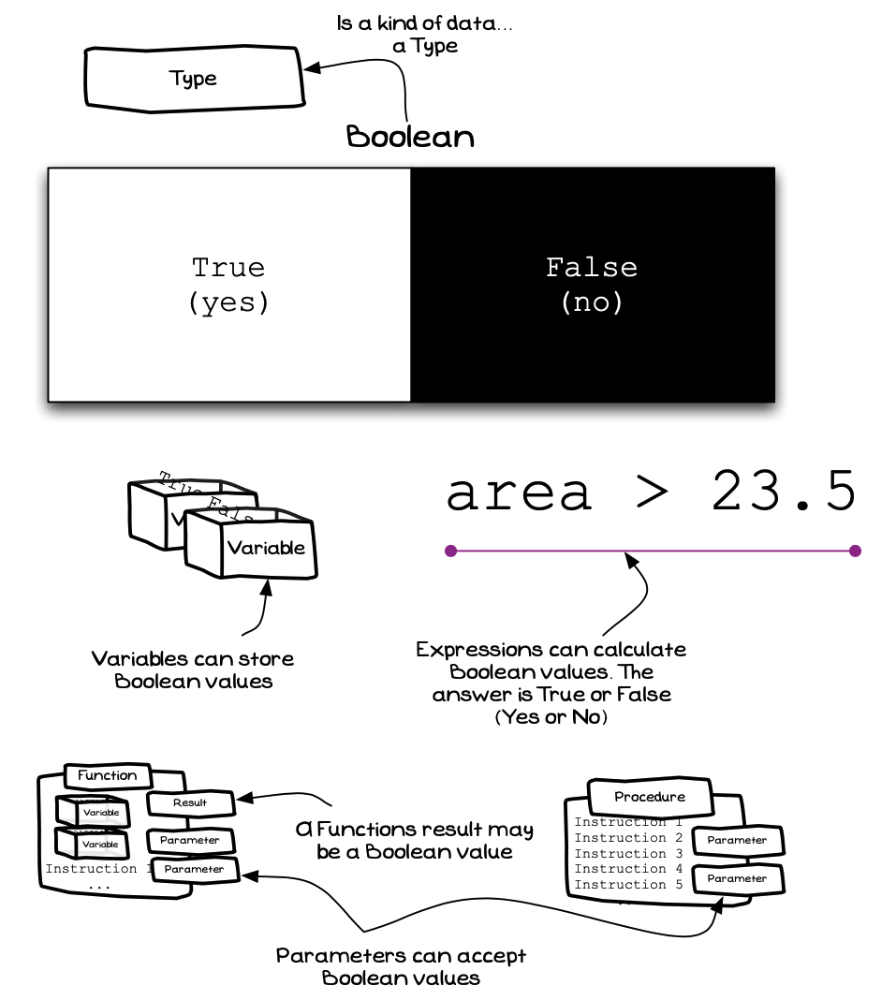

import { YouTube } from 'astro-embed';

  <YouTube id="rmY28jiKb5w" params="fs=1&modestbranding=1&rel=0&autoplay=1"/>

The boolean [type](../../../1-sequence-and-data/1-concepts/06-type) is used to represent **truth**. A boolean value will either be **true** or **false**. These values are used extensively in control flow statements to determine which instruction to perform next.

The following concept map shows how the boolean type relates to what you have learned so far.

:::tip[Why boolean?]
The boolean type is named after [George Boole's](https://en.wikipedia.org/wiki/George_Boole) boolean logic.
:::

## Boolean -- when, why, and how

Booleans are very helpful in programming, and developers use them throughout their code. Every time you want to make a decision, a boolean will be there to help you check which conditions are true, which you can use to decide what to do next. You already do this in your everyday life. For example, you probably check that your food is cooked before you eat it.

When programming, create boolean variables to store and work with conditions, or evaluate them on the fly with comparisons. With a boolean you are always asking "Is this true?". This could be a simple question (e.g., is my food cooked?), or something more complicated (e.g., do I have my shoes on, my bag packed, and my phone charged?). We use boolean values as **conditions** in control flow statements to determine what actions the computer should perform.

## Examples

The SplashKit library includes some useful examples of methods that return boolean data, as shown in the following table. You can use these to create conditions based on things the user has done. For example, you could create a condition that checks if the user has asked to quit the program or they have typed the escape key.

| 
**Method**
 | **Required Arguments** |**Description** |
|-----------|------------------------|----------------|
|`QuitRequested`| None | Has the user asked to quit the program? |
|`AnyKeyPressed`| None | Did the user press any key? |
|`KeyUp`| A key code | Is the indicated key *up*? |
|`KeyDown`| A key code | Is the indicated key held *down*? |
|`KeyReleased`| A key code | Was the key down and then released? |
|`KeyTyped`| A key code | Was the key up and then typed (pressed down and released)? |
|`MouseClicked`| A mouse button | Was the indicated mouse button clicked? |
|`MouseDown`| A mouse button | Is the indicated mouse button held down? |
|`MouseUp`| A mouse button | Is the indicated mouse button up? (not held down) |

SplashKit also provides some utility methods that you can use when working with text.

| 
**Method**
 | **Required Arguments** |**Description** |
|-----------|------------------------|----------------|
|`IsDouble`| a string | Returns true when the string argument can be converted to a double (it contains only a number). |
|`IsInteger`| a string | Returns true when the string argument can be converted to an integer (it contains only a whole number). |
|`IsNumber`| a string | An equivalent to `IsDouble`. Returns true when the string argument can be converted to a number (it contains only a number). |

:::note[Summary]

- Boolean is an [type](../../../1-sequence-and-data/1-concepts/07-type) that has been defined within the language to represent truth values.
- A boolean value is either **true** or **false**. You can also think of these as yes or no.
- Boolean values are used in most of the control flow statements.
- The boolean type can be used in the same way as other types to declare variables.
- You can use `true` and `false` as boolean [literals](../../../1-sequence-and-data/1-concepts/05-literal).

:::
