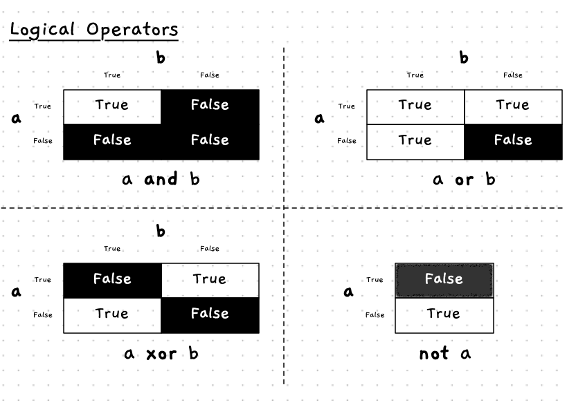

Comparison operators allow you to compare *two* values. This is very useful, but has limitations. For example, what do you do when you want to compare three or more values, or you want to check multiple different conditions?

In addition to the comparison operators, there are other operators that allow you to **combine** boolean expressions. This will enable you to combine multiple boolean values together into a single boolean expression.

There are four main **logical operators**:

- **and**: checks if two boolean values are both true.
- **or**: checks if one or both of two boolean values are true.
- **xor**: checks if one or the other of two boolean values is true.
- **not**: checks if a boolean value is false.

For example, the condition `area > 0` **and** `area < 10` will be true only when `area` is **both** larger than zero **and** area is less than ten.

Truth tables are a great way of visualising the results from these operators. In our image below we show you a table for each operator, so you can see the result of using that operator with all the different possible inputs.

For example, the top-left corner of the top-left table shows that the expression `a and b` is true when both `a` and `b` are true. In all other cases `a and b` is false.
Have a look at the four tables and make sure you understand how each value was calculated given the description of each operator above.

## Logical Operators -- when, why, and how

You often want to check multiple conditions when you are making a decision. For example, to check if the user has clicked something on the screen, you need to check if they have clicked *and* the mouse cursor is over that area. This is a case where **and** is useful.

We could achieve this using the condition like `MouseClicked(MouseButton.LeftButton) and MouseX() >= 5 and MouseX() <= 10`. This will be true when the left button was clicked, and the mouse is between 5 and 10 pixels from the left of the window. You can explore conditions like this in a table as shown below.

<table>
  <thead>
    <tr>
      <th colspan=2>Input</th>
      <th colspan=3>Condition</th>
      <th>Overall Result</th>
    </tr>
  </thead>
  <tbody>
    <tr>
      <td style="font-weight:bold">Clicked?</td>
      <td style="font-weight:bold">MouseX</td>
      <td style="font-weight:bold">MouseClicked</td>
      <td style="font-weight:bold">MouseX >= 5</td>
      <td style="font-weight:bold">MouseX <= 10</td>
      <td style="font-weight:bold"></td>
    </tr>
    <tr>
      <td>No</td>
      <td>7</td>
      <td>false</td>
      <td>true</td>
      <td>true</td>
      <td>false</td>
    </tr>
    <tr>
      <td>Yes</td>
      <td>7</td>
      <td>true</td>
      <td>true</td>
      <td>true</td>
      <td>true</td>
    </tr>
    <tr>
      <td>Yes</td>
      <td>11</td>
      <td>true</td>
      <td>true</td>
      <td>false</td>
      <td>false</td>
    </tr>
    <tr>
      <td>Yes</td>
      <td>4</td>
      <td>true</td>
      <td>false</td>
      <td>true</td>
      <td>false</td>
    </tr>
  </tbody>
</table>

Notice that in this case we need to have all parts of the condition being true for the overall result to be true. This matches what we asked for -- the mouse must be clicked and the mouse `x` between 5 and 10.

With **or** you can check if **any** of a number of conditions are true. For example, has the user asked to quit or have they typed the escape key. This can be achieved with a condition like `QuitRequested() or KeyTyped(KeyCode.EscapeKey)`, which is expanded in the following truth table.

<table>
  <thead>
    <tr>
      <th colspan=2>Input</th>
      <th colspan=2>Condition</th>
      <th>Overall Result</th>
    </tr>
  </thead>
  <tbody>
    <tr>
      <td style="font-weight:bold">Quit?</td>
      <td style="font-weight:bold">Escape key?</td>
      <td style="font-weight:bold">QuitRequested</td>
      <td style="font-weight:bold">KeyTyped(Escape)</td>
      <td style="font-weight:bold"></td>
    </tr>
    <tr>
      <td>No</td>
      <td>No</td>
      <td>false</td>
      <td>false</td>
      <td>false</td>
    </tr>
    <tr>
      <td>Yes</td>
      <td>No</td>
      <td>true</td>
      <td>false</td>
      <td>true</td>
    </tr>
    <tr>
      <td>No</td>
      <td>Yes</td>
      <td>false</td>
      <td>true</td>
      <td>true</td>
    </tr>
    <tr>
      <td>Yes</td>
      <td>Yes</td>
      <td>true</td>
      <td>true</td>
      <td>true</td>
    </tr>
  </tbody>
</table>

In this case you can see that if any one of the values is true, then the result is true. So, if you ask to quit *or* you type the escape key, then this condition will be true. If you manage to do both at the same time, that will be true as well.

## In C#

Because of the heritage of C#, which is based upon the C programming language, this is one area where C# uses cryptic symbols rather than clear text. Rather than using keywords for *and* and *or* orperators, C# uses **&&** for and, **||** for or, **!** for not, and **^** for xor. This is summarised in the following table.

|  | Description | Operator | Example |
|---|---|---|---|
| **And** | Are both values true? | `&&` | `a && b` |
| **Or** | Is at least one value true? | `\|\|` | `a \|\| b` |
| **Xor** | Is one value true, and the other false? | `^` | `a ^ b` |
| **Not** | Is the value false? | `!` | `! a` |

:::caution
To make matters worse, new versions of C# have added in **and** and **or** keywords for pattern matching expressions. These differ from boolean operators, so avoid their use.
:::

## Example

The following table shows some example comparisons using logical operators and an `area` variable with some example values.

<table>
<thead>
  <tr>
    <th rowspan="2">area</th>
    <th rowspan="2">area > 0</th>
    <th rowspan="2">area < 10</th>
    <th colspan="3">area > 0 [OPERATOR] area < 10</th>
  </tr>
  <tr>
    <th>and</th>
    <th>or</th>
    <th>xor</th>
  </tr>
</thead>
<tbody>
  <tr>
    <td>5</td>
    <td>True</td>
    <td>True</td>
    <td>True</td>
    <td>True</td>
    <td>False</td>
  </tr>
  <tr>
    <td>27</td>
    <td>True</td>
    <td>False</td>
    <td>False</td>
    <td>True</td>
    <td>True</td>
  </tr>
  <tr>
    <td>0</td>
    <td>False</td>
    <td>True</td>
    <td>False</td>
    <td>True</td>
    <td>True</td>
  </tr>
</tbody>
</table>

</tbody>
</table>
