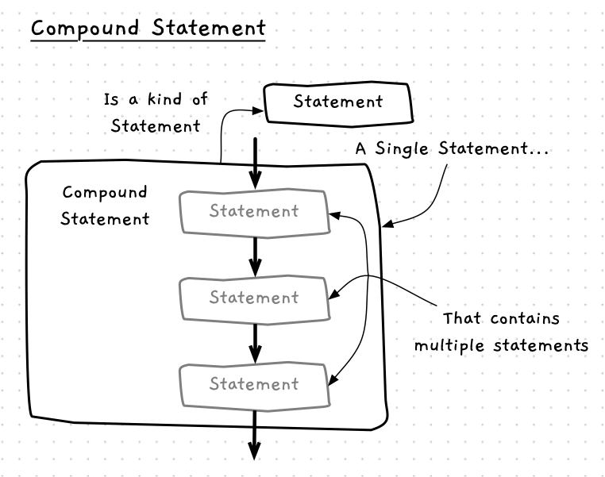

Before we explore control flow statements we need to make a small detour to see one new statement that programming languages use to simplify their syntax. This is a **compound statement** -- one statement that is actually a grouped list, or **block** of statements.

Programming languages will typically define control flow statements as only being able to control the flow of a **single** instruction.
This is quite limiting.
However, with compound statements we are able to bypass the limitation, by using a compound statement where this single instruction is expected.
This allows us to write control flow statements that actually alter the flow of more than one instruction.

Have a look at the following figure to see a visualisation of this idea.



## Compound Statements -- when, why, and how

You will use compound statements regularly within control flow statements. It simply provides you with a way of clearly showing which statements belong within the group, and then embedding that group within the flow of control.

## In C#

:::tip[Syntax]
The following diagram shows the syntax for a compound statement in C#.


:::

In C# you use curly braces (`{...}`) to bring together a list of statements. The group starts with the open brace (`{`) and end with the closing brace (`}`), with everything in between the two braces being part of the group. There are no restrictions on how many statements can be in a compound statement.

## Example

You can use compound statements anywhere in your code, such as in the following example.

```csharp
using static System.Console;

WriteLine("Statement 1");

// The next 4 lines are all part of the one compound statement
{
    WriteLine("In the compound statement - statement 2.1");
    WriteLine("This would be statement 2.2");
}

WriteLine("Statement 3");
```

There isn't any reason to do this though -- compound statements really make the most sense when combined with the control flow statements.

:::note[Summary]

- A compound statement is a **statement** that allows you to create a single statement that contains multiple statements.
- A compound statement may contain 0 or more statements.
- Compound Statements are useful when combined with control flow statements.
- The statements within the compound statement are often referred to as a **block**.

:::
