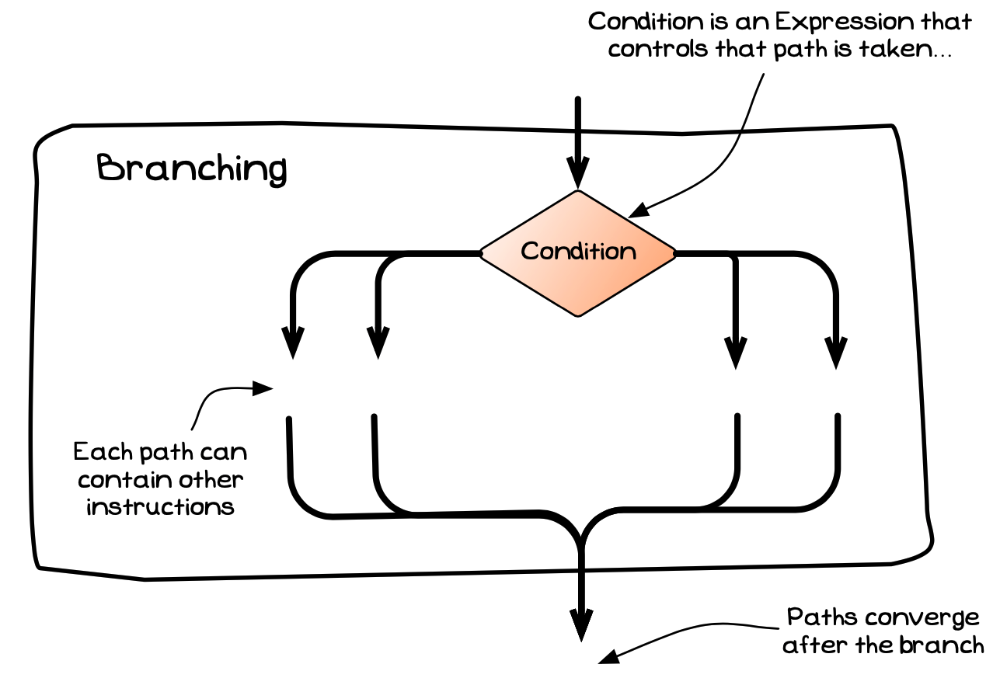

import { YouTube } from 'astro-embed';

  <YouTube id="72biJP5-FqM" params="fs=1&modestbranding=1&rel=0&autoplay=1"/>

The machine code of a computer will include instructions that allow it to conditionally jump to another instruction somewhere within the code. We have seen an example of a non-conditional jump with method calls, where control jumped to the instruction at the start of a method. Rather than jumping to new methods, conditional jumps are useful for jumping between instructions within the current code.

Originally, programs were written without any particular structure. This resulted in significant complexity, as you could never really be sure of how the program got to any particular place within the code. To overcome this, a set of control were introduced into languages. These allowed programmers to add structured conditional jumps to branch or loop statements, where there was always a single way into and out of each block of code.

Let's start by looking at the mechanism known as **branching** or **selection**. Branching allows you to get the computer to take one of a number of paths based on the value of a **condition**, as shown in the image below. The code enters, evaluates the condition, then follows one of the paths. All paths then rejoin before proceeding to the next statement.

The reason branching is described as "control flow" is because it allows us to **control** the **flow** of instructions to the CPU, as visualised in the image below.
Here, there are two alternative sequences of instructions.
Based on the value of the condition at instruction 20, only one of these sequences will be executed.

There are two forms of branching: [if statements](../03-1-if) and [case statements](../03-2-case).
Let's look at each of these in detail.

:::note[Summary]

- Branching is a kind of **instruction**. You can command the computer to take one of several paths through code.
- A branch has a **condition** that is evaluated and determines which path the computer will take.
- A branch will have one entry point and one exit point.

:::
